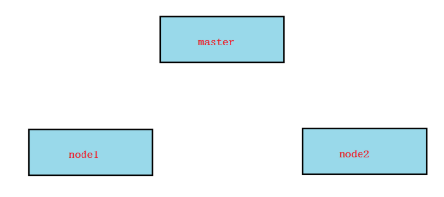

# 一、集群部署方式

**kubeadm介绍**

- 安装软件 kubelet kube-proxy kubeadm kubectl

- 初始化集群

- 添加node到集群中

- 证书自动生成

- 集群管理系统是以容器方式存在，容器运行在master

  

  

其它部署方式:

二进制手动部署    太麻烦

minikube  单机简化安装

kubeasz  支持多主,ansible自动部署  参考: https://github.com/easzlab/kubeasz

# 二、kubeadm部署kubernetes集群

## 准备环境

三台2G+内存4核CPU的centos7.6, 单网卡

| IP             | 角色                |
| -------------- | ------------------- |
| 192.168.122.15 | master（单管理节点) |
| 192.168.122.16 | node1               |
| 192.168.122.17 | node2               |

1, **所有节点**主机名及绑定

~~~powershell
127.0.0.1   localhost localhost.localdomain localhost4 localhost4.localdomain4
::1         localhost localhost.localdomain localhost6 localhost6.localdomain6
192.168.122.15  master
192.168.122.16  node1
192.168.122.17  node2
~~~

2, **所有节点**关闭selinux

3, **所有节点**关闭firewalld,安装iptables服务,并保存为空规则

~~~powershell
# systemctl stop firewalld
# systemctl disable firewalld

# yum install iptables-services -y
# systemctl restart iptables
# systemctl enable iptables

# iptables -F && iptables -F -t nat && iptables -F -t mangle  && iptables -F -t raw

# iptables -L
Chain INPUT (policy ACCEPT)
target     prot opt source               destination

Chain FORWARD (policy ACCEPT)
target     prot opt source               destination

Chain OUTPUT (policy ACCEPT)
target     prot opt source               destination

# service iptables save
iptables: Saving firewall rules to /etc/sysconfig/iptables:[  OK  ]
~~~

3, **所有节点**时间同步

4, **所有节点**准备yum源(在centos默认源的基础上再加上以下两个yum源)

~~~powershell
# vim /etc/yum.repos.d/kubernetes.repo
[k8s]
name=k8s
baseurl=https://mirrors.aliyun.com/kubernetes/yum/repos/kubernetes-el7-x86_64/
enabled=1
gpgcheck=0
~~~

~~~powershell
# wget https://mirrors.aliyun.com/docker-ce/linux/centos/docker-ce.repo -O /etc/yum.repos.d/docker-ce.repo
~~~

5, **所有节点**关闭swap(kubernetes1.8开始不关闭swap无法启动)

~~~powershell
# swapoff -a

打开fstab文件将swap那一行注释保存
# vim /etc/fstab
UUID=38182b36-9be4-45f8-9b3f-f9b3605fcdf0 /                       xfs     defaults        0 0
UUID=6b69e04f-4a85-4612-b1c0-24939fd84962 /boot                   xfs     defaults        0 0
#UUID=9ba6a188-d8e1-4983-9abe-ba4a29b1d138 swap                    swap    defaults        0 0
~~~

6, RHEL7和CentOS7有由于iptables被绕过而导致流量路由不正确的问题,需要**所有节点**做如下操作: 

~~~powershell
# modprobe br_netfilter
# lsmod |grep br_netfilter

# cat > /etc/sysctl.d/k8s.conf <<EOF
net.ipv4.ip_forward = 1
vm.swappiness = 0
net.bridge.bridge-nf-call-ip6tables = 1
net.bridge.bridge-nf-call-iptables = 1
EOF

# sysctl -p /etc/sysctl.d/k8s.conf
~~~

7, **所有节点**设置kube-proxy开启ipvs的前置条件

由于ipvs已经加入到了内核的主干，所以为kube-proxy开启ipvs的前提需要加载以下的内核模块

~~~powershell
# cat > /etc/sysconfig/modules/ipvs.modules <<EOF
modprobe ip_vs
modprobe ip_vs_rr
modprobe ip_vs_wrr
modprobe ip_vs_sh
modprobe nf_conntrack_ipv4
EOF

# chmod 755 /etc/sysconfig/modules/ipvs.modules
# sh /etc/sysconfig/modules/ipvs.modules
# lsmod |egrep 'ip_vs|nf_conntrack'
~~~

## 安装软件

1, **所有节点**安装docker

~~~powershell
# yum install docker-ce -y

# systemctl start docker
# systemctl enable docker
~~~

2, **所有节点**配置加速器和将cgroupdrivier改为systemd,并重启docker服务

~~~powershell
# vim /etc/docker/daemon.json
{
   "registry-mirrors": ["https://42h8kzrh.mirror.aliyuncs.com"],
   "exec-opts": ["native.cgroupdriver=systemd"]
}

# systemctl restart docker
~~~

3, **所有节点**安装kubelet,kubeadm,kubectl.并`enable kubelet`服务(**注意: 不要start启动**)

~~~powershell
# yum install kubelet-1.18.3-0 kubeadm-1.18.3-0 kubectl-1.18.3-0 -y
# systemctl enable kubelet
~~~

## kubeadm初始化

在master节点上操作(**其它节点不操作**)

注意: 

* 初始化的过程中需要下载近1G大小左右的镜像,
* 节点网络,service网络,pod网络不要在同一个网段

~~~powershell
[root@master ~]# kubeadm init --kubernetes-version=1.18.3 --apiserver-advertise-address=192.168.122.15 --image-repository registry.aliyuncs.com/google_containers --service-cidr=10.2.0.0/16 --pod-network-cidr=10.3.0.0/16
[init] Using Kubernetes version: v1.18.3
[preflight] Running pre-flight checks
[preflight] Pulling images required for setting up a Kubernetes cluster
[preflight] This might take a minute or two, depending on the speed of your internet connection
[preflight] You can also perform this action in beforehand using 'kubeadm config images pull'
[kubelet-start] Writing kubelet environment file with flags to file "/var/lib/kubelet/kubeadm-flags.env"
[kubelet-start] Writing kubelet configuration to file "/var/lib/kubelet/config.yaml"
[kubelet-start] Starting the kubelet
[certs] Using certificateDir folder "/etc/kubernetes/pki"
[certs] Generating "ca" certificate and key
[certs] Generating "apiserver" certificate and key
[certs] apiserver serving cert is signed for DNS names [master kubernetes kubernetes.default kubernetes.default.svc kubernetes.default.svc.cluster.local] and IPs [10.2.0.1 192.168.122.15]
[certs] Generating "apiserver-kubelet-client" certificate and key
[certs] Generating "front-proxy-ca" certificate and key
[certs] Generating "front-proxy-client" certificate and key
[certs] Generating "etcd/ca" certificate and key
[certs] Generating "etcd/server" certificate and key
[certs] etcd/server serving cert is signed for DNS names [master localhost] and IPs [192.168.122.15 127.0.0.1 ::1]
[certs] Generating "etcd/peer" certificate and key
[certs] etcd/peer serving cert is signed for DNS names [master localhost] and IPs [192.168.122.15 127.0.0.1 ::1]
[certs] Generating "etcd/healthcheck-client" certificate and key
[certs] Generating "apiserver-etcd-client" certificate and key
[certs] Generating "sa" key and public key
[kubeconfig] Using kubeconfig folder "/etc/kubernetes"
[kubeconfig] Writing "admin.conf" kubeconfig file
[kubeconfig] Writing "kubelet.conf" kubeconfig file
[kubeconfig] Writing "controller-manager.conf" kubeconfig file
[kubeconfig] Writing "scheduler.conf" kubeconfig file
[control-plane] Using manifest folder "/etc/kubernetes/manifests"
[control-plane] Creating static Pod manifest for "kube-apiserver"
[control-plane] Creating static Pod manifest for "kube-controller-manager"
W1115 14:39:27.265327    5059 manifests.go:225] the default kube-apiserver authorization-mode is "Node,RBAC"; using "Node,RBAC"
[control-plane] Creating static Pod manifest for "kube-scheduler"
W1115 14:39:27.266160    5059 manifests.go:225] the default kube-apiserver authorization-mode is "Node,RBAC"; using "Node,RBAC"
[etcd] Creating static Pod manifest for local etcd in "/etc/kubernetes/manifests"
[wait-control-plane] Waiting for the kubelet to boot up the control plane as static Pods from directory "/etc/kubernetes/manifests". This can take up to 4m0s
[apiclient] All control plane components are healthy after 34.640006 seconds
[upload-config] Storing the configuration used in ConfigMap "kubeadm-config" in the "kube-system" Namespace
[kubelet] Creating a ConfigMap "kubelet-config-1.18" in namespace kube-system with the configuration for the kubelets in the cluster
[upload-certs] Skipping phase. Please see --upload-certs
[mark-control-plane] Marking the node master as control-plane by adding the label "node-role.kubernetes.io/master=''"
[mark-control-plane] Marking the node master as control-plane by adding the taints [node-role.kubernetes.io/master:NoSchedule]
[bootstrap-token] Using token: wkao44.d22a549l70k3ydab
[bootstrap-token] Configuring bootstrap tokens, cluster-info ConfigMap, RBAC Roles
[bootstrap-token] configured RBAC rules to allow Node Bootstrap tokens to get nodes
[bootstrap-token] configured RBAC rules to allow Node Bootstrap tokens to post CSRs in order for nodes to get long term certificate credentials
[bootstrap-token] configured RBAC rules to allow the csrapprover controller automatically approve CSRs from a Node Bootstrap Token
[bootstrap-token] configured RBAC rules to allow certificate rotation for all node client certificates in the cluster
[bootstrap-token] Creating the "cluster-info" ConfigMap in the "kube-public" namespace
[kubelet-finalize] Updating "/etc/kubernetes/kubelet.conf" to point to a rotatable kubelet client certificate and key
[addons] Applied essential addon: CoreDNS
[addons] Applied essential addon: kube-proxy

Your Kubernetes control-plane has initialized successfully!

To start using your cluster, you need to run the following as a regular user:

  mkdir -p $HOME/.kube
  sudo cp -i /etc/kubernetes/admin.conf $HOME/.kube/config
  sudo chown $(id -u):$(id -g) $HOME/.kube/config

You should now deploy a pod network to the cluster.
Run "kubectl apply -f [podnetwork].yaml" with one of the options listed at:
  https://kubernetes.io/docs/concepts/cluster-administration/addons/

Then you can join any number of worker nodes by running the following on each as root:

kubeadm join 192.168.122.15:6443 --token wkao44.d22a549l70k3ydab \
    --discovery-token-ca-cert-hash sha256:20bc2df7f07737a8c1b53be22891136339a6eb8fc37e9c67643796f4c85bcc24
~~~

**重点注意:  请将最后这句命令保存下来，后面node节点加入集群需要使用。每个人的token不一样，不要复制笔记的。**

~~~powershell
kubeadm join 192.168.122.15:6443 --token wkao44.d22a549l70k3ydab \
--discovery-token-ca-cert-hash sha256:20bc2df7f07737a8c1b53be22891136339a6eb8fc37e9c67643796f4c85bcc24
~~~

**如果初始化不成功，解决方法:**

~~~powershell
[root@master ~]# kubeadm  reset
然后解决配置或环境问题后，重新初始化
~~~

验证镜像

~~~powershell
[root@master ~]# docker images
REPOSITORY                                                        TAG                 IMAGE ID            CREATED             SIZE
registry.aliyuncs.com/google_containers/kube-proxy                v1.18.3             3439b7546f29        5 months ago        117MB
registry.aliyuncs.com/google_containers/kube-apiserver            v1.18.3             7e28efa976bd        5 months ago        173MB
registry.aliyuncs.com/google_containers/kube-controller-manager   v1.18.3             da26705ccb4b        5 months ago        162MB
registry.aliyuncs.com/google_containers/kube-scheduler            v1.18.3             76216c34ed0c        5 months ago        95.3MB
registry.aliyuncs.com/google_containers/pause                     3.2                 80d28bedfe5d        9 months ago        683kB
registry.aliyuncs.com/google_containers/coredns                   1.6.7               67da37a9a360        9 months ago        43.8MB
registry.aliyuncs.com/google_containers/etcd                      3.4.3-0             303ce5db0e90        12 months ago       288MB
~~~

**补充: 初始化可能出现的问题**

警告:

~~~powershell
[WARNING IsDockerSystemdCheck]: detected "cgroupfs" as the Docker cgroup driver. The recommended driver is "systemd". Please follow the guide at https://kubernetes.io/docs/setup/cri/
~~~

解决: cgroup 驱动建议为systemd

报错:

~~~powershell
[ERROR Swap]: running with swap on is not supported. Please disable swap
[preflight] If you know what you are doing, you can make a check non-fatal with `--ignore-preflight-errors=...`
~~~

解决: kubernetes1.8开始需要关闭swap

## 启动集群

在master节点上操作(**其它节点不操作**)

执行`export KUBECONFIG=/etc/kubernetes/admin.conf`就可以启动集群(加到/etc/profile里实现开机自动启动)

~~~powershell
确认kubelet服务启动了
[root@master ~]# systemctl status kubelet.service

[root@master ~]# vim /etc/profile			
export KUBECONFIG=/etc/kubernetes/admin.conf			# 加到/etc/profile最下面

[root@master ~]# source /etc/profile
~~~

查看集群状态 

~~~powershell
[root@master ~]# kubectl get cs					# cs为componentstatus
NAME                 STATUS    MESSAGE             ERROR
scheduler            Healthy   ok
controller-manager   Healthy   ok
etcd-0               Healthy   {"health":"true"}

[root@master ~]# kubectl get node
NAME              STATUS     ROLES    AGE   VERSION
master            NotReady   master   6m   v1.15.1
~~~

## 创建flannel网络

参考: https://github.com/coreos/flannel

在master节点上操作(**其它节点不操作**)

1,下载kube-flannel.yml(下载不了，就在/etc/hosts里添加`199.232.4.133 raw.githubusercontent.com`)

~~~powershell
[root@master ~]# wget https://raw.githubusercontent.com/coreos/flannel/master/Documentation/kube-flannel.yml

~~~

2, 应用kube-flannel.yml创建pod(**这一步非常慢,因为要下载镜像,可以使用共享的镜像先导入**)

~~~powershell
[root@master ~]# docker pull  quay.io/coreos/flannel:v0.13.0		# 可以尝试先下载镜像

[root@master ~]# kubectl apply -f kube-flannel.yml
podsecuritypolicy.extensions/psp.flannel.unprivileged created
clusterrole.rbac.authorization.k8s.io/flannel created
clusterrolebinding.rbac.authorization.k8s.io/flannel created
serviceaccount/flannel created
configmap/kube-flannel-cfg created
daemonset.extensions/kube-flannel-ds-amd64 created
daemonset.extensions/kube-flannel-ds-arm64 created
daemonset.extensions/kube-flannel-ds-arm created
daemonset.extensions/kube-flannel-ds-ppc64le created
daemonset.extensions/kube-flannel-ds-s390x created
~~~

3, 要确认所有的pod为running状态

~~~powershell
[root@master ~]# kubectl get pods -n kube-system
NAME                             READY   STATUS    RESTARTS   AGE
coredns-bccdc95cf-d576d          1/1     Running   0          64m
coredns-bccdc95cf-xc8l4          1/1     Running   0          64m
etcd-master                      1/1     Running   0          63m
kube-apiserver-master            1/1     Running   0          63m
kube-controller-manager-master   1/1     Running   0          64m
kube-flannel-ds-amd64-5vp8k      1/1     Running   0          2m15s
kube-proxy-22x22                 1/1     Running   0          64m
kube-scheduler-master            1/1     Running   0          63m
~~~

**如果网络安装遇到问题，尝试使用下面方法**

~~~powershell
[root@master ~]# kubectl delete -f kube-flannel.yml  
此命名与kubectl apply -f kube-flannel.yml命令是相反操作
做完后，手动下载或导入镜像后，再kubectl apply -f kube-flannel.yml重新安装网络
~~~

## 验证master节点OK

~~~powershell
[root@master k8s]# kubectl get nodes
NAME     STATUS   ROLES    AGE   VERSION
master   Ready    master   66m   v1.15.1
~~~

## 加入其它节点

1, node1上join集群

~~~powershell
[root@node1 ~]# kubeadm join 192.168.122.15:6443 --token wkao44.d22a549l70k3ydab --discovery-token-ca-cert-hash sha256:20bc2df7f07737a8c1b53be22891136339a6eb8fc37e9c67643796f4c85bcc24

[preflight] Running pre-flight checks
[preflight] Reading configuration from the cluster...
[preflight] FYI: You can look at this config file with 'kubectl -n kube-system get cm kubeadm-config -oyaml'
[kubelet-start] Downloading configuration for the kubelet from the "kubelet-config-1.18" ConfigMap in the kube-system namespace
[kubelet-start] Writing kubelet configuration to file "/var/lib/kubelet/config.yaml"
[kubelet-start] Writing kubelet environment file with flags to file "/var/lib/kubelet/kubeadm-flags.env"
[kubelet-start] Activating the kubelet service
[kubelet-start] Waiting for the kubelet to perform the TLS Bootstrap...

This node has joined the cluster:
* Certificate signing request was sent to apiserver and a response was received.
* The Kubelet was informed of the new secure connection details.

Run 'kubectl get nodes' on the control-plane to see this node join the cluster.
~~~

2, node2上join集群

~~~powershell
[root@node2 ~]# kubeadm join 192.168.122.15:6443 --token wkao44.d22a549l70k3ydab --discovery-token-ca-cert-hash sha256:20bc2df7f07737a8c1b53be22891136339a6eb8fc37e9c67643796f4c85bcc24

[preflight] Running pre-flight checks
[preflight] Reading configuration from the cluster...
[preflight] FYI: You can look at this config file with 'kubectl -n kube-system get cm kubeadm-config -oyaml'
[kubelet-start] Downloading configuration for the kubelet from the "kubelet-config-1.18" ConfigMap in the kube-system namespace
[kubelet-start] Writing kubelet configuration to file "/var/lib/kubelet/config.yaml"
[kubelet-start] Writing kubelet environment file with flags to file "/var/lib/kubelet/kubeadm-flags.env"
[kubelet-start] Activating the kubelet service
[kubelet-start] Waiting for the kubelet to perform the TLS Bootstrap...

This node has joined the cluster:
* Certificate signing request was sent to apiserver and a response was received.
* The Kubelet was informed of the new secure connection details.

Run 'kubectl get nodes' on the control-plane to see this node join the cluster.
~~~

## 确认集群OK

在master上验证集群OK

~~~powershell
[root@master ~]# kubectl get nodes
NAME     STATUS   ROLES    AGE     VERSION
master   Ready    master   4m16s   v1.18.3
node1    Ready    <none>   89s     v1.18.3
node2    Ready    <none>   60s     v1.18.3
~~~

**补充: 移除节点的做法(假设移除node2)**

1, 在master节点上执行

~~~powershell
[root@master ~]# kubectl drain node2 --delete-local-data --force --ignore-daemonsets
[root@master ~]# kubectl delete node node2
~~~

2, 在node2节点上执行

~~~powershell
[root@node2 ~]# kubeadm reset
[root@node2 ~]# ifconfig cni0 down
[root@node2 ~]# ip link delete cni0
[root@node2 ~]# ifconfig flannel.1 down
[root@node2 ~]# ip link delete flannel.1
[root@node2 ~]# rm -rf /var/lib/cni/
~~~

3,在node1上执行

~~~powershell
[root@node1 ~]# kubectl delete node node2
~~~
