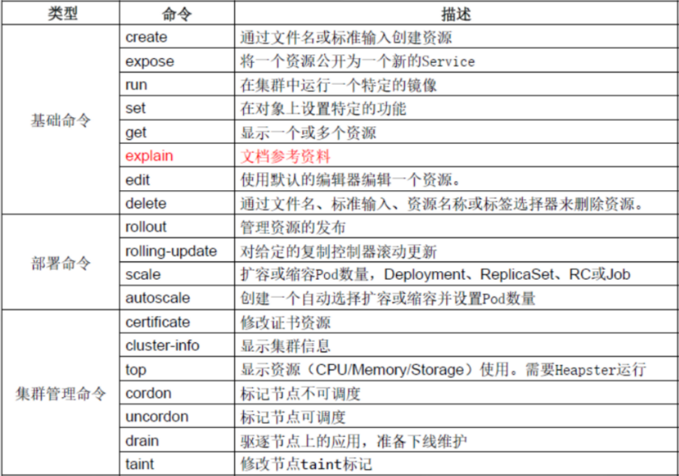
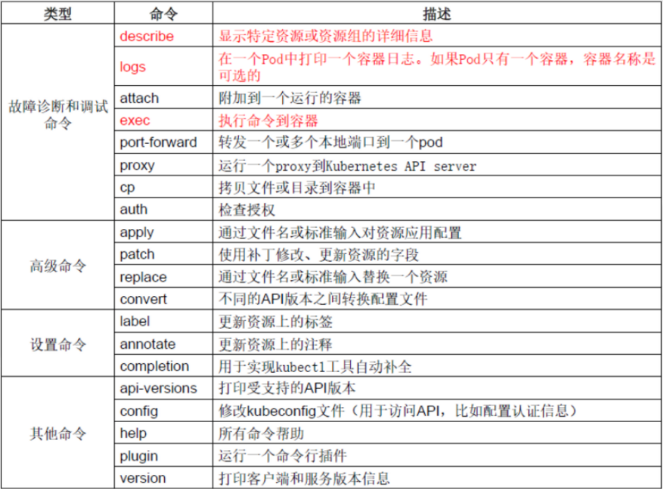

# 一、节点管理

## kubectl命令

集群中的管理操作几乎都可以使用`kubectl`命令完成	

```powershell
[root@master ~]# kubectl -h
```







## 查看集群信息

~~~powershell
[root@master1 ~]# kubectl cluster-info
Kubernetes master is running at https://192.168.122.11:6443
CoreDNS is running at https://192.168.122.11:6443/api/v1/namespaces/kube-system/services/kube-dns:dns/proxy
kubernetes-dashboard is running at https://192.168.122.11:6443/api/v1/namespaces/kube-system/services/https:kubernetes-dashboard:/proxy
Metrics-server is running at https://192.168.122.11:6443/api/v1/namespaces/kube-system/services/https:metrics-server:/proxy

To further debug and diagnose cluster problems, use 'kubectl cluster-info dump'.
~~~

## 查看节点信息

~~~powershell
[root@master1 ~]# kubectl get nodes
NAME             STATUS                     ROLES    AGE    VERSION
192.168.122.11   Ready,SchedulingDisabled   master   1h   v1.18.3
192.168.122.12   Ready,SchedulingDisabled   master   1h   v1.18.3
192.168.122.13   Ready                      node     1h   v1.18.3
192.168.122.14   Ready                      node     1h   v1.18.3
~~~

查看节点详细信息

~~~powershell
[root@master1 ~]# kubectl get nodes -o wide
NAME             STATUS                     ROLES    AGE    VERSION   INTERNAL-IP      EXTERNAL-IP   OS-IMAGE                KERNEL-VERSION          CONTAINER-RUNTIME
192.168.122.11   Ready,SchedulingDisabled   master   5d1h   v1.18.3   192.168.122.11   <none>        CentOS Linux 7 (Core)   3.10.0-957.el7.x86_64   docker://19.3.8
192.168.122.12   Ready,SchedulingDisabled   master   5d1h   v1.18.3   192.168.122.12   <none>        CentOS Linux 7 (Core)   3.10.0-957.el7.x86_64   docker://19.3.8
192.168.122.13   Ready                      node     5d1h   v1.18.3   192.168.122.13   <none>        CentOS Linux 7 (Core)   3.10.0-957.el7.x86_64   docker://19.3.8
192.168.122.14   Ready                      node     5d1h   v1.18.3   192.168.122.14   <none>        CentOS Linux 7 (Core)   3.10.0-957.el7.x86_64   docker://19.3.8
~~~

描述节点详细信息

~~~powershell
[root@master1 ~]# kubectl describe node 192.168.122.11
Name:               192.168.122.11
Roles:              master
Labels:             beta.kubernetes.io/arch=amd64
                    beta.kubernetes.io/os=linux
                    kubernetes.io/arch=amd64
                    kubernetes.io/hostname=192.168.122.11
                    kubernetes.io/os=linux
                    kubernetes.io/role=master
Annotations:        node.alpha.kubernetes.io/ttl: 0
                    volumes.kubernetes.io/controller-managed-attach-detach: true
CreationTimestamp:  Tue, 27 Oct 2020 22:14:11 +0800
Taints:             node.kubernetes.io/unschedulable:NoSchedule
Unschedulable:      true
Lease:
  HolderIdentity:  192.168.122.11
  AcquireTime:     <unset>
  RenewTime:       Sun, 01 Nov 2020 23:18:17 +0800
Conditions:
  Type             Status  LastHeartbeatTime                 LastTransitionTime                Reason                       Message
  ----             ------  -----------------                 ------------------                ------                       -------
  MemoryPressure   False   Sun, 01 Nov 2020 23:18:18 +0800   Tue, 27 Oct 2020 22:14:10 +0800   KubeletHasSufficientMemory   kubelet has sufficient memory available
  DiskPressure     False   Sun, 01 Nov 2020 23:18:18 +0800   Tue, 27 Oct 2020 22:14:10 +0800   KubeletHasNoDiskPressure     kubelet has no disk pressure
  PIDPressure      False   Sun, 01 Nov 2020 23:18:18 +0800   Tue, 27 Oct 2020 22:14:10 +0800   KubeletHasSufficientPID      kubelet has sufficient PID available
  Ready            True    Sun, 01 Nov 2020 23:18:18 +0800   Sun, 01 Nov 2020 22:39:43 +0800   KubeletReady                 kubelet is posting ready status
Addresses:
  InternalIP:  192.168.122.11
  Hostname:    192.168.122.11
Capacity:
  cpu:                8
  ephemeral-storage:  49999000Ki
  hugepages-2Mi:      0
  memory:             2046128Ki
  pods:               110
Allocatable:
  cpu:                8
  ephemeral-storage:  46079078324
  hugepages-2Mi:      0
  memory:             1329328Ki
  pods:               110
System Info:
  Machine ID:                 348039246418462d84e9bd84e70ea940
  System UUID:                D3A946C5-0059-407C-8D94-1F5321C29334
  Boot ID:                    54e7117f-e2ef-45b7-b851-2eb149650e07
  Kernel Version:             3.10.0-957.el7.x86_64
  OS Image:                   CentOS Linux 7 (Core)
  Operating System:           linux
  Architecture:               amd64
  Container Runtime Version:  docker://19.3.8
  Kubelet Version:            v1.18.3
  Kube-Proxy Version:         v1.18.3
PodCIDR:                      10.3.1.0/24
PodCIDRs:                     10.3.1.0/24
Non-terminated Pods:          (1 in total)
  Namespace                   Name                 CPU Requests  CPU Limits  Memory Requests  Memory Limits  AGE
  ---------                   ----                 ------------  ----------  ---------------  -------------  ---
  kube-system                 calico-node-tttlr    250m (3%)     0 (0%)      0 (0%)           0 (0%)         5d
Allocated resources:
  (Total limits may be over 100 percent, i.e., overcommitted.)
  Resource           Requests   Limits
  --------           --------   ------
  cpu                250m (3%)  0 (0%)
  memory             0 (0%)     0 (0%)
  ephemeral-storage  0 (0%)     0 (0%)
  hugepages-2Mi      0 (0%)     0 (0%)
Events:
  Type     Reason                   Age   From                        Message
  ----     ------                   ----  ----                        -------
  Normal   Starting                 41m   kube-proxy, 192.168.122.11  Starting kube-proxy.
  Normal   Starting                 39m   kubelet, 192.168.122.11     Starting kubelet.
  Normal   NodeHasSufficientMemory  39m   kubelet, 192.168.122.11     Node 192.168.122.11 status is now: NodeHasSufficientMemory
  Normal   NodeHasNoDiskPressure    39m   kubelet, 192.168.122.11     Node 192.168.122.11 status is now: NodeHasNoDiskPressure
  Normal   NodeHasSufficientPID     39m   kubelet, 192.168.122.11     Node 192.168.122.11 status is now: NodeHasSufficientPID
  Normal   NodeAllocatableEnforced  39m   kubelet, 192.168.122.11     Updated limits on kube reserved cgroup /podruntime.slice
  Normal   NodeAllocatableEnforced  39m   kubelet, 192.168.122.11     Updated Node Allocatable limit across pods
  Warning  Rebooted                 39m   kubelet, 192.168.122.11     Node 192.168.122.11 has been rebooted, boot id: 54e7117f-e2ef-45b7-b851-2eb149650e07
  Normal   NodeNotReady             39m   kubelet, 192.168.122.11     Node 192.168.122.11 status is now: NodeNotReady
  Normal   NodeNotSchedulable       39m   kubelet, 192.168.122.11     Node 192.168.122.11 status is now: NodeNotSchedulable
  Normal   NodeReady                38m   kubelet, 192.168.122.11     Node 192.168.122.11 status is now: NodeReady
~~~

## node节点管理集群

* **如果是kubeasz安装，所有节点(包括master与node)都已经可以对集群进行管理**


* 如果是kubeadm安装，在node节点上管理时会报如下错误

~~~powershell
[root@node1 ~]# kubectl get nodes
The connection to the server localhost:8080 was refused - did you specify the right host or port?
~~~

 只要把master上的管理文件`/etc/kubernetes/admin.conf`拷贝到node节点的`$HOME/.kube/config`就可以让node节点也可以实现kubectl命令管理

1, 在node节点的用户家目录创建`.kube`目录

~~~powershell
[root@node1 ~]# mkdir /root/.kube
~~~

2, 在master节点做如下操作

~~~powershell
[root@master ~]# scp /etc/kubernetes/admin.conf node1:/root/.kube/config
~~~

3, 在node节点验证

~~~powershell
[root@node1 ~]# kubectl get nodes
NAME     STATUS   ROLES    AGE    VERSION
master   Ready    master    2h    v1.15.1
node1    Ready    node      2h    v1.15.1
node2    Ready    node      2h    v1.15.1
~~~


## 节点标签(label)

* k8s集群如果由大量节点组成，可将节点打上对应的标签，然后通过标签进行筛选，查看

### 查看节点标签信息

~~~powershell
[root@master1 ~]# kubectl get node --show-labels
NAME             STATUS                     ROLES    AGE    VERSION   LABELS
192.168.122.11   Ready,SchedulingDisabled   master   5d1h   v1.18.3   beta.kubernetes.io/arch=amd64,beta.kubernetes.io/os=linux,kubernetes.io/arch=amd64,kubernetes.io/hostname=192.168.122.11,kubernetes.io/os=linux,kubernetes.io/role=master
192.168.122.12   Ready,SchedulingDisabled   master   5d1h   v1.18.3   beta.kubernetes.io/arch=amd64,beta.kubernetes.io/os=linux,kubernetes.io/arch=amd64,kubernetes.io/hostname=192.168.122.12,kubernetes.io/os=linux,kubernetes.io/role=master
192.168.122.13   Ready                      node     5d1h   v1.18.3   beta.kubernetes.io/arch=amd64,beta.kubernetes.io/os=linux,kubernetes.io/arch=amd64,kubernetes.io/hostname=192.168.122.13,kubernetes.io/os=linux,kubernetes.io/role=node
192.168.122.14   Ready                      node     5d1h   v1.18.3   beta.kubernetes.io/arch=amd64,beta.kubernetes.io/os=linux,kubernetes.io/arch=amd64,kubernetes.io/hostname=192.168.122.14,kubernetes.io/os=linux,kubernetes.io/role=node
~~~

### 设置节点标签信息

为节点`192.168.122.13`打一个`region=huanai` 的标签

~~~powershell
[root@master1 ~]# kubectl label node 192.168.122.13 region=huanai
node/192.168.122.13 labeled
~~~

查看所有节点标签

~~~powershell
[root@master1 ~]# kubectl get node --show-labels
NAME             STATUS                     ROLES    AGE    VERSION   LABELS
192.168.122.11   Ready,SchedulingDisabled   master   5d1h   v1.18.3   beta.kubernetes.io/arch=amd64,beta.kubernetes.io/os=linux,kubernetes.io/arch=amd64,kubernetes.io/hostname=192.168.122.11,kubernetes.io/os=linux,kubernetes.io/role=master
192.168.122.12   Ready,SchedulingDisabled   master   5d1h   v1.18.3   beta.kubernetes.io/arch=amd64,beta.kubernetes.io/os=linux,kubernetes.io/arch=amd64,kubernetes.io/hostname=192.168.122.12,kubernetes.io/os=linux,kubernetes.io/role=master
192.168.122.13   Ready                      node     5d1h   v1.18.3   beta.kubernetes.io/arch=amd64,beta.kubernetes.io/os=linux,kubernetes.io/arch=amd64,kubernetes.io/hostname=192.168.122.13,kubernetes.io/os=linux,kubernetes.io/role=node,region=huanai	  # 这里多了region=huanai
192.168.122.14   Ready                      node     5d1h   v1.18.3   beta.kubernetes.io/arch=amd64,beta.kubernetes.io/os=linux,kubernetes.io/arch=amd64,kubernetes.io/hostname=192.168.122.14,kubernetes.io/os=linux,kubernetes.io/role=node
~~~

查看所有节点带region的标签

~~~powershell
[root@master1 ~]# kubectl get nodes -L region
NAME             STATUS                     ROLES    AGE    VERSION   REGION
192.168.122.11   Ready,SchedulingDisabled   master   5d1h   v1.18.3
192.168.122.12   Ready,SchedulingDisabled   master   5d1h   v1.18.3
192.168.122.13   Ready                      node     5d1h   v1.18.3   huanai
192.168.122.14   Ready                      node     5d1h   v1.18.3
~~~


### 多维度标签

也可以加其它的多维度标签,用于不同的需要区分的场景

如把`192.168.122.14`标签为华南区,A机房,测试环境,游戏业务

~~~powershell
[root@master1 ~]# kubectl label node 192.168.122.14 zone=A env=test bussiness=game
node/192.168.122.14 labeled
~~~

~~~powershell
[root@master1 ~]# kubectl get nodes 192.168.122.14 --show-labels
NAME             STATUS   ROLES   AGE    VERSION   LABELS
192.168.122.14   Ready    node    5d1h   v1.18.3   beta.kubernetes.io/arch=amd64,beta.kubernetes.io/os=linux,bussiness=game,env=test,kubernetes.io/arch=amd64,kubernetes.io/hostname=192.168.122.14,kubernetes.io/os=linux,kubernetes.io/role=node,region=huanai,zone=A
~~~

显示节点的相应用标签

~~~powershell
[root@master1 ~]# kubectl get nodes -L region,zone
NAME             STATUS                     ROLES    AGE    VERSION   REGION   ZONE
192.168.122.11   Ready,SchedulingDisabled   master   5d1h   v1.18.3
192.168.122.12   Ready,SchedulingDisabled   master   5d1h   v1.18.3
192.168.122.13   Ready                      node     5d1h   v1.18.3   huanai
192.168.122.14   Ready                      node     5d1h   v1.18.3   huanai   A
~~~

查找`region=huanai`的节点

~~~powershell
[root@master1 ~]# kubectl get nodes -l region=huanai
NAME             STATUS   ROLES   AGE    VERSION
192.168.122.13   Ready    node    5d1h   v1.18.3
192.168.122.14   Ready    node    5d1h   v1.18.3
~~~

### **标签的修改**

~~~powershell
[root@master1 ~]# kubectl label node 192.168.122.14 bussiness=ad --overwrite=true
node/192.168.122.14 labeled
加上--overwrite=true覆盖原标签的value进行修改操作
~~~

~~~powershell
[root@master1 ~]# kubectl get nodes -L bussiness
NAME             STATUS                     ROLES    AGE    VERSION   BUSSINESS
192.168.122.11   Ready,SchedulingDisabled   master   5d1h   v1.18.3
192.168.122.12   Ready,SchedulingDisabled   master   5d1h   v1.18.3
192.168.122.13   Ready                      node     5d1h   v1.18.3
192.168.122.14   Ready                      node     5d1h   v1.18.3   ad
~~~


### **标签的删除**

使用key加一个减号的写法来取消标签

~~~powershell
[root@master1 ~]# kubectl label node 192.168.122.14 region- zone- env- bussiness-
node/192.168.122.14 labeled
~~~


### 标签选择器

标签选择器主要有2类:

* 等值关系: =, !=
* 集合关系: KEY in {VALUE1, VALUE2......}

~~~powershell
[root@master1 ~]# kubectl label node 192.168.122.13 bussiness=game
node/192.168.122.13 labeled
[root@master1 ~]# kubectl label node 192.168.122.14 bussiness=ad
node/192.168.122.14 labeled
~~~

~~~powershell
[root@master1 ~]# kubectl get node -l "bussiness in (game,ad)"
NAME             STATUS   ROLES   AGE    VERSION
192.168.122.13   Ready    node    5d1h   v1.18.3
192.168.122.14   Ready    node    5d1h   v1.18.3
~~~


**标签总结:** 

* k8s集群中, node是一种资源（后面还要学习很多的常见资源，如namespace,pod,deployment,service等)
* 很多资源类型都可以打标签

* 标签是为了更好的进行资源对象的相关选择与匹配


# 二、命名空间(namespace)

* Namespace是对一组资源和对象的抽象集合.
* 常见的 pod, service, deployment 等都是属于某一个namespace的（默认是 default）
* 不是所有资源都属于namespace，如nodes, persistent volume，namespace 等资源则不属于任何 namespace


## 查看namespace

~~~powershell
[root@master1 ~]# kubectl get namespaces       # namespaces可以简写为namespace或ns
NAME              STATUS   AGE
default           Active   130m			# 所有未指定Namespace的对象都会被默认分配在default命名空间
kube-node-lease   Active   130m			
kube-public       Active   130m			# 此命名空间下的资源可以被所有人访问
kube-system       Active   130m			# 所有由Kubernetes系统创建的资源都处于这个命名空间
~~~

## 查看namespace里的资源

**使用`kubectl get all --namespace=命名空间名称`可以查看此命名空间下的所有资源**

~~~powershell
[root@master1 ~]# kubectl get all --namespace=kube-system
NAME                                             READY   STATUS    RESTARTS   AGE
pod/calico-kube-controllers-7fdc86d8ff-cskfq     1/1     Running   3          5d1h
pod/calico-node-9dpc9                            1/1     Running   2          5d1h
pod/calico-node-jdmxw                            1/1     Running   3          5d1h
pod/calico-node-krwps                            1/1     Running   2          5d1h
pod/calico-node-tttlr                            1/1     Running   2          5d1h
pod/coredns-65dbdb44db-mm7cr                     1/1     Running   2          5d1h
pod/dashboard-metrics-scraper-545bbb8767-q66bc   1/1     Running   2          5d1h
pod/kubernetes-dashboard-65665f84db-nll6k        1/1     Running   4          5d1h
pod/metrics-server-869ffc99cd-8f4jd              1/1     Running   3          5d1h

NAME                                TYPE        CLUSTER-IP     EXTERNAL-IP   PORT(S)                  AGE
service/dashboard-metrics-scraper   ClusterIP   10.2.246.128   <none>        8000/TCP                 5d1h
service/kube-dns                    ClusterIP   10.2.0.2       <none>        53/UDP,53/TCP,9153/TCP   5d1h
service/kubernetes-dashboard        NodePort    10.2.213.30    <none>        443:21351/TCP            5d1h
service/metrics-server              ClusterIP   10.2.232.121   <none>        443/TCP                  5d1h

NAME                         DESIRED   CURRENT   READY   UP-TO-DATE   AVAILABLE   NODE SELECTOR                 AGE
daemonset.apps/calico-node   4         4         4       4            4           beta.kubernetes.io/os=linux   5d1h

NAME                                        READY   UP-TO-DATE   AVAILABLE   AGE
deployment.apps/calico-kube-controllers     1/1     1            1           5d1h
deployment.apps/coredns                     1/1     1            1           5d1h
deployment.apps/dashboard-metrics-scraper   1/1     1            1           5d1h
deployment.apps/kubernetes-dashboard        1/1     1            1           5d1h
deployment.apps/metrics-server              1/1     1            1           5d1h

NAME                                                   DESIRED   CURRENT   READY   AGE
replicaset.apps/calico-kube-controllers-7fdc86d8ff     1         1         1       5d1h
replicaset.apps/coredns-65dbdb44db                     1         1         1       5d1h
replicaset.apps/dashboard-metrics-scraper-545bbb8767   1         1         1       5d1h
replicaset.apps/kubernetes-dashboard-65665f84db        1         1         1       5d1h
replicaset.apps/metrics-server-869ffc99cd              1         1         1       5d1h

~~~

**使用`kubectl get 资源类型 --namespace=命名空间名称`可以查看此命名空间下的对应的资源**

~~~powershell
[root@master1 ~]# kubectl get pod --namespace=kube-system
NAME                                         READY   STATUS    RESTARTS   AGE
calico-kube-controllers-7fdc86d8ff-cskfq     1/1     Running   3          5d1h
calico-node-9dpc9                            1/1     Running   2          5d1h
calico-node-jdmxw                            1/1     Running   3          5d1h
calico-node-krwps                            1/1     Running   2          5d1h
calico-node-tttlr                            1/1     Running   2          5d1h
coredns-65dbdb44db-mm7cr                     1/1     Running   2          5d1h
dashboard-metrics-scraper-545bbb8767-q66bc   1/1     Running   2          5d1h
kubernetes-dashboard-65665f84db-nll6k        1/1     Running   4          5d1h
metrics-server-869ffc99cd-8f4jd              1/1     Running   3          5d1h
~~~


## 创建namespace 

### **命令创建**

~~~powershell
[root@master1 ~]# kubectl create namespace ns1
namespace/ns1 created

[root@master1 ~]# kubectl get ns
NAME              STATUS   AGE
default           Active   5d1h
kube-node-lease   Active   5d1h
kube-public       Active   5d1h
kube-system       Active   5d1h
ns1               Active   10s
~~~


### **YAML文件创建**

* k8s中几乎所有的资源都可以通这YAML编排来创建
* 可以使用`kubectl edit 资源类型 资源名`编辑资源的YAML语法

~~~powershell
[root@master1 ~]# kubectl edit namespace ns1
......
~~~

* 也可使用`kubectl get 资源类型 资源名 -o yaml`来查看

~~~powershell
[root@master1 ~]# kubectl get ns ns1 -o yaml
......
~~~

* ==**还可通过`kubectl explain 资源类型`来查看语法文档**== 

~~~powershell
[root@master1 ~]# kubectl explain namespace				   # 查看namespace相关语法参数
~~~

~~~powershell
[root@master1 ~]# kubectl explain namespace.metadata	   # 查看namespace下级metadata的相关语法参数
~~~

~~~powershell
[root@master1 ~]# kubectl explain namespace.metadata.name  # 查看namespace下级metadata再下级name的相关语法参数
~~~


编写创建namespace的YAML文件

~~~powershell
[root@master1 ~]# vim create_ns2.yml
apiVersion: v1							# api版本号
kind: Namespace							# 类型为namespace
metadata:								# 定义namespace的元数据属性
  name: ns2					    		# 定义name属性为ns2
~~~

使用`kubctl apply -f`应用YAML文件

~~~powershell
[root@master1 ~]# kubectl apply -f create_ns2.yml
namespace/ns2 created
~~~

~~~powershell
[root@master1 ~]# kubectl get ns
NAME              STATUS   AGE
default           Active   5d2h
kube-node-lease   Active   5d2h
kube-public       Active   5d2h
kube-system       Active   5d2h
ns1               Active   10m
ns2               Active   46s
~~~


## 删除namespace

**注意:** 

* 删除一个namespace会自动删除所有属于该namespace的资源(类似mysql中drop库会删除库里的所有表一样，请慎重操作)
* default,kube-system,kube-public命名空间不可删除

### **命令删除**

~~~powershell
[root@master1 ~]# kubectl delete namespace ns1
namespace "ns1" deleted
~~~

### **YAML文件删除**

~~~powershell
[root@master1 ~]# kubectl delete -f create_ns2.yml
namespace "ns2" deleted
~~~

~~~powershell
[root@master1 ~]# kubectl get ns
NAME              STATUS   AGE
default           Active   5d2h
kube-node-lease   Active   5d2h
kube-public       Active   5d2h
kube-system       Active   5d2h
~~~

1
