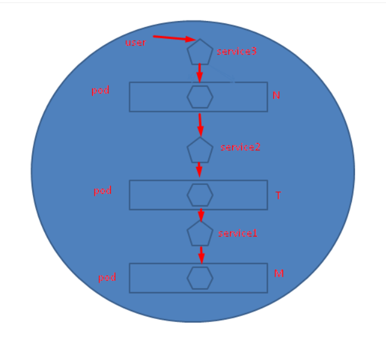
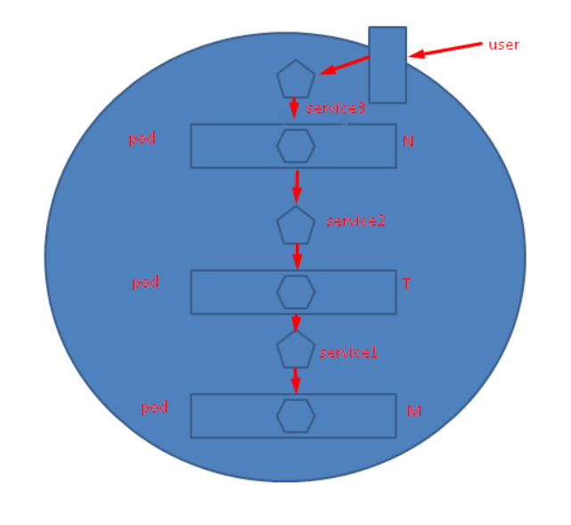
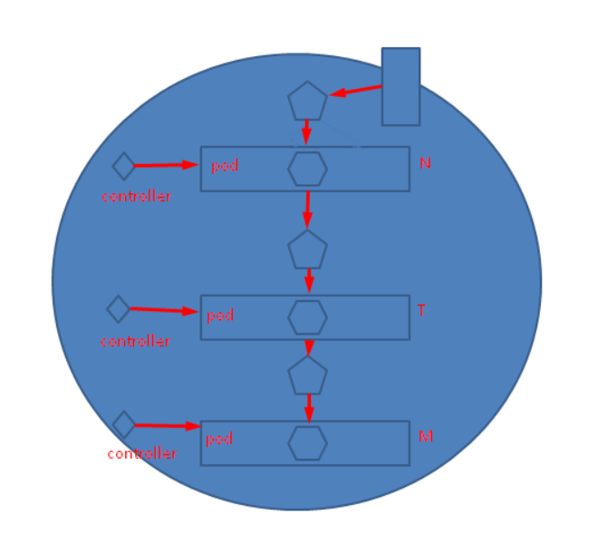
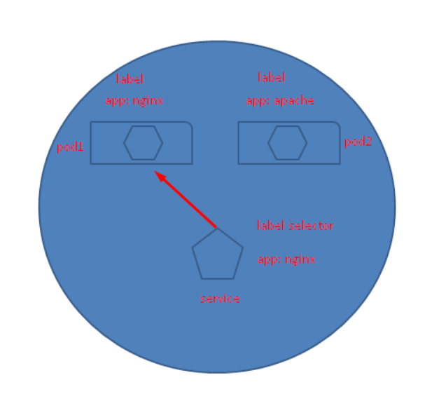
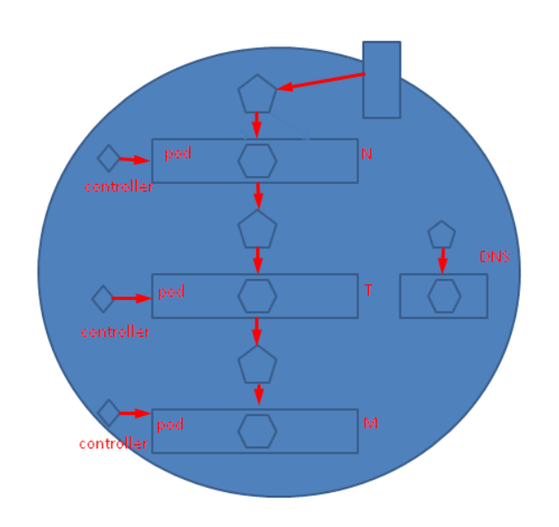

# 一、微服务架构

## 名词概念

 **pod**

- kubernetes集群最小调度或管理单元
- 用于封装容器

**controller**

* 用于控制pod的行为

**label**

给kubernetes资源对象打上标签,方便其它资源关联

**label selector**

指定关联的标签

**service**

- k8s中访问pod需要通过service
- service通过label selector找到打上对应标签的pod

**DNS**

* service和pod有时会需要通过名称来访问，而不是IP。这就需要用到dns

## 服务分层介绍

- LAMP  一台服务台安装 单服务架构
- LNMP 十台服务器安装 分层服务架构
- LNMP 使用容器进行分层，叫微服务架构

## 微服务架构组件之间的关系

> 使用kubernetes集群运行NMP或NMT

- 可以把Kubernetes集群看做是一个机房（IDC）
- 人访问N前面的service
- N访问T前面的service
- T访问M前面的service

## 内部用户访问

## 外部用户访问方法

* 可以通过添加边缘服务器将internet的客户访问转到k8s集群内部

## 控制器控制pod

## service与pod关联

service通过label与pod关联

## k8s集群内dns解析

