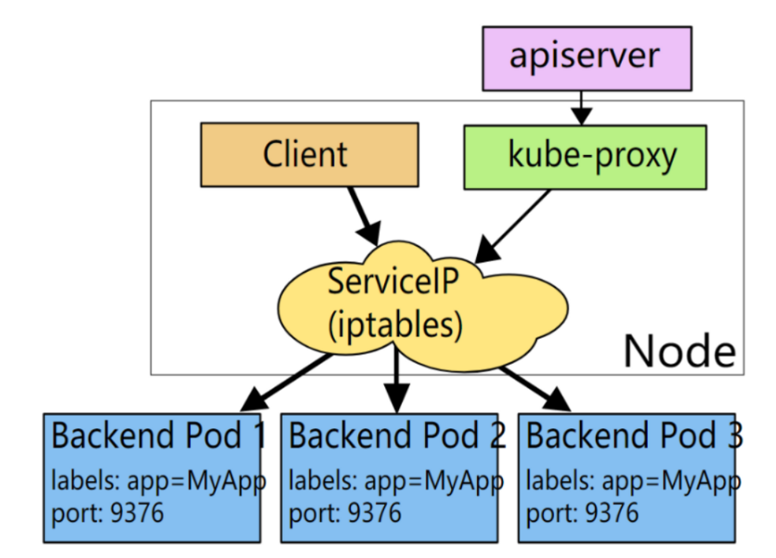
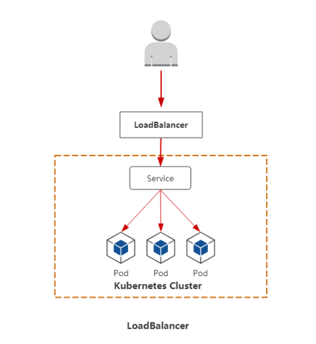

# 一、service

## service作用

- 通过service为pod客户端提供访问pod方法，即可客户端访问pod入口
- 通过标签动态感知pod IP地址变化等
- 防止pod失联
- 定义访问pod访问策略
- 通过label-selector相关联
- 通过Service实现Pod的负载均衡（TCP/UDP 4层）
- 底层实现主要通过iptables和IPVS二种网络模式

## service底层实现原理

* 底层流量转发与负载均衡实现均可以通过iptables或ipvs实现

**iptables实现**

**ipvs实现**

**对比**

Iptables：

- 灵活，功能强大（可以在数据包不同阶段对包进行操作）
- 规则遍历匹配和更新，呈线性时延

IPVS：

- 工作在内核态，有更好的性能
- 调度算法丰富：rr，wrr，lc，wlc，ip hash...

##  service类型

service类型分为:

- ClusterIP
  - 默认，分配一个集群内部可以访问的虚拟IP
- NodePort
  - 在每个Node上分配一个端口作为外部访问入口
- LoadBalancer
  - 工作在特定的Cloud Provider上，例如Google Cloud，AWS，OpenStack
- ExternalName
  - 表示把集群外部的服务引入到集群内部中来，即实现了集群内部pod和集群外部的服务进行通信

# 二、ClusterIP类型

## 普通ClusterIP类型

ClusterIP根据是否生成ClusterIP又可分为普通Service和Headless Service两类：

* 普通Service: 

  为Kubernetes的Service分配一个集群内部可访问的固定虚拟IP(Cluster IP), 通过iptables或ipvs实现负载均衡访问pod。

* Headless Service: 

  该服务不会分配Cluster IP, 也不通过kube-proxy做反向代理和负载均衡。而是通过DNS提供稳定的网络ID来访问，DNS会将headless service的后端直接解析为pod IP列表。

### 命令创建普通service

1, 准备YAML并创建deployment

~~~powershell
[root@master1 ~]# vim deployment-nginx.yml

apiVersion: apps/v1
kind: Deployment
metadata:
  name: deploy-nginx                   
spec:
  replicas: 2                                   # 使用2个副本
  selector:
    matchLabels:
      app: nginx                           
  template:                                   
    metadata:
      labels:
        app: nginx                             
    spec:
      containers:                             
      - name: nginx
        image: nginx:1.15-alpine
        imagePullPolicy: IfNotPresent
        ports:
        - containerPort: 80
~~~

~~~powershell
[root@master1 ~]# kubectl apply -f deployment-nginx.yml
deployment.apps/deploy-nginx created
~~~

2, 查看当前的service

~~~powershell
[root@master1 ~]# kubectl get services				# 或者使用svc简写
NAME         TYPE        CLUSTER-IP   EXTERNAL-IP   PORT(S)   AGE
kubernetes   ClusterIP   10.2.0.1     <none>        443/TCP   15h

默认只有kubernetes本身自己的services
~~~

3, 将名为nginx1的deployment映射端口

~~~powershell
[root@master1 ~]# kubectl expose deployment deploy-nginx --port=80 --target-port=80 --protocol=TCP
service/deploy-nginx exposed
~~~

说明: 

* 默认是`--type=ClusterIP`,也可以使用`--type="NodePort"`或`--type="ClusterIP"`

4, 验证

~~~powershell
[root@master1 ~]# kubectl get svc
NAME           TYPE        CLUSTER-IP    EXTERNAL-IP   PORT(S)   AGE
deploy-nginx   ClusterIP   10.2.148.99   <none>        80/TCP    23s
kubernetes     ClusterIP   10.2.0.1      <none>        443/TCP   5d20h
~~~

~~~powershell
[root@master1 ~]# kubectl get endpoints					# endpoints可简写为ep
NAME           ENDPOINTS                                 AGE
deploy-nginx   10.3.104.1:80,10.3.166.137:80             61s
kubernetes     192.168.122.11:6443,192.168.122.12:6443   5d20h
~~~

4, 访问(集群内部任意节点可访问) ,集群外部不可访问

~~~powershell
# curl 10.2.148.99
~~~

### YAML创建普通service

1, 直接使用上节内容创建的deployment，确认pod的标签为`app=nginx`

~~~powershell
[root@master1 ~]# kubectl get pods -l app=nginx
NAME                               READY   STATUS    RESTARTS   AGE
deployment-nginx-6fcfb67547-nv7dn   1/1     Running   0         22m
deployment-nginx-6fcfb67547-rqrcw   1/1     Running   0         22m
~~~

2, YAML编写ClusterIP类型service

~~~powershell
[root@master1 ~]# vim nginx_service.yml
apiVersion: v1
kind: Service
metadata: 
  name: my-service
  namespace: default
spec:
  clusterIP: 10.2.11.22		# 这个ip可以不指定，让它自动分配,需要与集群分配的网络对应
  type: ClusterIP			# ClusterIP类型,也是默认类型
  ports: 					# 指定service 端口及容器端口
  - port: 80				# service ip中的端口
    protocol: TCP
    targetPort: 80			# pod中的端口
  selector: 				# 指定后端pod标签(不是deployment的标签)
     app: nginx				# 表示此service关联app:nginx标签的pod
~~~

3, 应用YAML创建service

~~~powershell
[root@master1 ~]# kubectl apply -f nginx_service.yml
service/my-service created
~~~

4, 验证查看

~~~powershell
[root@master1 ~]# kubectl get svc
NAME           TYPE        CLUSTER-IP    EXTERNAL-IP   PORT(S)   AGE
deploy-nginx   ClusterIP   10.2.148.99   <none>        80/TCP    27m
kubernetes     ClusterIP   10.2.0.1      <none>        443/TCP   5d22h
my-service     ClusterIP   10.2.11.22    <none>        80/TCP    69s	IP对定义的对应了
~~~

~~~powershell
[root@master1 ~]# kubectl get pods -l app=nginx
NAME                               READY   STATUS    RESTARTS   AGE
deployment-nginx-6fcfb67547-nv7dn   1/1     Running   0         42m
deployment-nginx-6fcfb67547-rqrcw   1/1     Running   0         42m
~~~

5, 集群内节点访问验证

~~~powershell
# curl 10.2.11.22
集群内节点都可访问,集群外不可访问
~~~

### 验证负载均衡

**问题: 一共2个pod,那么访问的到底是哪一个呢?**

答案: 2个pod会负载均衡。

 1，两个pod里做成不同的主页方便测试负载均衡

~~~powershell
[root@master1 ~]# kubectl exec -it deployment-nginx-6fcfb67547-nv7dn -- /bin/sh
root@deployment-nginx-6fcfb67547-nv7dn:/# cd /usr/share/nginx/html/
root@deployment-nginx-6fcfb67547-nv7dn:/usr/share/nginx/html# echo web1 > index.html
root@deployment-nginx-6fcfb67547-nv7dn:/usr/share/nginx/html# exit
exit
~~~

~~~powershell
[root@master1 ~]# kubectl exec -it deployment-nginx-6fcfb67547-rqrcw -- /bin/sh
root@deployment-nginx-6fcfb67547-rqrcw:/# cd /usr/share/nginx/html/
root@deployment-nginx-6fcfb67547-rqrcw:/usr/share/nginx/html# echo web2 > index.html
root@deployment-nginx-6fcfb67547-rqrcw:/usr/share/nginx/html# exit
exit
~~~

2，测试

~~~powershell
# curl 10.2.11.22				# 多次访问有负载均衡

# curl 10.2.148.99				# 多次访问也有负载均衡，因为我两个service关联的是相同的两个pod
~~~

### sessionAffinity

设置sessionAffinity为Clientip  (类似nginx的ip_hash算法,lvs的source hash算法)

~~~powershell
[root@master1 ~]# kubectl patch svc my-service -p '{"spec":{"sessionAffinity":"ClientIP"}}'
service/my-service patched
~~~

测试

~~~powershell
# curl 10.2.11.22			# 多次访问,会话粘贴
~~~

设置回sessionAffinity为None

~~~powershell
[root@master1 ~]# kubectl patch svc my-service -p '{"spec":{"sessionAffinity":"None"}}'
service/my-service patched
~~~

测试

~~~powershell
# curl 10.2.11.22			# 多次访问,回到负载均衡
~~~

### 普通service的DNS解析

DNS服务监视Kubernetes API,为每一个Service创建DNS记录用于域名解析

**DNS记录格式为: <service-name>.<namespace-name>.svc.cluster.local**

1, 查看k8s的dns服务的IP

~~~powershell
[root@master1 ~]# kubectl get svc -n kube-system |grep dns
kube-dns                    ClusterIP   10.2.0.2       <none>        53/UDP,53/TCP,9153/TCP   5d23h
~~~

* 查询得到dns服务的IP为10.2.0.2

2, 查询服务的endpoints

~~~powershell
[root@master1 ~]# kubectl get endpoints
NAME           ENDPOINTS                                 AGE
deploy-nginx   10.3.104.1:80,10.3.166.137:80             173m
kubernetes     192.168.122.11:6443,192.168.122.12:6443   5d23h
my-service     10.3.104.1:80,10.3.166.137:80             76m
~~~

3，在node上验证dns解析

~~~powershell
[root@master1 ~]# nslookup deploy-nginx.default.svc.cluster.local 10.2.0.2
Server:         10.2.0.2
Address:        10.2.0.2#53

Name:   deploy-nginx.default.svc.cluster.local		deploy-nginx服务的域名
Address: 10.2.148.99					            deploy-nginx服务的service ip
~~~

~~~powershell
[root@master1 ~]# nslookup my-service.default.svc.cluster.local 10.2.0.2
Server:         10.2.0.2
Address:        10.2.0.2#53

Name:   my-service.default.svc.cluster.local		my-service服务的域名
Address: 10.2.11.22									my-service服务的service ip
~~~

注意:

* 在node上验证不能直接`curl my-service.default.svc.cluster.local`去访问，因为在node上操作，会默认走`/etc/resolv.conf` 里的DNS，而不是走k8s自己的DNS服务器，所以上面验证命令`nslookup`需要后面加上k8s自己的DNS服务器IP

* 在pod里就可以直接对service的域名进行操作了

4，在pod里验证dns解析

~~~powershell
[root@master1 ~]# kubectl run busybox sleep 1000000 --image=busybox
pod/busybox created

[root@master1 ~]# kubectl get pods
NAME                            READY   STATUS    RESTARTS   AGE
busybox                         1/1     Running   0          31s
deploy-nginx-55d5c89fc7-b66hc   1/1     Running   0          3h11m
deploy-nginx-55d5c89fc7-gzc46   1/1     Running   0          3h3m
~~~

~~~powershell
[root@master1 ~]# kubectl exec -it busybox -- /bin/sh
/ # ping my-service.default.svc.cluster.local.					# 直接可以通过域名解析到service-IP
PING my-service.default.svc.cluster.local. (10.2.11.22): 56 data bytes
64 bytes from 10.2.11.22: seq=0 ttl=64 time=0.122 ms
64 bytes from 10.2.11.22: seq=1 ttl=64 time=0.076 ms
~~~

因为busybox镜像里没有curl和yum命令，所以用wget通过域名下载pod的主页，也是OK的

~~~powershell
[root@master1 ~]# kubectl exec -it busybox -- /bin/sh
/ # wget my-service.default.svc.cluster.local./index.html     
Connecting to my-service.default.svc.cluster.local. (10.2.11.22:80)
saving to 'index.html'
index.html           100% |*******************************************|     5  0:00:00 ETA
'index.html' saved
/ # cat index.html
web2

/ # rm index.html -rf

/ # wget my-service.default.svc.cluster.local./index.html
Connecting to my-service.default.svc.cluster.local. (10.2.11.22:80)
saving to 'index.html'
index.html           100% |********************************************|     5  0:00:00 ETA
'index.html' saved
/ # cat index.html
web1
~~~

结论: 

* dns返回的结果为service的IP，而不是pod的IP
* 也就是说客户访问dns，解析为service的IP，再通过iptables或ipvs负载均衡到pod

### iptables与ipvs调度方式修改

* 在kubeasz安装时，默认现在指定为ipvs调度模式了，如果要改成iptables模式，操作如下

~~~powershell
[root@master1 ~]# systemctl cat kube-proxy  |grep  proxy-mode
  --proxy-mode=ipvs				# 这个参数是ipvs
~~~

~~~powershell
# vim /etc/systemd/system/kube-proxy.service
--proxy-mode=iptables			# k8s集群所有节点都将此参数由ipvs改成iptables
~~~

改完之后，重启kube-proxy服务无法直接生效，需要把整个k8s集群重启。

注意: 测试完后，请再改回成ipvs模式，重启集群生效。

* 如果是kubeadm安装，那么默认为iptables调度模式，则可使用下面的方式修改

1, 修改kube-proxy的配置文件

~~~powershell
[root@master ~]# kubectl edit configmap kube-proxy -n kube-system
     26     iptables:
     27       masqueradeAll: false
     28       masqueradeBit: 14
     29       minSyncPeriod: 0s
     30       syncPeriod: 30s
     31     ipvs:
     32       excludeCIDRs: null
     33       minSyncPeriod: 0s
     34       scheduler: ""					   # 可以在这里修改ipvs的算法,默认为rr轮循算法
     35       strictARP: false
     36       syncPeriod: 30s
     37     kind: KubeProxyConfiguration
     38     metricsBindAddress: 127.0.0.1:10249
     39     mode: "ipvs"							# 默认""号里为空,加上ipvs
~~~

2, 查看kube-system的namespace中kube-proxy有关的pod

~~~powershell
[root@master ~]# kubectl get pods -n kube-system |grep kube-proxy
kube-proxy-22x22                        1/1     Running   2          3d20h
kube-proxy-wk77n                        1/1     Running   2          3d19h
kube-proxy-wnrmr                        1/1     Running   2          3d19h
~~~

3, 验证kube-proxy-xxx的pod中的信息

4, 删除kube-proxy-xxx的所有pod，让它重新拉取新的kube-proxy-xxx的pod

~~~powershell
[root@master ~]# kubectl delete pod kube-proxy-22x22 -n kube-system
pod "kube-proxy-22x22" deleted
[root@master ~]# kubectl delete pod kube-proxy-wk77n -n kube-system
pod "kube-proxy-wk77n" deleted
[root@master ~]# kubectl delete pod kube-proxy-wnrmr -n kube-system
pod "kube-proxy-wnrmr" deleted
~~~

~~~powershell
[root@master ~]# kubectl get pods -n kube-system |grep kube-proxy
kube-proxy-224rc                        1/1     Running   0          22s
kube-proxy-8rrth                        1/1     Running   0          35s
kube-proxy-n2f68                        1/1     Running   0          6s
~~~

5, 随意查看其中1个或3个kube-proxy-xxx的pod,验证是否为IPVS方式了

6, 安装ipvsadm查看规则

~~~powershell
[root@master ~]# yum install ipvsadm -y

[root@master ~]# ipvsadm -Ln
IP Virtual Server version 1.2.1 (size=4096)
Prot LocalAddress:Port Scheduler Flags
  -> RemoteAddress:Port           Forward Weight ActiveConn InActConn
......
TCP  10.2.11.22:80 rr
  -> 10.3.1.61:80                 Masq    1      0          0
  -> 10.3.2.67:80                 Masq    1      0          0
......
~~~

7, 再次验证,就是标准的rr算法了

~~~powershell
[root@master ~]# curl 10.2.11.22		# 多次访问,rr轮循
~~~

## headless service

普通的ClusterIP service是service name解析为cluster ip,然后cluster ip对应到后面的pod ip

而无头service是指service name 直接解析为后面的pod ip

### 创建headless service

1, 编写YAML文件

~~~powershell
[root@master1 ~]# vim headless-service.yml
apiVersion: v1
kind: Service
metadata:
  name: headless-service
  namespace: default
spec:
  clusterIP: None                       # None就代表是无头service
  type: ClusterIP                       # ClusterIP类型,也是默认类型
  ports:                                # 指定service 端口及容器端口
  - port: 80                            # service ip中的端口
    protocol: TCP
    targetPort: 80                      # pod中的端口
  selector:                             # 指定后端pod标签
     app: nginx           				# 表示此service关联app:nginx标签的pod
~~~

2, 应用YAML文件创建无头服务

~~~powershell
[root@master1 ~]# kubectl apply -f headless-service.yml
service/headless-service created
~~~

3, 验证

~~~powershell
[root@master1 ~]# kubectl get svc
NAME               TYPE        CLUSTER-IP    EXTERNAL-IP   PORT(S)   AGE
deploy-nginx       ClusterIP   10.2.148.99   <none>        80/TCP    3h5m
headless-service   ClusterIP   None          <none>        80/TCP    6s
kubernetes         ClusterIP   10.2.0.1      <none>        443/TCP   5d23h
my-service         ClusterIP   10.2.11.22    <none>        80/TCP    88m

可以看到headless-service没有CLUSTER-IP,用None表示
~~~

### headless service的DNS解析

1, 查看kube-dns服务的IP

~~~powershell
[root@master1 ~]# kubectl get svc -n kube-system |grep dns
kube-dns                    ClusterIP   10.2.0.2       <none>        53/UDP,53/TCP,9153/TCP   5d23h
~~~

2, 能过DNS服务地址查找无头服务的dns解析

~~~powershell
[root@master1 ~]# nslookup headless-service.default.svc.cluster.local 10.2.0.2
Server:         10.2.0.2
Address:        10.2.0.2#53

Name:   headless-service.default.svc.cluster.local
Address: 10.3.166.137
Name:   headless-service.default.svc.cluster.local
Address: 10.3.104.1
~~~

3, 验证pod的IP

~~~powershell
[root@master1 ~]# kubectl get pods -o wide
NAME                            READY   STATUS    RESTARTS   AGE     IP             NODE             NOMINATED NODE   READINESS GATES
deploy-nginx-6c9764bb69-7t77p   1/1     Running   0          3h10m   10.3.104.1     192.168.122.14   <none>           <none>
deploy-nginx-6c9764bb69-crs5s   1/1     Running   0          3h10m   10.3.166.137   192.168.122.13   <none>           <none>

可以看到pod的IP与上面dns解析的IP是一致的
~~~

结论:

* 普通service的域名由dns解析为service IP, 要访问哪个pod，是由iptables或ipvs规则决定
* headless service的域名是直接解析给后端的多个POD

### headless service应用讨论

* headless主要可用于配合statefulset来部署有状态的服务

* 部署一些集群类型的服务，如mysql集群。它们之间需要互相识别身份。

* statefulset为每个pod分配一个域名,格式为<PodName>.<service name>.<namespace name>.svc.cluster.local.

* 每个pod都有域名，配合headless service服务可实现对不同的pod进行身份绑定与识别

# 三、NodePort类型

集群外访问：用户->域名->负载均衡器(后端服务器)->NodeIP:Port（service IP）->Pod IP：端口

### clusterIP修改成nodeport

1, 查看当前service与pod

~~~powershell
[root@master1 ~]# kubectl get svc
NAME               TYPE        CLUSTER-IP    EXTERNAL-IP   PORT(S)   AGE
deploy-nginx       ClusterIP   10.2.148.99   <none>        80/TCP    24h
headless-service   ClusterIP   None          <none>        80/TCP    21h
kubernetes         ClusterIP   10.2.0.1      <none>        443/TCP   6d21h
my-service         ClusterIP   10.2.11.22    <none>        80/TCP    23h
~~~

2, 将my-service这个service的TYPE由ClusterIP改为NodePort

~~~powershell
[root@master1 ~]# kubectl edit service my-service

......
spec:
  clusterIP: 10.2.11.22
  ports:
  - port: 80
    protocol: TCP
    targetPort: 80					
  selector:
    app: nginx
  sessionAffinity: None
  type: NodePort					这里由ClusterIP改为NodePort后保存退出,注意大小写
status:
  loadBalancer: {}
~~~

或者使用下面命令修改

~~~powershell
[root@master1 ~]# kubectl patch service my-service -p '{"spec":{"type":"NodePort"}}'
~~~

说明:

* NodePort: 集群外部机器可访问的端口(访问集群中任意节点中的此端口都可以)
* Port: 集群内其他pod访问本pod需要的一个端口，如nginx的pod访问mysql的pod

* targetPort: 容器的最终访问端口，与制作容器时暴露的端口一致（DockerFile中的EXPOSE)

3, 验证修改后的service

~~~powershell
[root@master1 ~]# kubectl get svc
NAME               TYPE        CLUSTER-IP    EXTERNAL-IP   PORT(S)        AGE
deploy-nginx       ClusterIP   10.2.148.99   <none>        80/TCP         24h
headless-service   ClusterIP   None          <none>        80/TCP         21h
kubernetes         ClusterIP   10.2.0.1      <none>        443/TCP        6d21h
my-service         NodePort    10.2.11.22    <none>        80:27785/TCP   23h

注意: my-service后面的TYPE为NodePort了,向外网暴露的端口为27785
~~~

4,  在集群外部主机(这里使用hostos宿主机模拟),使用`http://集群任意节点IP:27785`来访问就可以了

~~~powershell
[root@master1 ~]# kubectl get ep |grep my-service
my-service         10.3.104.2:80,10.3.166.130:80        23h	  

my-service对应这2个nginx的pod
~~~

~~~powershell
[root@hostos ~]# curl 192.168.122.11:27785
[root@hostos ~]# curl 192.168.122.12:27785
[root@hostos ~]# curl 192.168.122.13:27785
[root@hostos ~]# curl 192.168.122.14:27785

集群外访问集群任意节点的27785,都可以访问到pod
~~~

### YAML创建NodePort

1, 删除my-service，重新用YAML创建

~~~powershell
[root@master1 ~]# kubectl delete svc my-service
service "my-service" deleted
~~~

2，编写YAML并创建nodeport类型service

~~~powershell
[root@master1 ~]# vim my-service.yml
apiVersion: v1
kind: Service
metadata:
  name: my-service
  namespace: default
spec:
  type: NodePort                        # NodePort类型
  ports:
  - port: 80                            # 集群内部使用，pod与pod之间访问的端口
    protocol: TCP
    targetPort: 80                      # pod中的暴露端口
    nodePort: 30000                     # 所有的节点都会开放此端口，此端口供集群外部调用
  selector:                             # 指定后端pod标签(不是deployment的标签)
     app: nginx                         # 表示此service关联app:nginx标签的pod
~~~

~~~powershell
[root@master1 ~]# kubectl apply -f my-service.yml
service/my-service created
~~~

3, 验证

~~~powershell
[root@master1 ~]# kubectl get svc
NAME               TYPE        CLUSTER-IP    EXTERNAL-IP   PORT(S)        AGE
deploy-nginx       ClusterIP   10.2.148.99   <none>        80/TCP         24h
headless-service   ClusterIP   None          <none>        80/TCP         21h
kubernetes         ClusterIP   10.2.0.1      <none>        443/TCP        6d21h
my-service         NodePort    10.2.52.46    <none>        80:30000/TCP   19s
这次YAML没有使用clusterIP参数来指定IP(所以随机为10.2.52.46)，但使用nodePort: 30000来指定端口
~~~

~~~powershell
[root@hostos ~]# curl 192.168.122.11:30000
[root@hostos ~]# curl 192.168.122.12:30000
[root@hostos ~]# curl 192.168.122.13:30000
[root@hostos ~]# curl 192.168.122.14:30000

集群外访问集群任意节点的27785,都可以访问到pod
~~~

**补充:** 

* 可考虑搭建一个nginx负载均衡器来调度以上所有节点的30000端口
* 此nginx有一个公网IP，还有一个内网IP与K8S集群同网络，则可以实现客户从公网IP访问进来

下面两张图就是分别使用nginx与ipvsadm来模拟的负载均衡器案例:

# 四、loadbalancer类型

集群外访问：用户--> 域名-->  云服务提供端提供LB--> NodeIP:Port(service IP) -->   Pod IP：端口

* K8s没有为物理集群提供loadbalancer类型的service
* k8s附带的loadbalancer的实现都是调用各种IaaS平台（GCP，AWS，Azure等）

参考: https://help.aliyun.com/document_detail/181517.html?spm=5176.13910061.sslink.36.4e9651a23FifhV

* metalLB方案解决了这种问题，使k8s物理集群也能使用loadbalancer类型的service

### metalLB解决方案

参考:  https://metallb.universe.tf/installation/

1, 首先要确定为ipvs调度模式，而不是iptables调度。(此条件已经满足)

2,  下载YAML文件

~~~powershell
[root@master1 ~]# mkdir metallb
[root@master1 ~]# cd metallb/
[root@master1 metallb]# wget https://raw.githubusercontent.com/metallb/metallb/v0.9.4/manifests/namespace.yaml
[root@master1 metallb]# wget https://raw.githubusercontent.com/metallb/metallb/v0.9.4/manifests/metallb.yaml
~~~

说明: 如果`raw.githubusercontent.com`网站下不了，请在`/etc/hosts`添加DNS绑定

~~~powershell
[root@master1 ~]# vim /etc/hosts
199.232.4.133 raw.githubusercontent.com
~~~

3，应用YAML创建namespace

~~~powershell
[root@master1 metallb]# kubectl apply -f namespace.yaml
namespace/metallb-system created

[root@master1 metallb]# kubectl get ns |grep metallb-system
metallb-system    Active   16s
~~~

4, 创建secret

~~~powershell
[root@master1 metalb]# kubectl create secret generic -n metallb-system memberlist --from-literal=secretkey="$(openssl rand -base64 128)"
~~~

说明: 

* secret是一种存放密文的存储方式

* 这里要先创建，再做下面一步，否则pod启动不了，会`Error: secret "memberlist" not found`错误

4，创建相关pod等资源

~~~powershell
[root@master1 metallb]# kubectl apply -f metallb.yaml
podsecuritypolicy.policy/controller created
podsecuritypolicy.policy/speaker created
serviceaccount/controller created
serviceaccount/speaker created
clusterrole.rbac.authorization.k8s.io/metallb-system:controller created
clusterrole.rbac.authorization.k8s.io/metallb-system:speaker created
role.rbac.authorization.k8s.io/config-watcher created
role.rbac.authorization.k8s.io/pod-lister created
clusterrolebinding.rbac.authorization.k8s.io/metallb-system:controller created
clusterrolebinding.rbac.authorization.k8s.io/metallb-system:speaker created
rolebinding.rbac.authorization.k8s.io/config-watcher created
rolebinding.rbac.authorization.k8s.io/pod-lister created
daemonset.apps/speaker created
deployment.apps/controller created
~~~

说明: `metallb.yaml`文件里有定义两个镜像，下载可能较慢

~~~powershell
[root@master1 metallb]# kubectl get pods -n metallb-system                                                     NAME                          READY   STATUS    RESTARTS   AGE
controller-5854d49f77-kjzgv   1/1     Running   0          49s
speaker-fhdg9                 1/1     Running   0          49s
speaker-jxx9n                 1/1     Running   0          50s
speaker-pttlq                 1/1     Running   0          49s
speaker-wh4sh                 1/1     Running   0          48s
~~~

5, 编写YAML并创建configMap(一种存放明文文件的存储方式)

~~~powershell
[root@master1 metallb]# vim metallb-configmap.yml
apiVersion: v1
kind: ConfigMap
metadata:
  namespace: metallb-system
  name: config
data:
  config: |
    address-pools:
    - name: my-ip-space
      protocol: layer2										这里是2层网络
      addresses:
      - 192.168.122.100-192.168.122.200						分配的IP网段,和k8s集群物理网卡同网段

[root@master1 metallb]# kubectl apply -f metallb-configmap.yml
configmap/config created
~~~

6, 编写一个应用YAML使用LoadBanlancer类型service,并创建 

~~~powershell
[root@master1 metalb]# vim deploy-metallb.yml
apiVersion: apps/v1
kind: Deployment
metadata:
  name: deploy-nginx
  namespace: metallb-system
spec:
  replicas: 2
  selector:
    matchLabels:
      app: nginx
  template:
    metadata:
      labels:
        app: nginx
    spec:
      containers:
      - name: nginx
        image: nginx:1.15-alpine
        imagePullPolicy: IfNotPresent
        ports:
        - containerPort: 80
---
apiVersion: v1
kind: Service
metadata:
  name: svc1
  namespace: metallb-system
spec:
  type: LoadBalancer				# 类型为LoadBalancer
  ports:
  - port: 80
    targetPort: 80
  selector:
    app: nginx
~~~

~~~powershell
[root@master1 metallb]# kubectl apply -f deploy-metallb.yml
deployment.apps/deploy-nginx created
service/svc1 created
~~~

7, 验证创建好的service,pod与IP

~~~powershell
[root@master1 metallb]# kubectl get svc -n metallb-system
NAME   TYPE           CLUSTER-IP   EXTERNAL-IP       PORT(S)        AGE
svc1   LoadBalancer   10.2.57.24   192.168.122.100   80:26649/TCP   77s			注意192.168.122.100就是分配的IP

[root@master1 metalb]# kubectl get pods -o wide -n metallb-system |grep deploy-nginx
deploy-nginx-6c9764bb69-6gt95   1/1     Running   0    1m   10.3.104.20      192.168.122.14   <none>    <none>
deploy-nginx-6c9764bb69-cd92w   1/1     Running   0    1m   10.3.104.21      192.168.122.14   <none>    <none>
~~~

~~~powershell
[root@master1 ~]# ip a |grep 192.168.122.100
    inet 192.168.122.100/32 brd 192.168.122.100 scope global kube-ipvs0
[root@master2 ~]# ip a |grep 192.168.122.100
    inet 192.168.122.100/32 brd 192.168.122.100 scope global kube-ipvs0
[root@node1 ~]# ip a |grep 192.168.122.100
    inet 192.168.122.100/32 brd 192.168.122.100 scope global kube-ipvs0
[root@node1 ~]# ip a |grep 192.168.122.100
    inet 192.168.122.100/32 brd 192.168.122.100 scope global kube-ipvs0 			k8s集群节点上都有分配此IP
~~~

8， 验证负载均衡

~~~powershell
[root@master1 ~]# kubectl exec -it deploy-nginx-6c9764bb69-6gt95 -n metallb-system -- /bin/sh
/ # echo web1 > /usr/share/nginx/html/index.html
/ # exit

[root@master1 ~]# kubectl exec -it deploy-nginx-6c9764bb69-cd92w -n metallb-system -- /bin/sh
/ # echo web2 > /usr/share/nginx/html/index.html
/ # exit
~~~

客户端(这里用hostos模拟)访问验证

~~~powershell
[root@hostos ~]# curl 192.168.122.100
web2
[root@hostos ~]# curl 192.168.122.100
web1
[root@hostos ~]# curl 192.168.122.100
web2
[root@hostos ~]# curl 192.168.122.100
web1
结果有负载均衡
~~~

# 五、ExternalName

- 把集群外部的服务引入到集群内部中来，实现了集群内部pod和集群外部的服务进行通信
- ExternalName 类型的服务适用于外部服务使用域名的方式，缺点是不能指定端口
- 还有一点要注意: 集群内的Pod会继承Node上的DNS解析规则。所以只要Node可以访问的服务，Pod中也可以访问到, 这就实现了集群内服务访问集群外服务

### 将公网域名引入

1, 编写YAML文件

~~~powershell
[root@master ~]# vim externelname.yml

apiVersion: v1
kind: Service
metadata:
  name: my-externalname
  namespace: default
spec:
  type: ExternalName
  externalName: www.baidu.com                  # 对应的外部域名为www.baidu.com

~~~

2, 应用YAML文件

~~~powershell
[root@master1 ~]# kubectl apply -f externelname.yml
service/my-externalname created
~~~

3, 查看service

~~~powershell
[root@master1 ~]# kubectl get svc |grep exter
my-externalname    ExternalName   <none>         www.baidu.com   <none>         69s
~~~

4, 查看my-service的dns解析

~~~powershell
[root@master1 ~]# dig -t A my-externalname.default.svc.cluster.local. @10.2.0.2

; <<>> DiG 9.9.4-RedHat-9.9.4-72.el7 <<>> -t A my-externalname.default.svc.cluster.local. @10.2.0.2
;; global options: +cmd
;; Got answer:
;; ->>HEADER<<- opcode: QUERY, status: NOERROR, id: 31378
;; flags: qr aa rd; QUERY: 1, ANSWER: 4, AUTHORITY: 0, ADDITIONAL: 1
;; WARNING: recursion requested but not available

;; OPT PSEUDOSECTION:
; EDNS: version: 0, flags:; udp: 4096
;; QUESTION SECTION:
;my-externalname.default.svc.cluster.local. IN A

;; ANSWER SECTION:
my-externalname.default.svc.cluster.local. 5 IN CNAME www.baidu.com.
www.baidu.com.          5       IN      CNAME   www.a.shifen.com.
www.a.shifen.com.       5       IN      A       14.215.177.38			解析的是百度的IP
www.a.shifen.com.       5       IN      A       14.215.177.39			解析的是百度的IP

;; Query time: 32 msec
;; SERVER: 10.2.0.2#53(10.2.0.2)
;; WHEN: Thu Nov 05 11:23:41 CST 2020
;; MSG SIZE  rcvd: 245
~~~

~~~powershell
[root@master1 ~]# kubectl exec -it deploy-nginx-6c9764bb69-86gwj -- /bin/sh
/ # nslookup www.baidu.com
......
Name:      www.baidu.com
Address 1: 14.215.177.39
Address 2: 14.215.177.38

/ # nslookup my-externalname.default.svc.cluster.local		   
......
Name:      my-externalname.default.svc.cluster.local
Address 1: 14.215.177.38
Address 2: 14.215.177.39
~~~

解析此`my-externalname.default.svc.cluster.local`域名和解析`www.baidu.com`是一样的结果

### 不同namespace服务名引入

1， 创建ns1命名空间和相关deploy, pod,service

~~~powershell
[root@master1 ~]# vim ns1-nginx.yml
apiVersion: v1                                                  
kind: Namespace                                                 
metadata:                                                             
  name: ns1                                                     # 创建ns1命名空间
---
apiVersion: apps/v1
kind: Deployment
metadata:
  name: deploy-nginx                    
  namespace: ns1												# 属于ns1命名空间
spec:
  replicas: 1                                  
  selector:
    matchLabels:
      app: nginx                                
  template:                                        
    metadata:
      labels:
        app: nginx                             
    spec:
      containers:                              
      - name: nginx
        image: nginx:1.15-alpine
        imagePullPolicy: IfNotPresent
        ports:
        - containerPort: 80
---
apiVersion: v1
kind: Service
metadata:
  name: svc1								# 服务名
  namespace: ns1							# 属于ns1命名空间
spec:
  selector:
    app: nginx
  clusterIP: None                       	# 无头service
  ports:
  - port: 80                         
    targetPort: 80                  
---
kind: Service
apiVersion: v1
metadata:
  name: external-svc1
  namespace: ns1							#  属于ns1命名空间
spec:
  type: ExternalName
  externalName: svc2.ns2.svc.cluster.local	 # 将ns2空间的svc2服务引入到ns1命名空间
~~~

~~~powershell
[root@master1 ~]# kubectl apply -f ns1-nginx.yml
namespace/ns1 created
deployment.apps/deploy-nginx created
service/svc1 created

~~~

2， 创建ns2命名空间和相关deploy, pod,service

~~~powershell
[root@master1 ~]# vim ns1-nginx.yml
apiVersion: v1                                                  
kind: Namespace                                                 
metadata:                                                             
  name: ns2                                                     # 创建ns2命名空间
---
apiVersion: apps/v1
kind: Deployment
metadata:
  name: deploy-nginx                    
  namespace: ns2												# 属于ns2命名空间
spec:
  replicas: 1                                  
  selector:
    matchLabels:
      app: nginx                                
  template:                                        
    metadata:
      labels:
        app: nginx                             
    spec:
      containers:                              
      - name: nginx
        image: nginx:1.15-alpine
        imagePullPolicy: IfNotPresent
        ports:
        - containerPort: 80
---
apiVersion: v1
kind: Service
metadata:
  name: svc2								# 服务名
  namespace: ns2							# 属于ns2命名空间
spec:
  selector:
    app: nginx
  clusterIP: None                       	# 无头service
  ports:
  - port: 80                         
    targetPort: 80                  
---
kind: Service
apiVersion: v1
metadata:
  name: external-svc2
  namespace: ns2							#  属于ns2命名空间
spec:
  type: ExternalName
  externalName: svc1.ns1.svc.cluster.local	 # 将ns1空间的svc1服务引入到ns2命名空间
~~~

~~~powershell
[root@master1 ~]# kubectl apply -f ns2-nginx.yml
namespace/ns2 created
deployment.apps/deploy-nginx created
service/svc2 created
service/external-svc2 created
~~~

3,  在ns1命名空间的pod里验证

~~~powershell
[root@master1 ~]# kubectl get pods -n ns1
NAME                            READY   STATUS    RESTARTS   AGE
deploy-nginx-6c9764bb69-g5xl8   1/1     Running   0          8m10s
~~~

~~~powershell
[root@master1 ~]# kubectl exec -it -n ns1 deploy-nginx-6c9764bb69-g5xl8 -- /bin/sh
/ # nslookup svc1
......
Name:      svc1
Address 1: 10.3.166.140 deploy-nginx-6c9764bb69-g5xl8		IP与ns1里的podIP一致(见下面的查询结果)

/ # nslookup svc2.ns2.svc.cluster.local
.....
Name:      svc2.ns2.svc.cluster.local
Address 1: 10.3.104.17 10-3-104-17.svc2.ns2.svc.cluster.local	IP与ns2里的podIP一致(见下面的查询结果)

/ # nslookup external-svc1.ns1.svc.cluster.local.	# 将ns2里的svc2服务引到了ns1里的名字，也可以访问

Name:      external-svc1.ns1.svc.cluster.local.
Address 1: 10.3.166.169 10-3-166-169.svc2.ns2.svc.cluster.local

/ # exit

~~~

~~~powershell
[root@master1 ~]# kubectl get pods -o wide -n ns1
NAME                            READY   STATUS    RESTARTS   AGE   IP             NODE             NOMINATED NODE   READINESS GATES
deploy-nginx-6c9764bb69-g5xl8   1/1     Running   0          70m   10.3.166.140   192.168.122.13   <none>           <none>
~~~

~~~powershell
[root@master1 ~]# kubectl get pods -o wide -n ns2
NAME                            READY   STATUS    RESTARTS   AGE   IP            NODE             NOMINATED NODE   READI            NESS GATES
deploy-nginx-6c9764bb69-8psxl   1/1     Running   0          68m   10.3.104.17   192.168.122.14   <none>           <none>

~~~

反之，在ns2命名空间的pod里访问ns1里的service也是OK的(请自行验证)

4， 验证ns2中的pod的IP变化, ns1中的pod仍然可以使用访问

~~~powershell
[root@master2 ~]# kubectl get pod -n ns2
NAME                            READY   STATUS    RESTARTS   AGE
deploy-nginx-6c9764bb69-8psxl   1/1     Running   0          81m

[root@master2 ~]# kubectl delete pod deploy-nginx-6c9764bb69-8psxl -n ns2
pod "deploy-nginx-6c9764bb69-8psxl" deleted					  因为有replicas控制器，所以删除pod会自动拉一个起来

[root@master2 ~]# kubectl get pod -o wide -n ns2
NAME                            READY   STATUS    RESTARTS   AGE     IP             NODE             NOMINATED NODE   READINESS GATES
deploy-nginx-6c9764bb69-8qbz2   1/1     Running   0          5m36s   10.3.166.141   192.168.122.13   <none>           <none>

pod名称变了,IP也变成了10.3.166.141
~~~

回到ns1中的pod验证

~~~powershell
[root@master1 ~]# kubectl exec -it -n ns1 deploy-nginx-6c9764bb69-g5xl8 -- /bin/sh

/ # ping external-svc1.ns1.svc.cluster.local -c 2
PING svc2.ns2.svc.cluster.local (10.3.166.141): 56 data bytes    解析的IP就是ns2中pod的新IP
64 bytes from 10.3.166.141: seq=0 ttl=63 time=0.181 ms
64 bytes from 10.3.166.141: seq=1 ttl=63 time=0.186 ms

--- svc2.ns2.svc.cluster.local ping statistics ---
2 packets transmitted, 2 packets received, 0% packet loss
round-trip min/avg/max = 0.181/0.183/0.186 ms
/ # exit

~~~

