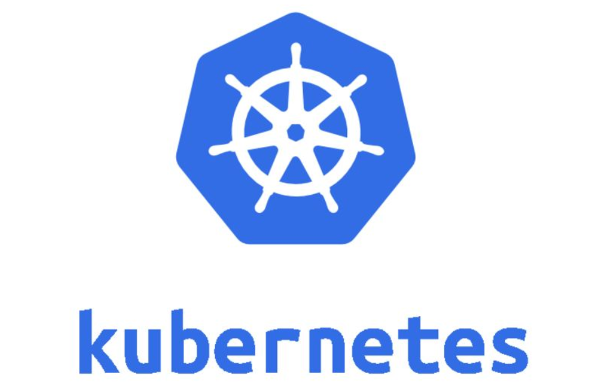
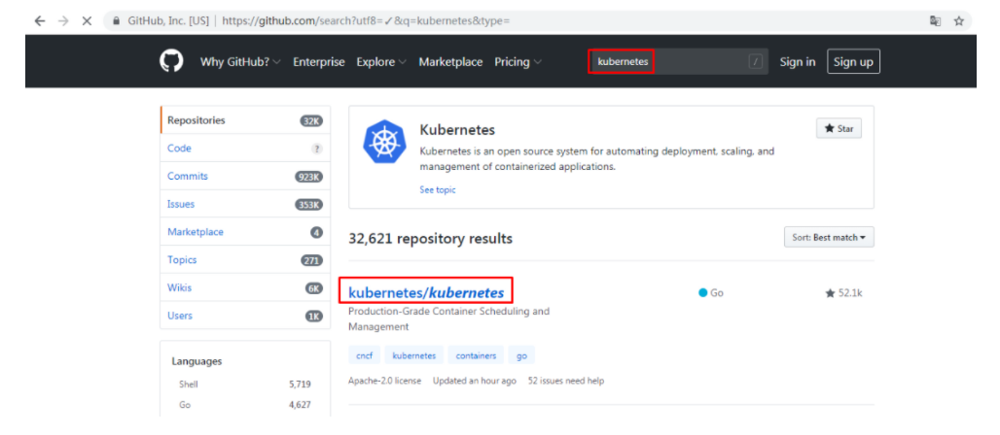
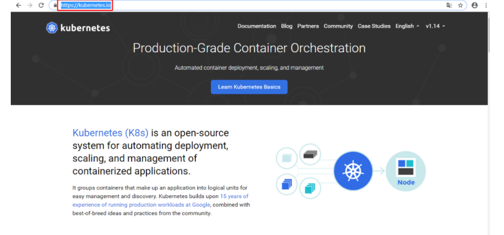
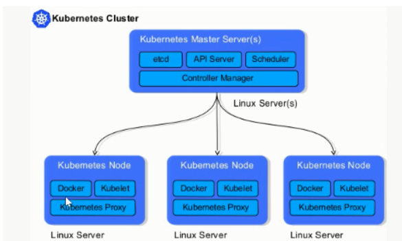
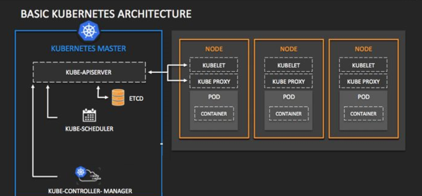
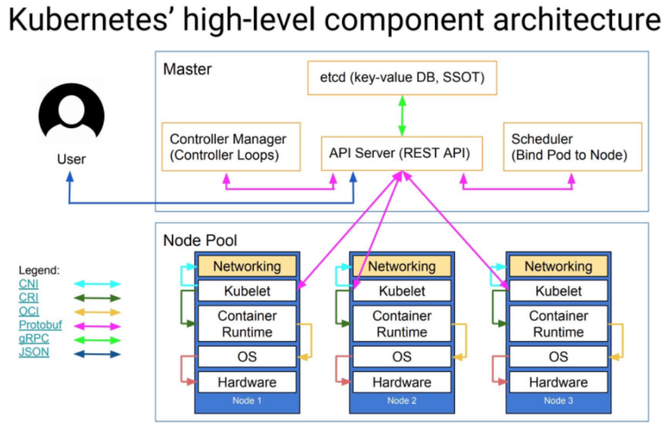

# 一、认识容器编排

- docker machine
- docker compose
- docker swarm
  - docker service
  - docker stack

- kubernetes
- mesos+marathon

# 二、认识kubernetes

官方网址

https://kubernetes.io/

https://kubernetes.io/zh/

中文社区

http://docs.kubernetes.org.cn/

希腊语：舵手、飞行员

来自于谷歌Borg

使用golang语言开发

简称为k8s

现归属于CNCF

- 云原生计算基金会

- 是一个开源软件基金会，致力于使云计算普遍性和持续性

- 官方：http://www.cncf.io

  

**kubernetes版本**

- 2014年9月第一个正式版本
- 2015年7月1.0版本正式发布
- 现在稳定版本为1.18
- 主要贡献者：Google,Redhat,Microsoft,IBM,Intel
- 代码托管github:<https://github.com/kubernetes/>

**用户**

- 2017年docker官方宣布原生支持kubernetes
- RedHat公司  PaaS平台  OpenShift核心是kubernetes
- Rancher平台核心是kubernetes
- 现国内大多数公司都可使用kubernetes进行传统IT服务转换，以实现高效管理等。

# 三、kubernetes架构

kubernetes是具有中心节点的架构,也就是说有master管理节点

节点角色

- Master Node   manager
- Minion Node   worker

**简单叫法**

Master

Node

## 架构图示

## Master节点组件介绍

master节点是集群管理中心，它的组件可以在集群内任意节点运行，但是为了方便管理所以会在一台主机上运行Master所有组件，**并且不在此主机上运行用户容器**

Master组件包括：

- kube-scheduler 

  监视新创建没有分配到Node的Pod，为Pod选择一个Node

- kube-apiserver

  用于暴露kubernetes API，任何的资源请求/调用操作都是通过kube-apiserver提供的接口进行。

- ETCD

  是kubernetes提供默认的数据库系统，保存所有集群数据。

- kube-controller-manager

  控制器管理器，它们是集群中处理常规任务的后台线程。 控制器包括：

  - 节点(Node)控制器
  - 副本(Replication)控制器：负责维护系统中每个副本中的pod
  - 端点(Endpoints)控制器：填充Endpoints对象(即连接service&pods)
  - Service Account和Token控制器：为新的NameSpaces创建默认帐户访问API Token

  

## Node节点组件介绍

node节点用于运行以及维护Pod, 管理volume(CVI)和网络(CNI)，维护pod及service等信息

Node组件包括：

- kubelet 
  - 负责维护容器的生命周期(创建pod，销毁pod)，同时也负责Volume(CVI)和网络(CNI)的管理
- kube-proxy 
  - 通过在主机上维护网络规则并执行连接转发来实现service(Iptables/Ipvs)
  - 随时与API通信，把Service或Pod改变提交给API（不存储在Master本地，需要保存至共享存储上），保存至etcd（可做高可用集群）中，负责service实现，从内部pod至service和从外部node到service访问。
- docker
  - 容器运行时(Container Runtime)
  - 负责镜像管理以及Pod和容器的真正运行
  - 支持docker/Rkt/Pouch/Kata等多种运行时,但我们这里只使用docker

## Add-ons介绍

Add-ons(附件)使功能更丰富，没它并不影响实际使用，可以与主体程序很好结合起来使用

- coredns/kube-dns:  负责为整个集群提供DNS服务
- Ingress Controller 为服务提供集群外部访问
- Heapster/Metries-server 提供集群资源监控(监控容器可以使用prometheus)
- Dashboard 提供GUI
- Federation 提供跨可用区的集群
- Fluentd-elasticsearch 提供集群日志采集、存储与查询

