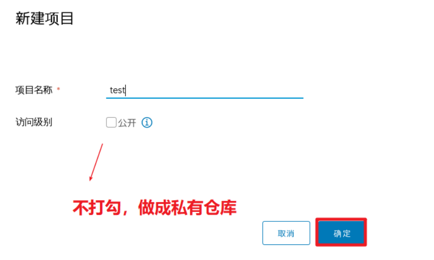

# 一、ConfigMap

## 什么是configmap

- **kubernetes集群可以使用ConfigMap来实现对容器中应用的配置管理**。
- **可以把ConfigMap看作是一个挂载到pod中的存储卷**


## 创建ConfigMap的4种方式

创建ConfigMap的方式有4种：


1, 通过直接在命令行中指定configmap参数创建，即`--from-literal=key=value`；

```powershell
[root@master1 ~]# kubectl create configmap cm1 --from-literal=host=127.0.0.1 --from-literal=port=3306
configmap/cm1 created
```

```powershell
[root@master1 ~]# kubectl get cm
NAME   DATA   AGE
cm1    2      12s
```


```powershell
[root@master1 ~]# kubectl describe cm cm1
Name:         cm1
Namespace:    default
Labels:       <none>
Annotations:  <none>

Data
====
host:
----
127.0.0.1
port:
----
3306
Events:  <none>
```


2, 通过指定文件创建，即将一个配置文件创建为一个ConfigMap，`--from-file=文件路径`；

```powershell
[root@master1 ~]# echo -n 127.0.0.1 > host
[root@master1 ~]# echo -n 3306 > port				

[root@master1 ~]# kubectl create configmap cm2 --from-file=./host --from-file=./port
configmap/cm2 created

```

```powershell
[root@master1 ~]# kubectl get cm
NAME   DATA   AGE
cm1    2      3m45s
cm2    2      94s
```


```powershell
[root@master1 ~]# kubectl describe cm cm2
Name:         cm2
Namespace:    default
Labels:       <none>
Annotations:  <none>

Data
====
host:
----
127.0.0.1
port:
----
3306
Events:  <none>
```


3, 通过一个文件内多个键值对，`--from-env-file=文件路径`;

```powershell
[root@master1 ~]# vim env.txt
host=127.0.0.1
port=3306

[root@master1 ~]# kubectl create configmap cm3 --from-env-file=env.txt
configmap/cm3 created
```

```powershell
[root@master1 ~]# kubectl get cm
NAME   DATA   AGE
cm1    2      4m37s
cm2    2      2m26s
cm3    2      12s
```

```powershell
[root@master1 ~]# kubectl describe cm cm3
Name:         cm3
Namespace:    default
Labels:       <none>
Annotations:  <none>

Data
====
host:
----
127.0.0.1
port:
----
3306
Events:  <none>
```


4, 通过`kubectl create/apply -f YMAL文件` 创建

```powershell
[root@master1 ~]# vim cm4.yml
apiVersion: v1
kind: ConfigMap
metadata:
  name: cm4
data:
  host: 127.0.0.1
  port: "3306"
  
[root@master1 ~]# kubectl apply -f cm4.yml
configmap/cm4 created
```


```powershell
[root@master1 ~]# kubectl get cm
NAME   DATA   AGE
cm1    2      6m18s
cm2    2      4m7s
cm3    2      113s
cm4    2      11s
```

```powershell
[root@master1 ~]# kubectl describe cm cm4
Name:         cm4
Namespace:    default
Labels:       <none>
Annotations:
Data
====
host:
----
127.0.0.1
port:
----
3306
Events:  <none>
```


## ConfigMap的2种使用方式

使用ConfigMap有2种方式：

- **通过环境变量的方式传递给pod**

```powershell
[root@master1 ~]# vim pod-cm1.yml
apiVersion: v1
kind: Pod
metadata:
  name: pod-cm1
spec:
  containers:
  - name: busybox
    image: busybox
    args: [ "/bin/sh", "-c", "sleep 10000" ]
    envFrom:							# env方式
    - configMapRef:
        name: cm1						# configmap名称
```

```powershell
[root@master ~]# kubectl apply -f pod-cm1.yml
pod/pod-cm1 created
```

```powershell
[root@master ~]# kubectl get pods
NAME               READY   STATUS    RESTARTS   AGE
pod-cm1            1/1     Running   0          9s
```

```powershell
[root@master ~]# kubectl exec pod-cm1 -- env
PATH=/usr/local/sbin:/usr/local/bin:/usr/sbin:/usr/bin:/sbin:/bin
HOSTNAME=pod-cm1
host=127.0.0.1								 # 我们创建的configmap传进去的env
port=3306									 # 我们创建的configmap传进去的env
DEPLOY_NGINX_PORT_80_TCP=tcp://10.2.205.160:80
DEPLOY_NGINX_PORT_80_TCP_ADDR=10.2.205.160
KUBERNETES_PORT=tcp://10.2.0.1:443
KUBERNETES_PORT_443_TCP=tcp://10.2.0.1:443
MY_SERVICE_SERVICE_HOST=10.2.52.46
MY_SERVICE_PORT_80_TCP_ADDR=10.2.52.46
KUBERNETES_SERVICE_HOST=10.2.0.1
KUBERNETES_PORT_443_TCP_PROTO=tcp
KUBERNETES_PORT_443_TCP_ADDR=10.2.0.1
MY_SERVICE_SERVICE_PORT=80
MY_SERVICE_PORT=tcp://10.2.52.46:80
MY_SERVICE_PORT_80_TCP=tcp://10.2.52.46:80
DEPLOY_NGINX_SERVICE_HOST=10.2.205.160
DEPLOY_NGINX_SERVICE_PORT=80
KUBERNETES_PORT_443_TCP_PORT=443
MY_SERVICE_PORT_80_TCP_PORT=80
DEPLOY_NGINX_PORT=tcp://10.2.205.160:80
DEPLOY_NGINX_PORT_80_TCP_PROTO=tcp
DEPLOY_NGINX_PORT_80_TCP_PORT=80
KUBERNETES_SERVICE_PORT=443
KUBERNETES_SERVICE_PORT_HTTPS=443
MY_SERVICE_PORT_80_TCP_PROTO=tcp
HOME=/root
```


- **通过volume的方式挂载到pod内**

```powershell
[root@master1 ~]# vim pod-cm2.yml
apiVersion: v1
kind: Pod
metadata:
  name: pod-cm2
spec:
  containers:
  - name: busybox
    image: busybox
    args: [ "/bin/sh", "-c", "sleep 10000" ]
    volumeMounts:                               # 用volume挂载方式
    - name: vol-cm                              # 对应下面的volume名
      mountPath: "/etc/mysql"                   # 挂载到容器内部的路径
      readOnly: true                            # 只读

  volumes:
  - name: vol-cm                                # 卷名称
    configMap:
      name: cm2                                 # configmap的名称
```

```powershell
[root@master1 ~]# kubectl apply -f pod-cm2.yml
pod/pod-cm2 created
```

```powershell
[root@master1 ~]# kubectl get pod
NAME      READY   STATUS    RESTARTS   AGE
pod-cm1   1/1     Running   0          3m51s
pod-cm2   1/1     Running   0          49s
```

```powershell
[root@master1 ~]# kubectl exec pod-cm2 -- ls /etc/mysql
host
port
[root@master1 ~]# kubectl exec pod-cm2 -- cat /etc/mysql/host
127.0.0.1

[root@master1 ~]# kubectl exec pod-cm2 -- cat /etc/mysql/port
3306
```


### subpath参数拓展讨论

1, 准备一个配置文件

~~~powershell
[root@master1 ~]# cat index.html
haha
~~~

2, 创建configmap

~~~powershell
[root@master1 ~]# kubectl create configmap nginx-index --from-file=index.html
configmap/nginx-index created
~~~

3, 创建测试pod

~~~powershell
[root@master1 ~]# vim subpath-cm.yaml
apiVersion: v1
kind: Pod
metadata:
  name: subpath-cm
spec:
  containers:
  - name: c1
    image: nginx:1.15-alpine
    volumeMounts:
    - name: nginx-config
      mountPath: /usr/share/nginx/html/index.html		# configmap要挂载并覆盖的绝对路径
      subPath: index.html							    # 这里要写相对路径

  volumes:
  - name: nginx-config
    configMap:
      name: nginx-index									# 对应上面创建的configmap
~~~

~~~powershell
[root@master1 ~]# kubectl apply -f subpath-cm.yaml
~~~

4,  进去测试

~~~powershell
[root@master1 ~]# kubectl exec -it subpath-cm -- /bin/sh
/ # cat /usr/share/nginx/html/index.html
haha											# 可以看到主面文件被覆盖了
/ # exit

~~~

**补充说明:  也可以用nginx.conf做成configmap覆盖/etc/nginx/nginx.conf，但必须是nginx.conf配置文件要能启动容器，否则启不了容器造成测试问题。**


## ConfigMap的热更新

如果我在宿主机上修改了value, 那么容器内部会不会更新?

- **通过环境变量的方式传递给pod。这种方式不会热更新**
- **通过volume的方式挂载到pod内。这种方式会热更新,大概需要半分钟左右。**
- **但是使用subpath挂载文件，也不能热更新**


**验证第1种方式**

1,  编辑修改对应的configmap

```powershell
[root@master1 ~]# kubectl edit cm cm1
apiVersion: v1
data:
  host: 127.0.0.1
  port: "3307"								3306修改成3307
kind: ConfigMap
metadata:
  creationTimestamp: "2020-11-07T12:07:04Z"
  managedFields:
  - apiVersion: v1
    fieldsType: FieldsV1
    fieldsV1:
      f:data:
        .: {}
        f:host: {}
        f:port: {}
    manager: kubectl
    operation: Update
    time: "2020-11-07T12:07:04Z"
  name: cm1
  namespace: default
  resourceVersion: "169386"
  selfLink: /api/v1/namespaces/default/configmaps/cm1
  uid: f06cd44d-2ef9-48f2-9ccc-995f9d9ea2ad
```

2, 验证对应的pod里的变化,发现很久都不会改变(**环境变量方式**)

```powershell
[root@master1 ~]# kubectl exec pod-cm1 -- env |grep port
port=3306									仍然为3306
```


**验证第2种方式**

1, 编辑修改对应的configmap

```powershell
[root@master1 ~]# kubectl edit cm cm2
apiVersion: v1
data:
  host: 127.0.0.1
  port: "3308"							 		 修改成3308
kind: ConfigMap
metadata:
  creationTimestamp: "2020-11-07T12:09:15Z"
  managedFields:
  - apiVersion: v1
    fieldsType: FieldsV1
    fieldsV1:
      f:data:
        .: {}
        f:host: {}
        f:port: {}
    manager: kubectl
    operation: Update
    time: "2020-11-07T12:09:15Z"
  name: cm2
  namespace: default
  resourceVersion: "169707"
  selfLink: /api/v1/namespaces/default/configmaps/cm2
```

2, 验证对应的pod里的变化,一段时间后会改变(**卷挂载方式**)

```powershell
[root@master1 ~]# kubectl exec pod-cm2 -- cat /etc/mysql/port
3308										     大概半分钟后更新
```


# 二、Secret

## 什么是secret

Secret与ConfigMap类似,主要的区别是Secret存储的是密文,而ConfigMap存储的是明文。

所以ConfigMap可以用配置文件管理,而Secret可用于密码,密钥,token等敏感数据的配置管理。


```powershell
[root@master1 ~]# kubectl create secret -h
Create a secret using specified subcommand.

Available Commands:
  docker-registry Create a secret for use with a Docker registry
  generic         Create a secret from a local file, directory or literal value
  tls             Create a TLS secret

Usage:
  kubectl create secret [flags] [options]

Use "kubectl <command> --help" for more information about a given command.
Use "kubectl options" for a list of global command-line options (applies to all commands).
```

Secret有4种类型:

- Opaque: base64编码格式的Secret，用来存储密码、密钥、信息、证书等，类型标识符为generic
- Service Account: 用来访问Kubernetes API，由Kubernetes自动创建，并且会自动挂载到Pod的/run/secrets/kubernetes.io/serviceaccount目录中
- kubernetes.io/dockerconfigjson: 用来存储私有docker registry的认证信息，类型标识为docker-registry。
- kubernetes.io/tls: 用于为SSL通信模式存储证书和私钥文件，命令式创建类型标识为tls。


## 创建mysql管理员密码Secret

我们使用Opaque类型来创建mysql密码Secret


1, 将明文密码进行base64编码

Opaque类型密码需要进行base64编码

```powershell
[root@master1 ~]# echo -n 123 |base64
MTIz
假设密码为123,得到的编码为MTIz
```

2, 编写创建secret的YAML文件

```powershell
[root@master1 ~]# vim secret-mysql.yml
apiVersion: v1
kind: Secret
metadata:
  name: secret-mysql
data:
  password: MTIz
```

3, 创建secret并确认

```powershell
[root@master1 ~]# kubectl apply -f secret-mysql.yml
secret/secret-mysql created
```

```powershell
[root@master1 ~]# kubectl get secret |grep secret-mysql
secret-mysql          Opaque                                1      40s
```


## Secret的2种使用方式

使用ConfigMap有2种方式：


**通过环境变量的方式传递给pod**

1, 编写pod的YAML文件使用Secret

```powershell
[root@master1 ~]# vim pod-mysql-secret.yml
apiVersion: v1
kind: Pod
metadata:
  name: pod-mysql-secret1
spec:
  containers:
  - name: mysql
    image: mysql:5.7
    env:
      - name: MYSQL_ROOT_PASSWORD
        valueFrom:
          secretKeyRef:
            name: secret-mysql				# 对应创建的secret名字
            key: password
```

2, 创建pod

```powershell
[root@master1 ~]# kubectl apply -f pod-mysql-secret.yml
pod/pod-mysql-secret1 created
```

3, 验证pod

```powershell
[root@master1 ~]# kubectl get pods
NAME                                READY   STATUS    RESTARTS   AGE
pod-mysql-secret1                   1/1     Running   0          1m46s
```

4, 验证传入pod的变量效果

```powershell
[root@master1 ~]# kubectl exec -it pod-mysql-secret1 -- /bin/bash
root@pod-mysql-secret1:/# env |grep MYSQL_ROOT_PASSWORD
MYSQL_ROOT_PASSWORD=123

root@pod-mysql-secret1:/# mysql -p123
```


**通过volume的方式挂载到pod内**

1, 编写pod的YAML文件使用Secret

```powershell
[root@master1 ~]# vim pod-mysql-secret2.yml

apiVersion: v1
kind: Pod
metadata:
  name: pod-mysql-secret2
spec:
  containers:
  - name: busybox
    image: busybox
    args:
    - /bin/sh
    - -c
    - sleep 100000
    volumeMounts:
    - name: vol-secret                  # 定义挂载的卷,对应下面定义的卷名
      mountPath: "/opt/passwd"    # 挂载目录(支持热更新),也可以使用subPath挂载文件(但不支持热更新)
      readOnly: true                    # 只读
  volumes:
  - name: vol-secret                    # 定义卷名
    secret:                             # 使用secret
      secretName: secret-mysql              # 对应创建好的secret名
```

2, 创建pod

```powershell
[root@master1 ~]# kubectl apply -f pod-mysql-secret2.yml
pod/pod-mysql-secret2 created
```

3, 验证pod

```powershell
[root@master1 ~]# kubectl get pods
NAME                                READY   STATUS    RESTARTS   AGE
pod-mysql-secret2                   1/1     Running   0          15m
```

4, 验证

```powershell
[root@master1 ~]# kubectl exec  pod-mysql-secret2 -- cat /opt/passwd/password
123												 在容器内都被解码了
```

5, 热更新测试

```powershell
[root@master ~]# echo -n haha123 |base64
aGFoYTEyMw==

[root@master ~]# kubectl edit secret secret-mysql
apiVersion: v1
data:
  password: aGFoYTEyMw==					    密码改成haha123的base64编码
kind: Secret
metadata:
```

```powershell
[root@master ~]# kubectl exec  pod-mysql-secret2 -- cat /opt/passwd/password
haha123										   过一会儿,确认密码确实更新了
```


# 三、k8s使用harbor仓库

## 1, 新建一个harbor私有仓库




## 2, 所有节点用http连接harbor

```powershell
# vim /etc/docker/daemon.json

{
  "data-root": "/var/lib/docker",
  "exec-opts": ["native.cgroupdriver=cgroupfs"],
  "registry-mirrors": ["https://docker.mirrors.ustc.edu.cn", "http://hub-mirror.c.163.com"],
  "insecure-registries": ["127.0.0.1/8"],
  "max-concurrent-downloads": 10,
  "log-driver": "json-file",
  "log-level": "warn",
  "log-opts": {
    "max-size": "15m",
    "max-file": "3"
    },
  "storage-driver": "overlay2",								上一句这里要加一个逗号
  "insecure-registries": ["192.168.122.18"]					加上这一句

}

# systemctl restart docker
```


## 3, 上传nginx测试镜像到harbor

```powershell
[root@master1 ~]# docker pull nginx:1.15-alpine


[root@master1 ~]# docker login 192.168.122.18
Username: admin
Password:							我这里密码是123
WARNING! Your password will be stored unencrypted in /root/.docker/config.json.
Configure a credential helper to remove this warning. See
https://docs.docker.com/engine/reference/commandline/login/#credentials-store


[root@master1 ~]# docker tag nginx:1.15-alpine 192.168.122.18/test/nginx:v1

[root@master1 ~]# docker push 192.168.122.18/test/nginx:v1
```


## 4, 创建docker-registry类型secret

```powershell
[root@master1 ~]# kubectl create secret docker-registry harbor-secret --docker-server=192.168.122.18 --docker-username=admin --docker-password=123
```

说明: 

- 类型为docker-registry
- --docker-server指定harbor仓库的IP
- --docker-username指定harbor仓库的登录用户名
- --docker-password指定harbor仓库的登录密码

验证查看

```powershell
[root@master1 ~]# kubectl get secret |grep harbor-secret
harbor-secret                        kubernetes.io/dockerconfigjson        1      19s
```

## 5, 创建pod并使用secret

```powershell
[root@master1 ~]# vim pod-harbor.yml
apiVersion: v1
kind: Pod
metadata:
  name: pod-harbor
spec:
  containers:
  - name: c1
    image: 192.168.122.18/test/nginx:v1
  imagePullSecrets:                     # 定义镜像下载使用的secrets
  - name: harbor-secret					# 与上面的secret一致
```

```powershell
[root@master1 ~]# kubectl apply -f pod-harbor.yml
pod/pod-harbor created
```

## 6, 验证pod

```powershell
[root@master1 ~]# kubectl describe pod pod-harbor |tail -8
Events:
  Type    Reason     Age        From                     Message
  ----    ------     ----       ----                     -------
  Normal  Scheduled  <unknown>  default-scheduler        Successfully assigned default/pod-harbor to 192.168.122.13
  Normal  Pulling    59s        kubelet, 192.168.122.13  Pulling image "192.168.122.18/test/nginx:v1"
  Normal  Pulled     52s        kubelet, 192.168.122.13  Successfully pulled image "192.168.122.18/test/nginx:v1"
  Normal  Created    50s        kubelet, 192.168.122.13  Created container c1
  Normal  Started    49s        kubelet, 192.168.122.13  Started container c1
  
可以看到是从192.168.122.18/test/nginx:v1拉取的镜像
```

## 7, 设为serviceaccount默认规则

如果每次编写yaml文件都需要添加imagePullSecrets这2行配置，有点麻烦， 有没有在不需要添加这2行配置就可以实现下载harbor仓库里面的镜像呢？答案是有的，可以把secret配置到serviceAccount中即可。


**1, 创建serviceaccount**

```powershell
[root@master1 ~]# vim serviceaccount-harbor-sa.yaml
apiVersion: v1
kind: ServiceAccount
metadata:
  name: harbor-sa
  namespace: default

[root@master1 ~]# kubectl apply -f serviceaccount-harbor-sa.yaml
serviceaccount/harbor-sa created

[root@master1 ~]# kubectl get sa |grep harbor-sa
harbor-sa                1         14s
```

**2, 修改serviceaccount添加使用harbor-secret**

```powershell
[root@master1 ~]# kubectl patch serviceaccount harbor-sa -n default  -p '{"imagePullSecrets": [{"name": "harbor-secret"}]}'
serviceaccount/harbor-sa patched


[root@master1 ~]# kubectl get serviceaccount harbor-sa -o yaml
apiVersion: v1
imagePullSecrets:
- name: harbor-secret					   # 确认通过patch方式更新了这两句
kind: ServiceAccount
......
```

**3, 修改yaml使用serviceAccount**

```powershell
[root@master1 ~]# vim pod-harbor.yml
apiVersion: v1
kind: Pod
metadata:
  name: pod-harbor2
spec:
  serviceAccount: harbor-sa					# 原来的2句换成使用harbor-sa这个serviceAccount
  containers:
  - name: c1
    image: 192.168.122.18/test/nginx:v1
```

**4, 删除先前的重新创建pod验证**

```powershell
[root@master1 ~]# kubectl delete pod pod-harbor2
pod "pod-harbor2" deleted

[root@master1 ~]# kubectl apply -f pod-harbor.yml
pod/pod-harbor created

[root@master1 ~]# kubectl get pods
NAME         READY   STATUS    RESTARTS   AGE
pod-harbor2   1/1     Running   0          8s
```


补充: serviceAccount可以实现不同namespace下载镜像使用访问harbor账号的不同。