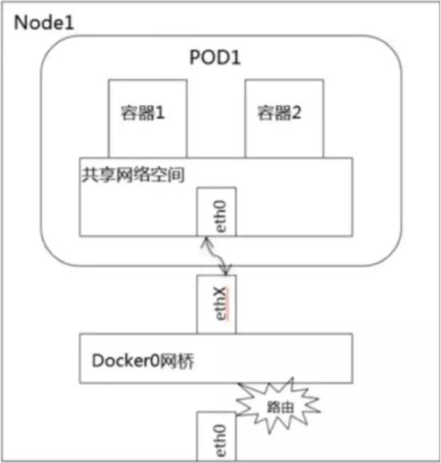
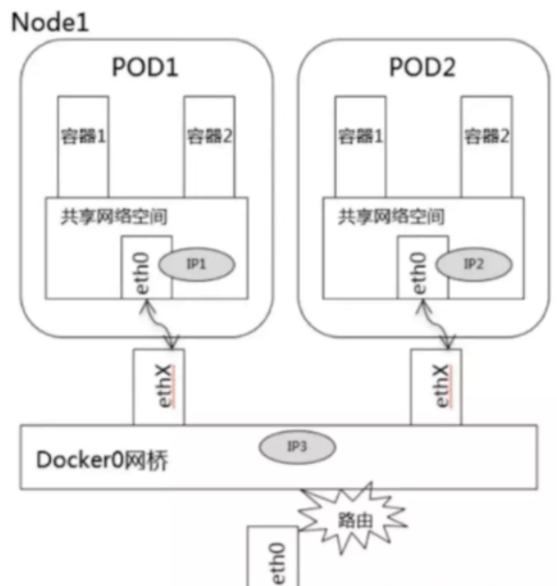
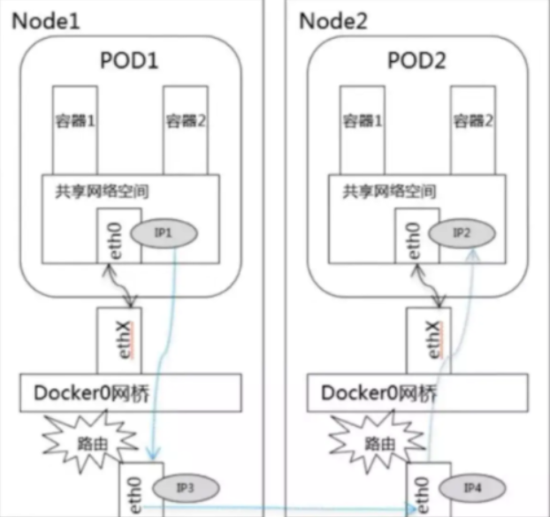
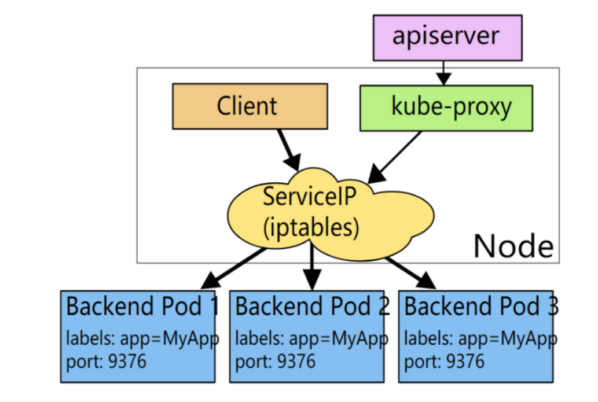
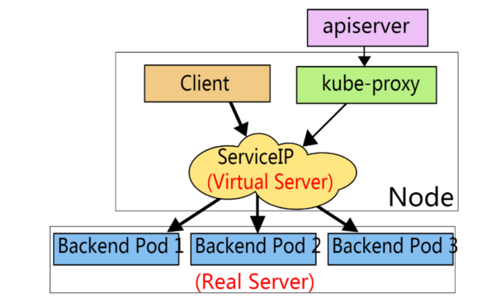
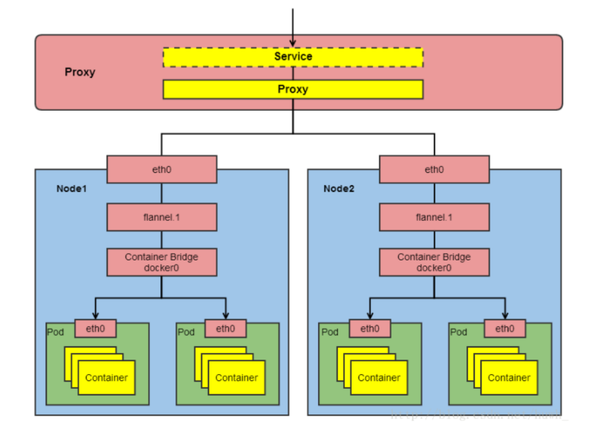
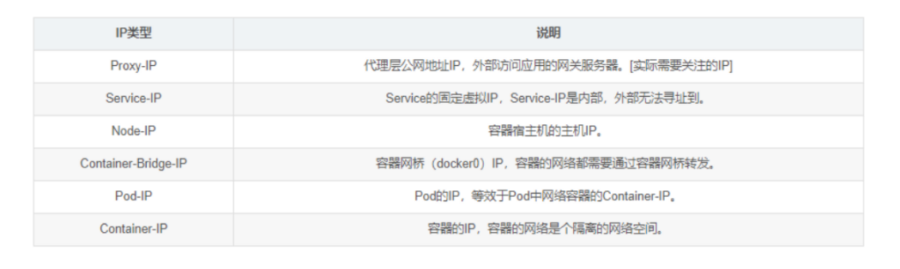
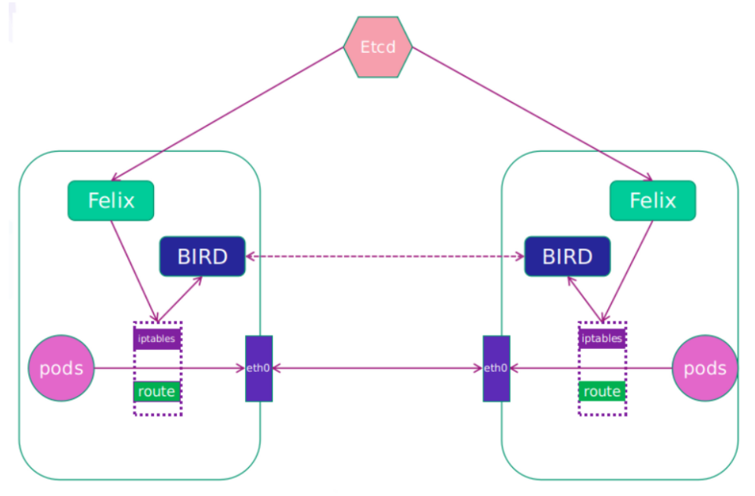

# 一、k8s网络通信模型

k8s的网络中主要存在四种类型的通信：

* 同一pod内的容器间通信
* pod与pod之间的通信    
* pod与service间的通信
* Internet同service之间的通信


## 1, 同一pod内的容器间通信

同一pod内的容器共享同一个网络命名空间，所以可以直接通过lo直接通信




## 2, pod与pod之间的通信

又分为:

* 同node上pod之间通信
* 不同node上的pod之间通信

### 同node上pod之间通信

* 不同pod都有独立的IP，可以直接通信
* 它们在同一个网段上，通过Docker0网桥实现通信



### 不同node上pod之间的通信

* 可以使用Overlay Network（叠加网络，二层报文或三层隧道报文）进行通信


## 3, pod与service间的通信

* Service都会生成一个虚拟IP，称为Service-IP，

* Kube-porxy组件负责实现Service-IP路由和转发，在overlay network之上又实现了虚拟转发网络

Kube-porxy实现了以下功能：

1. 转发访问Service的Service-IP的请求到Endpoints(即Pod-IP)。
2. 监控Service和Endpoints的变化，实时刷新转发规则。
3. 负载均衡能力。


**iptables实现**




****


**IPVS实现**




## 4, Internet同service之间的通信

分为以下两种情况:

* 从k8s的service访问Internet

* 从Internet访问k8s的service

### 从k8s的service访问Internet

步骤:

* 将pod-IP进行SNAT转换为node-IP
* node-IP通过网关指向路由器将包给路由器
* 路由器SNAT成路由器公网IP出去访问Internet
* 包回来给路由器公网IP
* 由路由器自动DNAT给node-IP
* 由node自动DNAT给pod-IP


说明: 和以前学习的虚拟机NAT上外网，云主机NAT上外网过程一致。


### 从Internet访问k8s的service

让Internet流量进入k8s集群，可分为：

* NodePort
* LoadBalancer
* Ingress控制器
* pod的`hostnetwork: True`或`hostPort`







# 二、k8s网络分层

通过以上章节内容可将k8s网络分层为:

1, **Internet** :   外部网络   ( 严格来说，internet不属于k8s集群网络 )

2, node网络:   各主机（master、node、etcd等）自身所属的网络，物理网卡配置的网络

3, service网络:  虚拟网络

4, pod网络:   虚拟网络


# 三、k8s网络解决方案

## CNI

CNI（container network interface）是容器网络接口

* 是K8s中提供的一种通用网络标准规范，因为k8s本身不提供网络解决方案
* 以插件方式使用, 为用户在pod创建或者销毁时动态配置网络


## **CNI插件的三种使用模式**

* overlay      通过隧道通信
* 路由           通过路由通信
* underlay   直接使用底层网络的IP，与宿主机在同一个网络里进行通讯


|            | Overlay                            | L3 Routing                                 | Underlay                                             |
| ---------- | ---------------------------------- | ------------------------------------------ | ---------------------------------------------------- |
| 描述       | 把二层报文封装在IP报文之上进行传输 | 通过三层路由的方式向IP报文传输到目的宿主机 | 直接使用底层网络的IP，与宿主机在同一个网络里进行通讯 |
| 网络要求   | 低：IP可达                         | 二层可达或BGP可达                          | 二层可达/交换机支持                                  |
| 性能       | 中：封包、拆包                     | 高：路由转发                               | 高：几乎没有损耗                                     |
| IP类型     | 虚拟IP                             | 虚拟IP                                     | 物理IP                                               |
| 集群外访问 | Ingress/NodePort                   | Ingress/NodePort                           | Ingress/NodePort                                     |
| 访问控制   | Network Policy                     | Network Policy                             | Iptables/外部网络                                    |
| 静态IP     | 不支持                             | 不支持                                     | 支持                                                 |
| 场景       | 对性要求不高的；网络环境不灵活的   | 大多数场景                                 | 对性能要求高的，需要和现有业务直接通信，需要静态IP   |
| 开源产品   | flannel-vxlan,openshift-sdn        | calico,flannel-hostgw                      | Macvlan/IPvlan                                       |


## 选择网络方案需要考虑的维度

- 网络配置：给Pod、Service提供IP地址
- 网络策略：通过提供网络策略添加网络规则，实现网络隔离（多租户场景下非常有必要）


## 常见网络方案对比

- flannel 仅支持网络配置
- calico   支持网络配置及网络策略，三层BGP网络
- canel    使用calico提供网络策略，使用flannel提供网络配置


~~~powershell
[root@master1 ~]# ls /etc/cni/net.d/
10-calico.conflist  calico-kubeconfig  calico-tls
~~~

~~~powershell
[root@master1 ~]# which calico
/opt/kube/bin/calico
~~~


# 四、calico网络

官方网站: https://www.projectcalico.org/

## calico设计优势

**1, 更优的资源利用**

- 二层网络通讯需要依赖广播消息机制，广播消息的开销与 host 的数量呈指数级增长，Calico 使用的三层路由方法，则完全抑制了二层广播，减少了资源开销。
- 二层网络使用 VLAN 隔离技术，有 4096 个规格限制，即便可以使用 vxlan 解决，但 vxlan 又带来了隧道开销的新问题。而 Calico 不使用 vlan 或 vxlan 技术，使资源利用率更高。

**2, 可扩展性**

- Calico 使用与 Internet 类似的方案，Internet 的网络比任何数据中心都大，Calico 同样天然具有可扩展性。

**3, 简单而更容易 debug**

- 因为没有隧道，意味着 workloads 之间路径更短更简单，配置更少，在 host 上更容易进行 debug 调试。

**4. 更少的依赖**

- Calico 仅依赖三层路由可达。

**5, 可适配性**

- Calico 较少的依赖性使它能适配所有 VM、Container、白盒或者混合环境场景。


优势总结:

- 由于Calico是一种纯三层的实现，因此可以避免与二层方案相关的数据包封装的操作，中间没有任何的NAT，没有任何的overlay，所以它的转发效率非常高.
- 因为它的包直接走原生TCP/IP的协议栈，它的隔离也因为这个栈而变得好做。因为TCP/IP的协议栈提供了一整套的防火墙的规则，所以它可以通过IPTABLES的规则达到比较复杂的隔离逻辑。


## Calico架构图




## Calico主要工作组件

1，**Felix:**  运行在每一台Host的agent进程，主要负责网络接口管理和监听、路由、ARP 管理、ACL 管理和同步、状态上报等。

```powershell
[root@master1 ~]# ps -ef |grep felix |grep -v grep
root      8712  7527  0 12:06 ?        00:00:00 runsv felix
root      8723  8712  5 12:06 ?        00:30:24 calico-node -felix
其它节点上都可查到相关进程
```


2，**etcd:**  分布式键值存储，主要负责网络元数据一致性，确保Calico网络状态的准确性，可以与kubernetes共用；


3，**BGP Client（BIRD）**：Calico 为每一台 Host 部署一个BGP Client，使用BIRD实现，BIRD 是一个单独的持续发展的项目，实现了众多动态路由协议比如 BGP、OSPF、RIP 等。在 Calico 的角色是监听 Host 上由 Felix 注入的路由信息，然后通过 BGP 协议广播告诉剩余 Host 节点，从而实现网络互通。


4，**BGP Route Reflector**：在大型网络规模中，如果仅仅使用 BGP client 形成 mesh 全网互联的方案就会导致规模限制，因为所有节点之间俩俩互联，需要 N^2 个连接，为了解决这个规模问题，可以采用 BGP 的 Router Reflector 的方法，使所有 BGP Client 仅与特定 RR 节点互联并做路由同步，从而大大减少连接数。

 


## calico通迅协议

calico主要通过两种协议来实现通信

- ipip协议		通过ipip隧道作为通信基础
- bgp协议       纯三层的路由交换


bgp协议主要由两种方式：

- BGP Speaker 全互联模式(node-to-node mesh) 
  - 网络成网状，两两互联，适合小规模集群
- BGP Speaker 路由反射模式(Route Reflector)
  - BGP Speaker连接到一个或多个中心BGP Speaker，网络成星状。适合大规模节点集群


# 五、calicoctl工具

安装calicoctl工具

```powershell
[root@master1 ~]# wget https://github.com/projectcalico/calicoctl/releases/download/v3.16.5/calicoctl-linux-amd64

[root@master1 ~]# mv calicoctl-linux-amd64 /bin/calicoctl
[root@master1 ~]# chmod a+x /bin/calicoctl
```

如果是kubeasz安装时选择了calico方案，默认就已经有calicoctl命令了

~~~powershell
[root@master1 ~]# which calicoctl
/opt/kube/bin/calicoctl
~~~


查看calico节点信息

```powershell
[root@master1 ~]# calicoctl get node
NAME
master1
master2
node1
node2
```

查看calico节点详细信息

```powershell
[root@master1 ~]# calicoctl get node -o yaml
......
......
```

查看当前ip池

```powershell
[root@master1 ~]# calicoctl get ippool
NAME                  CIDR          SELECTOR
default-ipv4-ippool   10.3.0.0/16   all()
```

查看当前网络模式

```powershell
[root@master1 ~]# calicoctl node status
Calico process is running.

IPv4 BGP status
+----------------+-------------------+-------+----------+-------------+
|  PEER ADDRESS  |     PEER TYPE     | STATE |  SINCE   |    INFO     |
+----------------+-------------------+-------+----------+-------------+
| 192.168.122.12 | node-to-node mesh | up    | 04:06:47 | Established |
| 192.168.122.13 | node-to-node mesh | up    | 04:07:56 | Established |
| 192.168.122.14 | node-to-node mesh | up    | 04:06:37 | Established |
+----------------+-------------------+-------+----------+-------------+

IPv6 BGP status
No IPv6 peers found.
可以看到使用的是BGP的node-to-node mesh模式
```


```powershell
[root@master1 ~]# netstat -anp | grep ESTABLISH | grep bird
tcp        0      0 192.168.122.11:179      192.168.122.13:39842    ESTABLISHED 8955/bird
tcp        0      0 192.168.122.11:179      192.168.122.14:54717    ESTABLISHED 8955/bird
tcp        0      0 192.168.122.11:179      192.168.122.12:59785    ESTABLISHED 8955/bird
我的k8s集群是4个节点，所以每个节点上能看到3个连接。(证明了节点之间是两两连接)
```


# 六、calico网络策略

## 网络策略介绍

参考: https://kubernetes.io/zh/docs/concepts/services-networking/network-policies/

网络策略就是对网络进行隔离和限制。

CNI插件可以实现不同Node节点的Pod互通问题，这整个就是一个扁平化的网络。但是如果遇到以下场景呢?

- 多租户网络环境隔离
- 不同环境之间的隔离，如: 开发环境namespace与测试环境namespace之间的隔离
- 应用程序间的访问控制。例如微服务A允许访问微服务B，却不能访问微服务C等
- 当Pod暴露到外部时，需要做Pod黑白名单

这时候网络策略就派上用场了。


网络策略就相当于把iptables防火墙规则做成了YAML资源，只要iptables会玩，网络策略就不难。

以官方一个YAML例子做讲解:

~~~powershell
apiVersion: networking.k8s.io/v1
kind: NetworkPolicy
metadata:
  name: test-network-policy
  namespace: default					# 代表此策略对default这个namespace生效(还要看下面的podSelector)
spec:
  podSelector:
    matchLabels:
      role: db							# 代表此策略对default这个namespace里的带有role=db标签的pod才生效
  policyTypes:
  - Ingress							    # 相当于iptables -P INPUT DROP,做成进入流量全拒绝
  - Egress								# 相当于iptables -P OUTPUT DROP,做成出去流量全拒绝
  ingress:								# 在双链接拒绝的情况下配置的进入白名单
  - from:
    - ipBlock:							# 以ip段的方式配置的白名单
        cidr: 172.17.0.0/16				# 允许的IP段
        except:
        - 172.17.1.0/24					# 允许的IP段基础上再拒绝的IP段或IP
    - namespaceSelector:				# 以namespace的标签配置的白名单
        matchLabels:
          project: myproject			# 允许带有project=myproject标签的namespace里的所有pod
    - podSelector:
        matchLabels:
          role: frontend				# 允许相同namespace里的带有role=frontend标签的pod
    ports:
    - protocol: TCP
      port: 6379						# 相当于一个端口的过滤条件。上面三种白名单都只能访问目标tcp:6379端口
  egress:								# 在双链接拒绝的情况下配置的出去白名单
  - to:
    - ipBlock:
        cidr: 10.0.0.0/24
    ports:
    - protocol: TCP
      port: 5978
~~~


## namespace拒绝进入流量

1，创建两个命名空间

```powershell
[root@master1 ~]# kubectl create ns dev
namespace/dev created

[root@master1 ~]# kubectl create ns test
namespace/test created
```

2，分别运行一个pod

```powershell
[root@master1 ~]# kubectl run nginx1 --image=nginx:1.15-alpine -n dev
pod/nginx1 created
[root@master1 ~]# kubectl run nginx2 --image=nginx:1.15-alpine -n test
pod/nginx2 created
```

3, 查看两个pod的IP

```powershell
[root@master1 ~]# kubectl get pods -o wide -n dev
NAME     READY   STATUS    RESTARTS   AGE     IP           NODE             NOMINATED NODE   READINESS GATES
nginx1   1/1     Running   0          8m33s   10.3.104.4   192.168.122.14   <none>           <none>

[root@master1 ~]# kubectl get pods -o wide -n test
NAME     READY   STATUS    RESTARTS   AGE     IP             NODE             NOMINATED NODE   READINESS GATES
nginx2   1/1     Running   0          8m26s   10.3.166.139   192.168.122.13   <none>           <none>

```

4, 验证不同命名空间两个pod可以互通

```powershell
[root@master1 ~]# kubectl exec -it nginx1 -n dev -- ping -c 2 10.3.166.139
PING 10.3.166.139 (10.3.166.139): 56 data bytes
64 bytes from 10.3.166.139: seq=0 ttl=62 time=1.454 ms
64 bytes from 10.3.166.139: seq=1 ttl=62 time=0.891 ms


```

```powershell
[root@master1 ~]# kubectl exec -it nginx2 -n test -- ping -c 2 10.3.104.4
PING 10.3.104.4 (10.3.104.4): 56 data bytes
64 bytes from 10.3.104.4: seq=0 ttl=62 time=1.094 ms
64 bytes from 10.3.104.4: seq=1 ttl=62 time=4.969 ms


```

5，对dev命名空间创建网络策略(**拒绝所有进入流量，允许所有出去流量**)

```powershell
[root@master1 ~]# vim dev-netpolicy.yaml
apiVersion: networking.k8s.io/v1
kind: NetworkPolicy
metadata:
  name: dev-netpolicy
spec:
  podSelector: {}			#  任意pod
  policyTypes:
  - Ingress					#  ingress代表进入
  
[root@master1 ~]# kubectl apply -f ingress-deny.yaml -n dev
networkpolicy.networking.k8s.io/dev-netpolicy created


[root@master1 ~]# kubectl get netpol -n dev
NAME               POD-SELECTOR   AGE
dev-netpolicy      <none>         9s

```

6, 验证dev的pod可以ping通test的pod(对于dev来说，可以出去)

```powershell
[root@master1 ~]# kubectl exec -it nginx1 -n dev -- ping -c 2 10.3.166.139
PING 10.3.166.139 (10.3.166.139): 56 data bytes
64 bytes from 10.3.166.139: seq=0 ttl=62 time=0.345 ms
64 bytes from 10.3.166.139: seq=1 ttl=62 time=0.690 ms

```

7, 验证test的pod不能ping通dev的pod(对于dev来说，拒绝进入)

```powershell
[root@master1 ~]# kubectl exec -it nginx2 -n test -- ping -c 2 10.3.104.4
PING 10.3.104.4 (10.3.104.4): 56 data bytes

```


## namespace拒绝进出所有流量

1，修改yaml并应用

```powershell
[root@master1 ~]# vim dev-netpolicy.yaml
apiVersion: networking.k8s.io/v1
kind: NetworkPolicy
metadata:
  name: dev-netpolicy		
spec:
  podSelector: {}
  policyTypes:
  - Ingress
  - Egress		 		# 加1个Egress代表出, 其它不变

```


```powershell
[root@master1 ~]# kubectl apply -f ingress-deny.yaml -n dev
networkpolicy.networking.k8s.io/dev-netpolicy configured	   # apply后在原基础上修改了配置

```


2，验证( 对于dev命名空间来说，进入与出去都拒绝)

出去ping不通

```powershell
[root@master1 ~]# kubectl exec -it nginx1 -n dev -- ping -c 2 10.3.166.139
PING 10.3.166.139 (10.3.166.139): 56 data bytes

```

进入ping不通

```powershell
[root@master1 ~]# kubectl exec -it nginx2 -n test -- ping -c 2 10.3.104.4
PING 10.3.104.4 (10.3.104.4): 56 data bytes

```


## 通过IP段与label定义策略

1, dev命名空间再创建一个名为nginx3的pod，test命名空间再创建一个名为nginx4的pod

```powershell
[root@master1 ~]# kubectl run nginx3 --image=nginx:1.15-alpine -n dev
pod/nginx3 created

[root@master1 ~]# kubectl run nginx4 --image=nginx:1.15-alpine -n test
pod/nginx4 created

```

2, 为dev命名空间名为nginx1的pod打一个标记

```powershell
[root@master1 haha]# kubectl label pod nginx1 app=nginx1 -n dev
pod/nginx1 labeled

```

3, 修改策略并应用

```powershell
[root@master1 ~]# vim dev-netpolicy.yaml
apiVersion: networking.k8s.io/v1
kind: NetworkPolicy
metadata:
  name: dev-netpolicy
spec:
  podSelector:
    matchLabels:
      app: nginx1				# 匹配pod的标签
  policyTypes:
  - Ingress
  - Egress						# 双链拒绝
  ingress:
  - from:
    - ipBlock:				    # IP地址块
        cidr: 10.3.0.0/16		# 允许的IP段
        except:
          - 10.3.166.139/32		# 在允许的IP段中拒绝的IP(必须加掩码32位),这个IP是test命名空间的nginx2的pod-ip

```

```powershell
[root@master1 ~]# kubectl apply -f dev-netpolicy.yaml -n dev
networkpolicy.networking.k8s.io/dev-netpolicy configured

[root@master1 ~]# kubectl get netpol -n dev
NAME               POD-SELECTOR   AGE
dev-netpolicy       app=nginx1    85m

```

说明: 总的意思就是dev命名空间中带有app=nginx1标签的pod，允许`10.3.0.0/16`网段进来，但拒绝`10.3.166.139`进来


4， 确认nginx1与nginx3的pod-IP

```powershell
[root@master1 ~]# kubectl get pods -o wide -n dev
NAME     READY   STATUS    RESTARTS   AGE    IP           NODE          NOMINATED NODE   READINESS GATES
nginx1   1/1     Running   0          134m   10.3.104.4   192.168.122.14  <none>           <none>
nginx3   1/1     Running   0          20m    10.3.104.5   192.168.122.14  <none>           <none>

```

5， 验证

- test命名空间的nginx4可以ping通dev命名空间的nginx1

```powershell
[root@master1 ~]# kubectl exec -it nginx4 -n test -- ping -c 2 10.3.104.4
PING 10.3.104.4 (10.3.104.4): 56 data bytes
64 bytes from 10.3.104.4: seq=0 ttl=63 time=0.146 ms
64 bytes from 10.3.104.4: seq=1 ttl=63 time=0.150 ms

```

- 但test命名空间的nginx2可以ping不通dev命名空间的nginx1(**因为策略拒绝了**)

```powershell
[root@master2 ~]# kubectl exec -it nginx2 -n test -- ping -c 2 10.3.104.4
PING 10.3.104.4 (10.3.104.4): 56 data bytes

```

- 但test命名空间的nginx2又可以ping通dev命名空间的nginx3(**因为只有nginx1才带有app=nginx1标签, nginx3不带此标签**)

```powershell
[root@master2 ~]# kubectl exec -it nginx2 -n test -- ping -c 2 10.3.104.5
PING 10.3.104.5 (10.3.104.5): 56 data bytes
64 bytes from 10.3.104.5: seq=0 ttl=62 time=0.507 ms
64 bytes from 10.3.104.5: seq=1 ttl=62 time=0.749 ms


```


## 同namespace通过label访问

1，修改策略并应用

```powershell
[root@master1 ~]# vim dev-netpolicy.yaml
apiVersion: networking.k8s.io/v1
kind: NetworkPolicy
metadata:
  name: dev-netpolicy
spec:
  podSelector:
    matchLabels:
      app: nginx1					# 只能访问app=nginx1标签的pod
  policyTypes:
  - Ingress
  - Egress    
  ingress:
  - from:
    - podSelector:
        matchLabels:
          access_nginx1: "true"		# 表示只有带有access_nginx1=true标签的pod才能访问(同namespace下)
```

```powershell
[root@master1 ~]# kubectl apply -f dev-netpolicy.yaml -n dev
networkpolicy.networking.k8s.io/dev-netpolicy configured

```

2, 验证: 同namespace下的nginx3 ping不通nginx1

```powershell
[root@master2 ~]# kubectl exec -it nginx3 -n dev -- ping -c 2 10.3.104.4
PING 10.3.104.4 (10.3.104.4): 56 data bytes

```

3, 验证: 为nginx3打上`access_nginx1=true`标签就可以访问nginx1了

```powershell
[root@master2 ~]# kubectl label pod nginx3 access_nginx1=true -n dev
pod/nginx3 labeled
[root@master2 ~]# kubectl exec -it nginx3 -n dev -- ping -c 2 10.3.104.4
PING 10.3.104.4 (10.3.104.4): 56 data bytes
64 bytes from 10.3.104.4: seq=0 ttl=63 time=0.260 ms
64 bytes from 10.3.104.4: seq=1 ttl=63 time=0.164 ms


```


**写在最后: 以上几个小例子只是抛砖引玉，更多复杂策略请按照业务需求对照语法来实现。**


# 七、修改为Route Reflector模式

## 关闭node-to-node模式

```powershell
[root@master1 ~]# vim bgpconfig.yml
apiVersion: projectcalico.org/v3
kind: BGPConfiguration
metadata:
  name: default
spec:
  logSeverityScreen: Info
  nodeToNodeMeshEnabled: false			# 关闭node-to-node模式
  asNumber: 61234						# 自定义AS号

```


```powershell
[root@master1 ~]# calicoctl apply -f bgpconfig.yml
Successfully applied 1 'BGPConfiguration' resource(s)

```

**验证**

```powershell
[root@master1 ~]# calicoctl get bgpconfig
NAME      LOGSEVERITY   MESHENABLED   ASNUMBER
default   Info          false         61234

```


```powershell
[root@master1 ~]# kubectl get pods -o wide
NAME                            READY   STATUS    RESTARTS   AGE   IP             NODE             NOMINATED NODE   READINESS GATES
deploy-nginx-59bd7848d6-4fsph   1/1     Running   1          22h   10.3.104.35    192.168.122.14   <none>           <none>
deploy-nginx-59bd7848d6-c5c49   1/1     Running   1          22h   10.3.166.160   192.168.122.13   <none>           <none>


[root@master1 ~]# ping 10.3.104.35
ping不通k8s集群中的pod了

```


```powershell
[root@master1 ~]# calicoctl get nodes --output=wide
NAME      ASN       IPV4                IPV6
master1   (61234)   192.168.122.11/24
master2   (61234)   192.168.122.12/24
node1     (61234)   192.168.122.13/24
node2     (61234)   192.168.122.14/24

```


## 创建bgppeer

```powershell
[root@master1 ~]# vim bgppeer.yml
apiVersion: projectcalico.org/v3
kind: BGPPeer
metadata:
  name: bgppeer-global
spec:
  peerIP: 192.168.122.11			# 指定路由反射器节点(BGPPeer)
  asNumber: 61234

```

**验证**

```powershell
[root@master1 ~]# calicoctl apply -f bgppeer.yml
Successfully applied 1 'BGPPeer' resource(s)

[root@master1 ~]# calicoctl get bgppeer
NAME             PEERIP           NODE       ASN
bgppeer-global   192.168.122.11   (global)   61234

```


**验证**

```powershell
[root@master1 ~]# calicoctl node status
Calico process is running.

IPv4 BGP status
+----------------+---------------+-------+----------+-------------+
|  PEER ADDRESS  |   PEER TYPE   | STATE |  SINCE   |    INFO     |
+----------------+---------------+-------+----------+-------------+
| 192.168.122.12 | node specific | up    | 15:10:22 | Established |
| 192.168.122.13 | node specific | up    | 15:10:22 | Established |		 现在为node specific
| 192.168.122.14 | node specific | up    | 15:10:22 | Established |
+----------------+---------------+-------+----------+-------------+

IPv6 BGP status
No IPv6 peers found.

[root@master1 ~]# ping -c 2 10.3.104.35					
PING 10.3.104.35 (10.3.104.35) 56(84) bytes of data.
64 bytes from 10.3.104.35: icmp_seq=1 ttl=63 time=0.359 ms				
64 bytes from 10.3.104.35: icmp_seq=2 ttl=63 time=0.759 ms				k8s集群上的pod也可以ping得通了


```

## 验证集群各节点的连接

除了bgppeer节点有N-1个连接外，其它节点只有1个连接

```powershell
[root@master1 ~]# netstat -anp | grep ESTABLISH | grep bird
tcp        0      0 192.168.122.11:55617    192.168.122.14:179      ESTABLISHED 8955/bird
tcp        0      0 192.168.122.11:179      192.168.122.12:43342    ESTABLISHED 8955/bird
tcp        0      0 192.168.122.11:33696    192.168.122.13:179      ESTABLISHED 8955/bird
```


```powershell
[root@master2 ~]#  netstat -anp | grep ESTABLISH | grep bird
tcp        0      0 192.168.122.12:43342    192.168.122.11:179      ESTABLISHED 8216/bird

```


```powershell
[root@node1 ~]# netstat -anp | grep ESTABLISH | grep bird
tcp        0      0 192.168.122.13:179      192.168.122.11:33696    ESTABLISHED 13541/bird

```


```powershell
[root@node2 ~]#  netstat -anp | grep ESTABLISH | grep bird
tcp        0      0 192.168.122.14:179      192.168.122.11:55617    ESTABLISHED 12223/bird

```


## 改回mesh模式的方法

~~~powershell
[root@master1 ~]# calicoctl delete -f bgppeer.yml
Successfully deleted 1 'BGPPeer' resource(s)
~~~


~~~powershell
[root@master1 ~]# vim bgpconfig.yml
apiVersion: projectcalico.org/v3
kind: BGPConfiguration
metadata:
  name: default
spec:
  logSeverityScreen: Info
  nodeToNodeMeshEnabled: true              # 再改为True
  asNumber: 61234 
~~~


~~~powershell
[root@master1 ~]# calicoctl apply -f bgpconfig.yml
Successfully applied 1 'BGPConfiguration' resource(s)
~~~


~~~powershell
[root@master1 ~]# calicoctl node status
Calico process is running.

IPv4 BGP status
+----------------+-------------------+-------+----------+-------------+
|  PEER ADDRESS  |     PEER TYPE     | STATE |  SINCE   |    INFO     |
+----------------+-------------------+-------+----------+-------------+
| 192.168.122.12 | node-to-node mesh | up    | 08:17:11 | Established |
| 192.168.122.13 | node-to-node mesh | up    | 08:17:11 | Established |
| 192.168.122.14 | node-to-node mesh | up    | 08:17:11 | Established |
+----------------+-------------------+-------+----------+-------------+

IPv6 BGP status
No IPv6 peers found.
~~~


