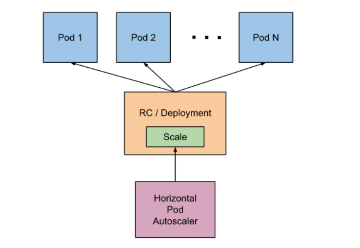

# 一、认识HPA

参考: https://kubernetes.io/zh/docs/tasks/run-application/horizontal-pod-autoscale/

* HPA全称是Horizontal Pod Autoscaler，中文意思是POD水平自动伸缩.

* 可以基于 CPU 利用率自动扩缩 ReplicationController、Deployment、ReplicaSet 和 StatefulSet 中的 Pod 数量。

* 除了 CPU 利用率，内存占用外，也可以基于其他应程序提供的自定义度量指标来执行自动扩缩。

自定义度量参考: https://github.com/kubernetes/community/blob/master/contributors/design-proposals/instrumentation/custom-metrics-api.md

* Pod 自动扩缩不适用于无法扩缩的对象，比如 DaemonSet。

* Pod 水平自动扩缩特性由 Kubernetes API 资源和控制器实现。资源决定了控制器的行为。

* 控制器会周期性的调整副本控制器或 Deployment 中的副本数量，以使得 Pod 的平均 CPU 利用率与用户所设定的目标值匹配。

# 二、HPA工作机制

Pod 水平自动扩缩器的实现是一个控制回路，由控制器管理器的 `--horizontal-pod-autoscaler-sync-period` 参数指定周期（默认值为 15 秒）。

每个周期内，控制器管理器根据每个 HorizontalPodAutoscaler 定义中指定的指标查询资源利用率。 控制器管理器可以从资源度量指标 API（按 Pod 统计的资源用量）和自定义度量指标 API（其他指标）获取度量值。

- 对于按 Pod 统计的资源指标（如 CPU）, 控制器从资源指标 API 中获取每一个 HorizontalPodAutoscaler 指定的 Pod 的度量值，如果设置了目标使用率， 控制器获取每个 Pod 中的容器资源使用情况，并计算资源使用率。 如果设置了 target 值，将直接使用原始数据（不再计算百分比）。 接下来，控制器根据平均的资源使用率或原始值计算出扩缩的比例，进而计算出目标副本数。

  需要注意的是，如果 Pod 某些容器不支持资源采集，那么控制器将不会使用该 Pod 的 CPU 使用率。 

- 如果 Pod 使用自定义指示，控制器机制与资源指标类似，区别在于自定义指标只使用 原始值，而不是使用率。

- 如果 Pod 使用对象指标和外部指标（每个指标描述一个对象信息）。 这个指标将直接根据目标设定值相比较，并生成一个上面提到的扩缩比例。 在 `autoscaling/v2beta2` 版本 API 中，这个指标也可以根据 Pod 数量平分后再计算。

通常情况下，控制器将从一系列的聚合 API（`metrics.k8s.io`、`custom.metrics.k8s.io` 和 `external.metrics.k8s.io`）中获取度量值。 `metrics.k8s.io` API 通常由 Metrics 服务器（需要额外启动）提供。 

**确认安装metrics-server**

~~~powershell
[root@master1 ~]# kubectl get pods -n kube-system |grep metrics-server
metrics-server-869ffc99cd-lz68h              1/1     Running   5          23h
~~~

~~~powershell
[root@master1 ~]# kubectl top nodes
NAME             CPU(cores)   CPU%   MEMORY(bytes)   MEMORY%
192.168.122.11   357m         4%     895Mi           17%
192.168.122.12   426m         5%     910Mi           28%
192.168.122.13   353m         4%     664Mi           20%
192.168.122.14   251m         3%     408Mi           12%
~~~

# 三、HPA  API对象

HPA的API有三个版本

~~~powershell
[root@master1 ~]# kubectl api-versions | grep autoscal
autoscaling/v1
autoscaling/v2beta1
autoscaling/v2beta2
~~~

| APA版本             | 描述                                                         |
| ------------------- | ------------------------------------------------------------ |
| autoscaling/v1      | 只支持基于CPU指标的缩放                                      |
| autoscaling/v2beta1 | 支持Resource Metrics（资源指标，如pod的CPU）和Custom Metrics（自定义指标）的缩放； |
| autoscaling/v2beta2 | 支持Resource Metrics（资源指标，如pod的CPU）和Custom Metrics（自定义指标）和ExternalMetrics（额外指标）的缩放。 |

# 四、kubectl对HPA的支持

与其他 API 资源类似，`kubectl` 以标准方式支持 HPA。 

* 通过 `kubectl create` 命令创建一个 HPA 对象

* 通过 `kubectl get hpa` 命令来获取所有 HPA 对象

* 通过 `kubectl describe hpa` 命令来查看 HPA 对象的详细信息

* 通过 `kubectl delete hpa` 命令删除对象。

  

此外，还有个简便的命令 `kubectl autoscale` 来创建 HPA 对象。 

例如，命令 `kubectl autoscale rs foo --min=2 --max=5 --cpu-percent=80` 将会为名 为 *foo* 的 ReplicationSet 创建一个 HPA 对象， 目标 CPU 使用率为 `80%`，副本数量配置为 2 到 5 之间。

# 五、HPA演示案例

参考: https://kubernetes.io/zh/docs/tasks/run-application/horizontal-pod-autoscale-walkthrough/

## 基于CPU的HPA

### 1, 构建测试镜像

~~~powershell
[root@master1 ~]# vim index.php
<?php
  $x = 0.0001;
  for ($i = 0; $i <= 1000000; $i++) {
    $x += sqrt($x);
  }
  echo "OK!";
?>
~~~

~~~powershell
[root@master1 ~]# vim Dockerfile
FROM php:5-apache
COPY index.php /var/www/html/index.php
RUN chmod a+rx index.php
~~~

~~~powershell
[root@master1 ~]# docker build -f Dockerfile -t 192.168.122.18/library/hpa-example:v1 .
~~~

### 2, 上传到harbor

~~~powershell
[root@master1 ~]# docker login 192.168.122.18
Username: admin
Password:
WARNING! Your password will be stored unencrypted in /root/.docker/config.json.
Configure a credential helper to remove this warning. See
https://docs.docker.com/engine/reference/commandline/login/#credentials-store

Login Succeeded
[root@master1 ~]# docker push 192.168.122.18/library/hpa-example:v1
~~~

### 3, 部署测试deployment

~~~powershell
[root@master1 ~]# vim php-apache.yaml
apiVersion: apps/v1
kind: Deployment
metadata:
  name: php-apache
spec:
  selector:
    matchLabels:
      app: php-apache
  replicas: 1
  template:
    metadata:
      labels:
        app: php-apache
    spec:
      containers:
      - name: php-apache
        image: 192.168.122.18/library/hpa-example:v1
        ports:
        - containerPort: 80
        resources:
          limits:
            cpu: 500m
          requests:
            cpu: 200m
~~~

~~~powershell
[root@master1 ~]# kubectl apply -f php-apache.yaml
deployment.apps/php-apache created
~~~

### 4, 验证得到pod-IP

~~~powershell
[root@master1 ~]# kubectl get pods -o wide
NAME                          READY   STATUS    RESTARTS   AGE   IP             NODE             NOMINATED NODE   READIN            ESS GATES
php-apache-665fc66c67-cfj6f   1/1     Running   0          25m   10.3.104.15    192.168.122.14   <none>           <none>
~~~

得到pod-IP为`10.3.104.15`，此IP下面测试需要用到

### 5, 创建HPA

~~~powershell
[root@master1 ~]# kubectl autoscale deployment php-apache --cpu-percent=50 --min=1 --max=10
horizontalpodautoscaler.autoscaling/php-apache autoscaled
~~~

说明: 

* --cpu-percent=50表示所有Pod的平均CPU使用率维持在50％，超过就要扩容
* --min=1  --max=10表示pod数量的范围

~~~powershell
[root@master1 ~]# kubectl get hpa
NAME         REFERENCE               TARGETS   MINPODS   MAXPODS   REPLICAS   AGE
php-apache   Deployment/php-apache   0%/50%    1         10        1          20s
看到目前CPU还是0%
~~~

### 6, 创建测试pod对其访问

用另一个终端(我这里是master2)使用busybox镜像产生一个测试pod,对`10.3.104.15`进行压测

~~~powershell
[root@master2 ~]# kubectl run busybox -it --image=busybox /bin/sh

/ # while true; do wget -q -O- http://10.3.104.15; done
OK!OK!OK!OK!OK!OK!OK!OK!OK!OK!OK!OK!OK!OK!OK!OK!OK!OK!OK!OK!OK!OK!OK!OK!OK!OK!OK!OK!OK!OK!OK!OK!OK!OK!OK!OK!OK!OK!OK!OK!OK!OK!OK!OK!OK!OK!OK!OK!OK!OK!OK!OK!OK!OK!OK!OK!OK!OK!OK!OK!OK!OK!OK!OK!OK!OK!OK!OK!OK!OK!OK!OK!OK!OK!OK!OK!OK!OK!OK!OK!OK!OK!OK!OK!OK!OK!OK!OK!OK!OK!OK!OK!OK!OK!OK!OK!OK!OK!OK!OK!OK!OK!OK!OK!OK!OK!OK!OK!OK!OK!OK!OK!OK!OK!OK!OK!OK!OK!OK!OK!OK!OK!OK!OK!OK!OK!OK!OK!OK!OK!OK!OK!OK!OK!OK!OK!OK!OK!OK!OK!OK!OK!OK!OK!OK!OK!OK!OK!OK!OK!OK!OK!OK!OK!OK!OK!OK!OK!OK!OK!OK!OK!OK!OK!OK!OK!OK!OK!OK!OK!OK!OK!OK!OK!OK!OK!OK!OK!OK!OK!......
~~~

不断查询hpa状态，**大概一分钟后**才会看到效果

~~~powershell
[root@master1 ~]# kubectl get hpa
NAME         REFERENCE               TARGETS    MINPODS   MAXPODS   REPLICAS   AGE
php-apache   Deployment/php-apache   250%/50%   1         10        1          19m
cpu用到250%了
~~~

~~~powershell
[root@master1 ~]# kubectl get pods
NAME                          READY   STATUS    RESTARTS   AGE
busybox                       1/1     Running   0          3m27s
php-apache-665fc66c67-8z6wj   1/1     Running   0          59s
php-apache-665fc66c67-cfj6f   1/1     Running   0          26m
php-apache-665fc66c67-fn4wg   1/1     Running   0          59s
php-apache-665fc66c67-t9wpr   1/1     Running   0          44s
php-apache-665fc66c67-zw662   1/1     Running   0          60s
也可以看到pod扩容到了5个
~~~

~~~powershell
[root@master2 ~]# kubectl run busybox -it --image=busybox /bin/sh

/ # while true; do wget -q -O- http://10.3.104.15; done
OK!OK!OK!OK!OK!OK!OK!OK!OK!OK!OK!OK!OK!OK!OK!OK!OK!OK!OK!OK!OK!OK!OK!OK!OK!OK!OK!OK!OK!OK!OK!OK!OK!OK!OK!OK!OK!OK!OK!OK!OK!OK!OK!OK!OK!OK!OK!OK!OK!OK!OK!OK!OK!OK!OK!OK!OK!OK!OK!OK!OK!OK!OK!OK!OK!OK!OK!OK!OK!OK!OK!OK!OK!OK!OK!OK!OK!OK!OK!OK!OK!OK!OK!OK!OK!OK!OK!OK!OK!OK!OK!OK!OK!OK!OK!OK!OK!OK!OK!OK!OK!OK!OK!OK!OK!OK!OK!OK!OK!OK!OK!OK!OK!OK!OK!OK!OK!OK!OK!OK!OK!OK!OK!OK!OK!OK!OK!OK!OK!OK!OK!OK!OK!OK!OK!OK!OK!OK!OK!OK!OK!OK!OK!OK!OK!OK!OK!OK!OK!OK!OK!OK!OK!OK!OK!OK!OK!OK!OK!OK!OK!OK!OK!OK!OK!OK!OK!OK!OK!OK!OK!OK!OK!OK!OK!OK!OK!OK!OK!OK!OK!OK!OK!OK!OK!OK!OK!OK!OK!OK!OK!OK!OK!OK!OK!OK!OK!OK!OK!OK!OK!OK!OK!OK!OK!OK!OK!OK!OK!OK!OK!OK!OK!OK!OK!OK!OK!OK!OK!OK!OK!OK!OK!OK!OK!OK!OK!OK!OK!OK!OK!OK!OK!OK!OK!OK!OK!OK!OK!OK!OK!OK!OK!OK!OK!OK!OK!OK!OK!OK!OK!OK!OK!OK!OK!OK!OK!OK!OK!OK!OK!OK!OK!OK!OK!OK!OK!OK!OK!OK!OK!OK!OK!OK!OK!OK!OK!OK!OK!OK!OK!OK!OK!OK!OK!OK!OK!OK!OK!OK!OK!OK!OK!OK!OK!OK!OK!OK!OK!OK!OK!OK!OK!OK!OK!OK!OK!OK!OK!OK!OK!OK!OK!OK!OK!OK!OK!OK!OK!OK!OK!OK!OK!OK!OK!OK!OK!OK!OK!OK!OK!OK!OK!OK!OK!OK!OK!OK!OK!OK!OK!OK!OK!^
ctrl+c取消压力测试
~~~

**要等几分钟甚至更久后**，就看到cpu与pod数量都回去了

~~~powershell
[root@master1 ~]# kubectl get hpa
NAME         REFERENCE               TARGETS   MINPODS   MAXPODS   REPLICAS   AGE
php-apache   Deployment/php-apache   0%/50%    1         10        5          22m

[root@master1 ~]# kubectl get pods
NAME                          READY   STATUS    RESTARTS   AGE
busybox                       1/1     Running   0          28m
php-apache-665fc66c67-t9wpr   1/1     Running   0          25m
~~~

### 7, 测试完后删除

~~~powershell
[root@master1 ~]# kubectl delete deployments.apps php-apache
deployment.apps "php-apache" deleted

[root@master1 ~]# kubectl delete pod busybox
pod "busybox" deleted

[root@master1 ~]# kubectl delete hpa php-apache
horizontalpodautoscaler.autoscaling "php-apache" deleted
~~~

## 基于内存的HPA

### 1, 创建测试deployment

~~~powershell
[root@master1 ~]# vim nginx-hpa.yaml
apiVersion: apps/v1
kind: Deployment
metadata:
  name: nginx-hpa
spec:
  selector:
    matchLabels:
      app: nginx-hpa
  replicas: 1
  template:
    metadata:
      labels:
        app: nginx-hpa
    spec:
      containers:
      - name: nginx
        image: nginx:1.15-alpine
        ports:
        - containerPort: 80
          name: http
          protocol: TCP
        resources:
          requests:
            cpu: 0.01
            memory: 25Mi
          limits:
            cpu: 0.05
            memory: 60Mi

~~~

~~~powershell
[root@master1 ~]# kubectl apply -f nginx-hpa.yaml
deployment.apps/nginx-hpa created
~~~

### 2, 创建HPA

~~~powershell
[root@master1 ~]# vim mem-hpa.yaml
apiVersion: autoscaling/v2beta1				# v2beta1版本
kind: HorizontalPodAutoscaler
metadata:
  name: nginx-hpa
spec:
  maxReplicas: 10
  minReplicas: 1							# 1-10个pod范围内扩容与裁剪
  scaleTargetRef:
    apiVersion: apps/v1
    kind: Deployment
    name: nginx-hpa
  metrics:
  - type: Resource				
    resource:
      name: memory
      targetAverageUtilization: 50			# 50%内存利用
~~~

~~~powershell
[root@master1 ~]# kubectl apply -f mem-hpa.yaml
horizontalpodautoscaler.autoscaling/nginx-hpa created
~~~

~~~powershell
[root@master1 ~]# kubectl get hpa
NAME        REFERENCE              TARGETS   MINPODS   MAXPODS   REPLICAS   AGE
nginx-hpa   Deployment/nginx-hpa   12%/50%   1         10        1          60s
~~~

### 3, 对pod进行测试

换一个终端(master2)，进入pod后进行dd命令测试

~~~powershell
[root@master2 ~]# kubectl exec -it nginx-hpa-74ccf95f7d-454z5 -- /bin/sh
/ # dd if=/dev/zero of=/tmp/file1
~~~

### 4, 验证

不断查询hpa状态，**大概一分钟后**才会看到效果

~~~powershell
[root@master1 ~]# kubectl get hpa
NAME        REFERENCE              TARGETS    MINPODS   MAXPODS   REPLICAS   AGE
nginx-hpa   Deployment/nginx-hpa   204%/50%   1         10        5          3m10s

[root@master1 ~]# kubectl get pods
NAME                         READY   STATUS    RESTARTS   AGE
nginx-hpa-74ccf95f7d-454z5   1/1     Running   0          6m20s
nginx-hpa-74ccf95f7d-8gznw   1/1     Running   0          30s
nginx-hpa-74ccf95f7d-bv4hm   1/1     Running   0          30s
nginx-hpa-74ccf95f7d-g9276   1/1     Running   0          15s
nginx-hpa-74ccf95f7d-xmzqs   1/1     Running   0          30s
~~~

### 5, 裁剪测试

ctrl+c取消后，删除dd的文件

~~~powershell
[root@master2 ~]# kubectl exec -it nginx-hpa-74ccf95f7d-454z5 -- /bin/sh

/ # rm /tmp/file1 -rf

~~~

**等几分钟甚至更久后**，就看到cpu与pod数量都回去了

~~~powershell
[root@master1 ~]# kubectl get hpa
NAME        REFERENCE              TARGETS   MINPODS   MAXPODS   REPLICAS   AGE
nginx-hpa   Deployment/nginx-hpa   12%/50%   1         10        1          28m

[root@master1 ~]# kubectl get pods
NAME                         READY   STATUS    RESTARTS   AGE
nginx-hpa-74ccf95f7d-xmzqs   1/1     Running   0          25m
~~~

### 6, 测试完后删除

~~~powershell
[root@master1 ~]# kubectl delete deploy nginx-hpa
deployment.apps "nginx-hpa" deleted

[root@master1 ~]# kubectl delete hpa nginx-hpa
horizontalpodautoscaler.autoscaling "nginx-hpa" deleted
~~~

写在最后，更多功能可以自己去探索。虽然目前HPA功能还在beta版，但以后肯定会越来越成熟。