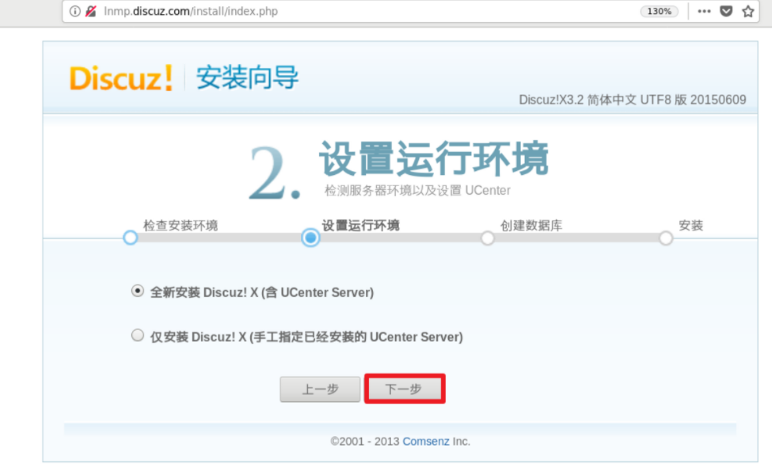
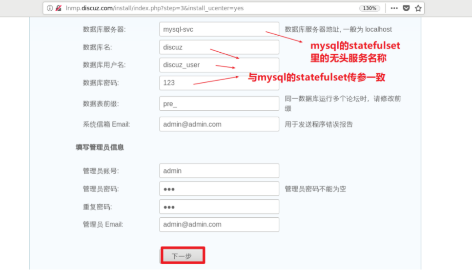

# lnmp项目部署

## 环境准备

1，k8s集群

2，harbor仓库

3，存储卷与动态供给  (这里使用前面的nfs存储)

4，Ingress   (这里使用前面安装好的traefik或ingress-nginx)


## 部署前注意事项

1，是否需要多套项目资源

* 开发环境
* 测试环境
* 生产环境

2，是否需要不同环境之间的隔离

* 每个项目都独立使用一个namespace
* 每套环境也独立使用一个namespace
* 是否需要做网络隔离


## 需要的服务与资源

这里以单环境的lnmp+discuz为例:

**镜像:**

* nginx+php                         可自行构建
* mysql                                 
* nfs-client-provisioner      

**服务与资源:**

* ingress     			           负责外网用户通过项目域名访问进来，流量给nginx+php的service

* ClusterIP类型service    负责ingress与nginx+php之间的连接
* deployment                   负责运行多副本的nginx+php的pod
* headless  service          负责连接跑nginx+php的deployment与跑mysql的statefulset
* statefulset                      负责运行mysql的pod
* storageclass                   负责nginx与mysql的存储
* secret                              负责harbor的私有仓库密码或mysql的root密码等


## 镜像准备

在任意一台可连通harbor的机器上构建，我这里用`192.168.122.1`这台操作

**1, 准备php配置文件**

~~~powershell
[root@hostos ~]# mkdir /root/lnmp
[root@hostos ~]# cd /root/lnmp
[root@hostos lnmp]# vim www.conf
[www]
listen = 127.0.0.1:9000
listen.allowed_clients = 127.0.0.1
user = nginx
group = nginx
pm = dynamic
pm.max_children = 50
pm.start_servers = 5
pm.min_spare_servers = 5
pm.max_spare_servers = 35
slowlog = /var/log/php-fpm/www-slow.log
php_admin_value[error_log] = /var/log/php-fpm/www-error.log
php_admin_flag[log_errors] = on
php_value[session.save_handler] = files
php_value[session.save_path] = /var/lib/php/session
~~~

说明: 就是把php的配置文件原配置文件去掉了注释并修改了`user`与`group`两个参数。

**2, 准备nginx配置文件**

~~~powershell
[root@hostos lnmp]# vim nginx.conf
user nginx;
worker_processes auto;
error_log /var/log/nginx/error.log;
pid /run/nginx.pid;
include /usr/share/nginx/modules/*.conf;
events {
    worker_connections 1024;
}
http {
    log_format  main  '$remote_addr - $remote_user [$time_local] "$request" '
                      '$status $body_bytes_sent "$http_referer" '
                      '"$http_user_agent" "$http_x_forwarded_for"';
    access_log  /var/log/nginx/access.log  main;
    sendfile            on;
    tcp_nopush          on;
    tcp_nodelay         on;
    keepalive_timeout   65;
    types_hash_max_size 2048;
    include             /etc/nginx/mime.types;
    default_type        application/octet-stream;
    include /etc/nginx/conf.d/*.conf;
    server {
        listen       80 default_server;
        listen       [::]:80 default_server;
        server_name  _;
        root         /usr/share/nginx/html;
        index      index.php index.html;			   # 增加了主页配置
        include /etc/nginx/default.d/*.conf;
        location / {
        }
        error_page 404 /404.html;
        location = /404.html {
        }
        error_page 500 502 503 504 /50x.html;
        location = /50x.html {
        }
        location ~ \.php$ {								# 增加了php配置段
                fastcgi_pass   127.0.0.1:9000;
                fastcgi_index  index.php;
                fastcgi_param  SCRIPT_FILENAME  $document_root$fastcgi_script_name;
                include        fastcgi_params;
        }
    }
}

~~~

说明: 把原配置文件去掉注释后，只增加了index与php的配置，其它不变。

**3, 准备时区文件**

~~~powershell
[root@hostos lnmp]# cp /etc/localtime .
~~~

**4,  编写Dockerfile并构建镜像**

~~~powershell
[root@hostos lnmp]# vim Dockerfile
FROM centos:7.6

RUN yum install epel-release -y && yum install nginx  php php-mysql php-gd libjpeg\* php-ldap php-odbc php-pear php-xml php-xmlrpc php-mbstring php-bcmath php-common php-fpm php-pecl-zendopcache -y \
    && echo 'Asia/Shanghai' > /etc/timezone && rm -f /etc/nginx/nginx.conf && rm -f /etc/php-fpm.d/www.conf

COPY localtime /etc/localtime
COPY nginx.conf /etc/nginx/nginx.conf
COPY www.conf /etc/php-fpm.d/www.conf

VOLUME ["/usr/share/nginx/html"]

EXPOSE 80

CMD /usr/sbin/nginx -c /etc/nginx/nginx.conf && /usr/sbin/php-fpm -c /etc/php-fpm.d/www.conf
~~~

构建镜像

~~~powershell
[root@hostos lnmp]# docker build -f Dockerfile -t nginx_php_fpm:v1 .
~~~

构建完后验证

~~~powershell
[root@hostos lnmp]# docker images |grep nginx_php_fpm
nginx_php_fpm               v1                  81472aa07f1d        About an hour ago   471MB
~~~

**5, 创建harbor私有仓库**


**6, 上传镜像到harbor**

```powershell
[root@hostos lnmp]# docker login 192.168.122.18

[root@hostos lnmp]# docker tag nginx_php_fpm:v1 192.168.122.18/lnmp/nginx_php_fpm:v1

[root@hostos lnmp]# docker push 192.168.122.18/lnmp/nginx_php_fpm:v1
```


```powershell
[root@hostos lnmp]# docker pull mysql:5.7

[root@hostos lnmp]# docker tag mysql:5.7 192.168.122.18/lnmp/mysql:5.7

[root@hostos lnmp]# docker push 192.168.122.18/lnmp/mysql:5.7
```

~~~powershell
[root@hostos lnmp]# docker pull registry.cn-hangzhou.aliyuncs.com/open-ali/nfs-client-provisioner

[root@hostos lnmp]# docker tag registry.cn-hangzhou.aliyuncs.com/open-ali/nfs-client-provisioner 192.168.122.18/lnmp/nfs-client-provisioner

[root@hostos lnmp]# docker push 192.168.122.18/lnmp/nfs-client-provisioner
~~~


## 编写YAML资源文件

在k8s的master1节点上准备一个目录

~~~powershell
[root@master1 ~]# mkdir /root/lnmp_discuz
[root@master1 ~]# cd /root/lnmp_discuz/
~~~


### namespace.yaml

~~~powershell
[root@master1 lnmp_discuz]# vim namespace.yaml
apiVersion: v1
kind: Namespace
metadata:
  name: lnmp-discuz
~~~

~~~powershell
[root@master1 lnmp_discuz]# kubectl apply -f namespace.yaml
namespace/lnmp-discuz created
~~~


### ingress.yaml

提前确认安装好ingress-nginx或traefik（不用和项目安装在同一个namespace，下面的ingress资源和项目同一个namespace即可)

~~~powershell
[root@master1 lnmp_discuz]# vim ingress.yaml
apiVersion: extensions/v1beta1
kind: Ingress
metadata:
  name: ingress
  namespace: lnmp-discuz
spec:
  rules:
  - host: lnmp.discuz.com
    http:
      paths:
      - backend:
          serviceName: nginx-svc
          servicePort: 80
~~~

~~~powershell
[root@master1 lnmp_discuz]# kubectl apply -f ingress.yaml
ingress.extensions/ingress created
~~~


### service.yaml

~~~powershell
[root@master1 lnmp_discuz]# vim service.yaml
apiVersion: v1
kind: Service
metadata:
  name: nginx-svc
  namespace: lnmp-discuz
spec:
  selector:
    app: nginx-php
  ports:
  - name: web
    port: 80
    targetPort: 80
~~~

~~~powershell
[root@master1 lnmp_discuz]# kubectl apply -f service.yaml
service/nginx-svc created
~~~


### secrect.yaml

登录一次成功后，会得到`~/.docker/config.json`文件，用它产生密码用于YAML文件

~~~powershell
[root@master1 ~]# docker login 192.168.122.18
Username: admin
Password:
WARNING! Your password will be stored unencrypted in /root/.docker/config.json.
Configure a credential helper to remove this warning. See
https://docs.docker.com/engine/reference/commandline/login/#credentials-store

Login Succeeded
[root@master1 ~]# base64 -w 0 ~/.docker/config.json
ewoJImF1dGhzIjogewoJCSIxOTIuMTY4LjEyMi4xOCI6IHsKCQkJImF1dGgiOiAiWVdSdGFXNDZNVEl6IgoJCX0KCX0sCgkiSHR0cEhlYWRlcnMiOiB7CgkJIlVzZXItQWdlbnQiOiAiRG9ja2VyLUNsaWVudC8xOS4wMy44IChsaW51eCkiCgl9Cn0=
~~~


~~~powershell
[root@master1 lnmp_discuz]# vim secret.yaml
apiVersion: v1
kind: Secret
metadata:
  name: harbor-secret
  namespace: lnmp-discuz
data:
  .dockerconfigjson: ewoJImF1dGhzIjogewoJCSIxOTIuMTY4LjEyMi4xOCI6IHsKCQkJImF1dGgiOiAiWVdSdGFXNDZNVEl6IgoJCX0KCX0sCgkiSHR0cEhlYWRlcnMiOiB7CgkJIlVzZXItQWdlbnQiOiAiRG9ja2VyLUNsaWVudC8xOS4wMy44IChsaW51eCkiCgl9Cn0=
type: kubernetes.io/dockerconfigjson
~~~

~~~powershell
[root@master1 lnmp_discuz]# kubectl apply -f secret.yaml
secret/harbor-secret created
~~~


### deployment.yaml

在nfs服务器上的共享目录`/data/nfs`里创建一个子目录，用于挂载给nginx的家目录

~~~powershell
[root@hostos ~]# mkdir /data/nfs/nginxroot/
~~~


~~~powershell
[root@master1 lnmp_discuz]# vim deployment.yaml
apiVersion: apps/v1
kind: Deployment
metadata:
  name: nginx-php
  namespace: lnmp-discuz
spec:
  replicas: 2
  selector:
    matchLabels:
      app: nginx-php
  template:
    metadata:
      labels:
        app: nginx-php
    spec:
      imagePullSecrets:
      - name: harbor-secret
      containers:
      - name: c1
        image: 192.168.122.18/lnmp/nginx_php_fpm:v1
        volumeMounts:
        - name: nginxroot
          mountPath: /usr/share/nginx/html
      volumes:
      - name: nginxroot
        nfs:
          server: 192.168.122.1
          path: /data/nfs/nginxroot
~~~

~~~powershell
[root@master1 lnmp_discuz]# kubectl apply -f deployment.yaml
deployment.apps/nginx-php created
~~~


### storageclass-nfs.yml

~~~powershell
[root@master1 lnmp_discuz]# vim storageclass-nfs.yml
apiVersion: storage.k8s.io/v1
kind: StorageClass
metadata:
  name: managed-nfs-storage
  namespace: lnmp-discuz
provisioner: fuseim.pri/ifs
parameters:
  archiveOnDelete: "false"
~~~

~~~powershell
[root@master1 lnmp_discuz]# kubectl apply -f storageclass-nfs.yml
storageclass.storage.k8s.io/managed-nfs-storage created
~~~

### storageclass-nfs-rbac.yaml

~~~powershell
[root@master1 lnmp_discuz]# vim storageclass-nfs-rbac.yaml
apiVersion: v1
kind: ServiceAccount
metadata:
  name: nfs-client-provisioner
  # replace with namespace where provisioner is deployed
  namespace: lnmp-discuz
---
kind: ClusterRole
apiVersion: rbac.authorization.k8s.io/v1
metadata:
  name: nfs-client-provisioner-runner
rules:
  - apiGroups: [""]
    resources: ["persistentvolumes"]
    verbs: ["get", "list", "watch", "create", "delete"]
  - apiGroups: [""]
    resources: ["persistentvolumeclaims"]
    verbs: ["get", "list", "watch", "update"]
  - apiGroups: ["storage.k8s.io"]
    resources: ["storageclasses"]
    verbs: ["get", "list", "watch"]
  - apiGroups: [""]
    resources: ["events"]
    verbs: ["create", "update", "patch"]
---
kind: ClusterRoleBinding
apiVersion: rbac.authorization.k8s.io/v1
metadata:
  name: run-nfs-client-provisioner
subjects:
  - kind: ServiceAccount
    name: nfs-client-provisioner
    # replace with namespace where provisioner is deployed
    namespace: lnmp-discuz
roleRef:
  kind: ClusterRole
  name: nfs-client-provisioner-runner
  apiGroup: rbac.authorization.k8s.io
---
kind: Role
apiVersion: rbac.authorization.k8s.io/v1
metadata:
  name: leader-locking-nfs-client-provisioner
  # replace with namespace where provisioner is deployed
  namespace: lnmp-discuz
rules:
  - apiGroups: [""]
    resources: ["endpoints"]
    verbs: ["get", "list", "watch", "create", "update", "patch"]
---
kind: RoleBinding
apiVersion: rbac.authorization.k8s.io/v1
metadata:
  name: leader-locking-nfs-client-provisioner
  # replace with namespace where provisioner is deployed
  namespace: lnmp-discuz
subjects:
  - kind: ServiceAccount
    name: nfs-client-provisioner
    # replace with namespace where provisioner is deployed
    namespace: lnmp-discuz
roleRef:
  kind: Role
  name: leader-locking-nfs-client-provisioner
  apiGroup: rbac.authorization.k8s.io
~~~


~~~powershell
[root@master1 lnmp_discuz]# kubectl apply -f storageclass-nfs-rbac.yaml
serviceaccount/nfs-client-provisioner created
clusterrole.rbac.authorization.k8s.io/nfs-client-provisioner-runner created
clusterrolebinding.rbac.authorization.k8s.io/run-nfs-client-provisioner created
role.rbac.authorization.k8s.io/leader-locking-nfs-client-provisioner created
rolebinding.rbac.authorization.k8s.io/leader-locking-nfs-client-provisioner created
~~~

### nfs-client-provisioner.yml

~~~powershell
[root@master1 lnmp_discuz]# vim nfs-client-provisioner.yml
apiVersion: apps/v1
kind: Deployment
metadata:
  name: nfs-client-provisioner
  namespace: lnmp-discuz
spec:
  replicas: 1
  strategy:
    type: Recreate
  selector:
    matchLabels:
      app: nfs-client-provisioner
  template:
    metadata:
      labels:
        app: nfs-client-provisioner
    spec:
      serviceAccount: nfs-client-provisioner
      imagePullSecrets:
      - name: harbor-secret				
      containers:
        - name: nfs-client-provisioner
          image: 192.168.122.18/lnmp/nfs-client-provisioner
          volumeMounts:
            - name: nfs-client-root
              mountPath: /persistentvolumes
          env:
            - name: PROVISIONER_NAME
              value: fuseim.pri/ifs
            - name: NFS_SERVER
              value: 192.168.122.1
            - name: NFS_PATH
              value: /data/nfs
      volumes:
        - name: nfs-client-root
          nfs:
            server: 192.168.122.1
            path: /data/nfs
~~~

~~~powershell
[root@master1 lnmp_discuz]# kubectl apply -f nfs-client-provisioner.yml
deployment.apps/nfs-client-provisioner created
~~~


### statefulset.yaml

~~~powershell
[root@master1 lnmp_discuz]# vim statefulset.yaml
apiVersion: v1
kind: Service
metadata:
  name: mysql-svc
  namespace: lnmp-discuz
spec:
  ports:
  - port: 3306
    name: mysql
  clusterIP: None
  selector:
    app: mysql
---
apiVersion: apps/v1
kind: StatefulSet
metadata:
  name: mysql
  namespace: lnmp-discuz
spec:
  selector:
    matchLabels:
      app: mysql
  serviceName: mysql-svc
  template:
    metadata:
      labels:
        app: mysql
    spec:
      imagePullSecrets:
      - name: harbor-secret
      containers:
      - name: mysql
        image: 192.168.122.18/lnmp/mysql:5.7
        env:
        - name: MYSQL_ROOT_PASSWORD
          value: "123456"
        - name: MYSQL_DATABASE
          value: discuz
        - name: MYSQL_USER
          value: discuz_user
        - name: MYSQL_PASSWORD
          value: "123"
        ports:
        - containerPort: 3306
        volumeMounts:
        - mountPath: "/var/lib/mysql"
          name: mysql-data
  volumeClaimTemplates:
  - metadata:
      name: mysql-data
    spec:
      accessModes: ["ReadWriteMany"]
      storageClassName: "managed-nfs-storage"
      resources:
        requests:
          storage: 3Gi
~~~

~~~powershell
[root@master1 lnmp_discuz]# kubectl apply -f statefulset.yaml
service/mysql-svc created
statefulset.apps/mysql created
~~~


## 存储端解压discuz

~~~powershell
[root@hostos ~]# unzip Discuz_X3.2_SC_UTF8.zip -d /data/nfs/nginxroot/
[root@hostos ~]# mv /data/nfs/nginxroot/upload/* /data/nfs/nginxroot/
~~~


## 客户端添加域名绑定

~~~powershell
[root@hostos ~]# vim /etc/hosts
192.168.122.14   lnmp.discuz.com
~~~

## 浏览器安装验证


~~~powershell
[root@hostos ~]# chmod a+w -R /data/nfs/nginxroot/
~~~








