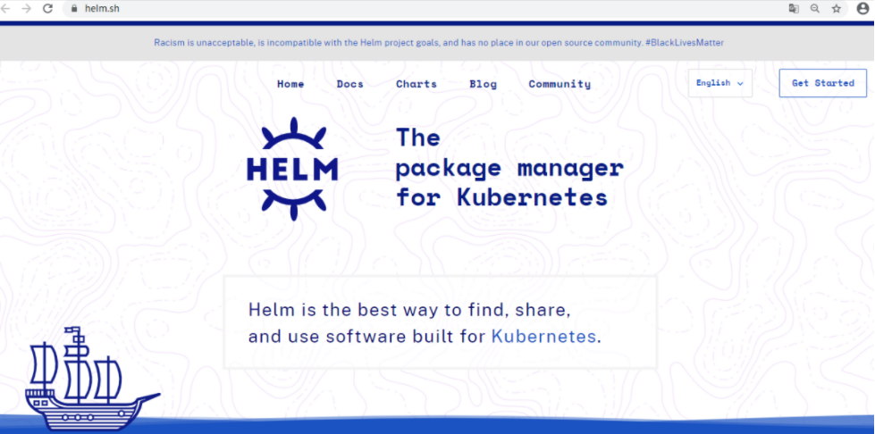

# 一、helm介绍

## 为什么要用helm?

* 一个复杂应用中涉及到多个YAML文件，如: deployment,service,configmap,pv,pvc等。

* 如果需要更新或回滚，那么要修改的YAML文件很多，管理起来比较痛苦。


所以，我们需要将这些YAML文件作为一个**整体**管理，并高效复用。


## 什么是helm?

官方: https://helm.sh/




* Helm(舵柄; 舵轮)是一个Kubernetes的包管理工具，就像Linux下的包管理器，如yum/apt等。

* 可以很方便的将之前打包好的yaml文件部署到kubernetes上。

* 对于应用发布者而言，可以通过Helm打包应用，管理应用依赖关系，管理应用版本并发布应用到软件仓库。

* 对于使用者而言，使用Helm后不用需要了解Kubernetes的Yaml语法并编写应用部署文件，可以通过Helm下载并在kubernetes上安装需要的应用。

* 除此以外，Helm还提供了kubernetes上的软件部署，删除，升级，回滚应用的强大功能。


## 基础概念

**helm：**一个命令行客户端工具，主要用于Kubernetes应用chart的创建、打包、发布和管理。

**Chart：**Helm 的软件包（项目资源清单yaml文件的集合），采用 TAR 格式，类似rpm包。

**Release：**基于Chart的部署实例，一个 chart 被 Helm 运行后将会生成对应的一个 release


**Tiller：** Tiller是Helm的服务端，部署在Kubernetes集群中, 降低了其安全性和可用性。 **helm3中已经移除了该组件**，直接采用Kubernetes CRD 资源来进行管理。


# 二、helm部署

下载地址：https://github.com/kubernetes/helm/releases

```powershell
[root@master1 ~]# wget https://get.helm.sh/helm-v3.4.1-linux-amd64.tar.gz

[root@master1 ~]# tar xf helm-v3.4.1-linux-amd64.tar.gz

[root@master1 ~]# mv linux-amd64/helm /bin/helm

[root@master1 ~]# helm version
version.BuildInfo{Version:"v3.4.1", GitCommit:"c4e74854886b2efe3321e185578e6db9be0a6e29", GitTreeState:"clean", GoVersion:"go1.14.11"}
```

# 三、Helm基础使用

## 添加仓库

查看

~~~powershell
[root@master1 ~]# helm repo list
Error: no repositories to show
~~~

添加新的仓库地址

``` powershell
阿里源，helm3使用不了，有坑(未更新)
[root@master1 ~]# helm repo add stable https://kubernetes.oss-cn-shenzhen.aliyuncs.com/charts

微软源(目前建议使用)
[root@master ~]# helm repo add stable http://mirror.azure.cn/kubernetes/charts/

网友开源的：
[root@master ~]# helm repo add stable https://charts.ost.ai/
```

更新仓库

```powershell
[root@master1 ~]# helm repo update
Hang tight while we grab the latest from your chart repositories...
...Successfully got an update from the "stable" chart repository
Update Complete. ⎈Happy Helming!⎈
```

再查看

~~~powershell
[root@master ~]# helm repo list
NAME    URL
stable  http://mirror.azure.cn/kubernetes/charts/
~~~


补充: 可用`helm repo remove stable`删除仓库。


## 查看charts

使用`helm search repo 关键字`可以查看相关charts

~~~powershell
[root@master1 ~]# helm search repo stable
NAME                                    CHART VERSION   APP VERSION             DESCRIPTION                             
stable/acs-engine-autoscaler            2.2.2           2.1.1                   DEPRECATED Scales worker nodes within agent pools
stable/aerospike                        0.3.4           v4.5.0.5                A Helm chart for Aerospike in Kubernetes
stable/airflow                          7.13.1          1.10.12                 Airflow is a platform to programmatically autho...
stable/ambassador                       5.3.2           0.86.1                  DEPRECATED A Helm chart for 
......
......
~~~


~~~powershell
[root@master ~]# helm search repo nginx
NAME                            CHART VERSION   APP VERSION     DESCRIPTION
stable/nginx-ingress            1.41.3          v0.34.1         DEPRECATED! An nginx Ingress controller that us...
stable/nginx-ldapauth-proxy     0.1.5           1.13.5          nginx proxy with ldapauth
stable/nginx-lego               0.3.1                           Chart for nginx-ingress-controller and kube-lego
stable/gcloud-endpoints         0.1.2           1               DEPRECATED Develop, deploy, protect and monitor...
~~~


~~~powershell
[root@master ~]# helm search repo tomcat
NAME            CHART VERSION   APP VERSION     DESCRIPTION
stable/tomcat   0.4.2           7.0             Deploy a basic tomcat application server with s...
~~~


## 下载chart资源

```powershell
[root@master1 ~]# helm pull stable/mysql                    # 默认下载最新版
[root@master1 ~]# helm pull stable/mysql --version 1.6.8    # 指定下载某一个版本
```


```powershell
[root@master1 ~]# tar xf mysql-1.6.8.tgz
[root@master1 ~]# ls mysql
Chart.yaml  README.md  templates  values.yaml
```


## 部署应用

比如我们现在安装一个 `mysql` 应用：

```powershell
[root@master ~]# helm install stable/mysql --generate-name 
NAME: mysql-1605192239									# --generate-name会产生随机名称
LAST DEPLOYED: Thu Nov 12 22:44:01 2020
NAMESPACE: default
STATUS: deployed
REVISION: 1
NOTES:
MySQL can be accessed via port 3306 on the following DNS name from within your cluster:
mysql-1605192239.default.svc.cluster.local
......
```

也可以通过下载到本地的chart包进行安装

~~~powershell
[root@master ~]# helm install mysql-1.6.8.tgz --generate-name
~~~


一个 chart 包是可以多次安装到同一个集群中的，每次安装都会产生一个release, 每个release都可以独立管理和升级。

~~~powershell
[root@master ~]# helm install stable/mysql --generate-name
NAME: mysql-1605195227
......
~~~


~~~powershell
[root@master ~]# helm ls
NAME              NAMESPACE     REVISION     UPDATED    STATUS        CHART           APP VERSION
mysql-1605192239     default     1        .........     deployed      mysql-1.6.8       5.7.30
mysql-1605195227     default     1        .........     deployed      mysql-1.6.8       5.7.30
~~~


## 查看chart资源

```powershell
[root@master ~]# kubectl get all -l release=mysql-1605192239
NAME                                   READY   STATUS    RESTARTS   AGE
pod/mysql-1605192239-95d97f89f-t2mv4   0/1     Pending   0          47m  # 因为存储卷问题启不来，先忽略

NAME                       TYPE        CLUSTER-IP     EXTERNAL-IP   PORT(S)    AGE
service/mysql-1605192239   ClusterIP   10.2.157.208   <none>        3306/TCP   47m

NAME                               READY   UP-TO-DATE   AVAILABLE   AGE
deployment.apps/mysql-1605192239   0/1     1            0           47m    

NAME                                         DESIRED   CURRENT   READY   AGE
replicaset.apps/mysql-1605192239-95d97f89f   1         1         0       47m
```


我们也可以 `helm show chart` 命令来了解 MySQL 这个 chart 包的一些特性：

```powershell
[root@master ~]# helm show chart stable/mysql
......
```

如果想要了解更多信息，可以用 `helm show all` 命令：

```powershell
[root@master ~]# helm show all stable/mysql
......
```

## 删除charts

如果需要删除这个 release，也很简单，只需要使用 `helm uninstall`或`helm delete` 命令即可：

```powershell
[root@master ~]# helm uninstall mysql-1605195227
release "mysql-1605195227" uninstalled
```

`uninstall` 命令会从 Kubernetes 中删除 release，也会删除与 release 相关的所有 Kubernetes 资源以及 release 历史记录。

~~~powershell
[root@master ~]# helm ls
NAME              NAMESPACE     REVISION     UPDATED    STATUS        CHART           APP VERSION
mysql-1605192239     default     1        .........     deployed      mysql-1.6.8       5.7.30
~~~

在删除的时候使用 `--keep-history` 参数，则会保留 release 的历史记录，该 release 的状态就是 `UNINSTALLED`，

```powershell
[root@master ~]# helm uninstall mysql-1605192239 --keep-history
release "mysql-1605192239" uninstalled

[root@master ~]# helm ls -a
NAME                    NAMESPACE       REVISION        UPDATED     STATUS        CHART     APP VERSION
mysql-1605192239        default         1              ........    uninstalled     mysql-1.6.8     5.7.30
状态为uninstalled
```

审查历史时甚至可以取消删除`release`。

`Usage:  helm rollback <RELEASE> [REVISION] [flags]`

~~~powershell
[root@master ~]# helm rollback mysql-1605192239 1
Rollback was a success! Happy Helming!

[root@master ~]# helm ls
NAME              NAMESPACE     REVISION     UPDATED    STATUS        CHART           APP VERSION
mysql-1605192239     default     1        .........     deployed      mysql-1.6.8       5.7.30
rollback后，又回到deployed状态
~~~


## 定制参数部署应用

上面我们都是直接使用的 `helm install` 命令安装的 chart 包，这种情况下只会使用 chart 的默认配置选项，但是更多的时候，是各种各样的需求，索引我们希望根据自己的需求来定制 chart 包的配置参数。

我们可以使用 `helm show values` 命令来查看一个 chart 包的所有可配置的参数选项：

```powershell
[root@master ~]# helm show values stable/mysql
......
......
```

上面我们看到的所有参数都是可以用自己的数据来覆盖的，可以在安装的时候通过 YAML 格式的文件来传递这些参数


1，准备参数文件

~~~powershell
[root@master ~]# vim mysql-config.yml
mysqlUser: daniel
mysqlPassword: "123"			# 密码纯数字需要引起来，否则报类型错误
mysqlDatabase: helm
persistence:
  enabled: false				# 前面就是因为这里为True，启不来pod。现在没有存储卷，改为false
~~~


2, 使用`-f mysql-config.yml`安装应用并覆盖参数

```powershell
[root@master ~]# helm install mysql -f mysql-config.yml stable/mysql
NAME: mysql								# 指定release名字为mysql
LAST DEPLOYED: Fri Nov 13 16:23:35 2020
NAMESPACE: default
STATUS: deployed
REVISION: 1
NOTES:
MySQL can be accessed via port 3306 on the following DNS name from within your cluster:
mysql.default.svc.cluster.local

To get your root password run:

    MYSQL_ROOT_PASSWORD=$(kubectl get secret --namespace default mysql -o jsonpath="{.data.mysql-root-password}" | base64 --decode; echo)
......
```

3, 查看覆盖的参数

~~~powershell
[root@master ~]# helm get values mysql
USER-SUPPLIED VALUES:
mysqlDatabase: helm
mysqlPassword: "123"
mysqlUser: daniel
persistence:
  enabled: false
~~~

4, 查看部署的相关资源

~~~powershell
[root@master ~]# kubectl get all -l release=mysql
NAME                         READY   STATUS    RESTARTS   AGE
pod/mysql-5756df8454-r2zp6   1/1     Running   0          107s			# pod是Running状态了

NAME            TYPE        CLUSTER-IP    EXTERNAL-IP   PORT(S)    AGE
service/mysql   ClusterIP   10.2.134.59   <none>        3306/TCP   107s

NAME                    READY   UP-TO-DATE   AVAILABLE   AGE
deployment.apps/mysql   1/1     1            1           107s

NAME                               DESIRED   CURRENT   READY   AGE
replicaset.apps/mysql-5756df8454   1         1         1       107s
~~~

5, 查看pod的IP

~~~powershell
[root@master ~]# kubectl get pod -o wide -l release=mysql
NAME                     READY   STATUS    RESTARTS  AGE  IP        NODE   NOMINATED   NODE   READINESS GATES
mysql-5756df8454-h8wdz   1/1     Running   0         15m  10.3.1.5  node1   <none>            <none>
得到pod的IP为10.3.1.5
~~~

6, 安装mysql客户端并连接测试

~~~powershell
[root@master ~]# yum install mariadb -y
~~~

~~~powershell
[root@master ~]# mysql -h 10.3.1.5 -u daniel -p123 -e 'show databases'
+--------------------+
| Database           |
+--------------------+
| information_schema |
| helm               |
+--------------------+


[root@master ~]# mysql -h 10.2.134.59 -u daniel -p123 -e 'show databases'
+--------------------+
| Database           |
+--------------------+
| information_schema |
| helm               |
+--------------------+
~~~

7, mysql管理员连接测试

~~~powershell
[root@master ~]# kubectl get secret --namespace default mysql -o jsonpath="{.data.mysql-root-password}" | base64 --decode; echo
55xYBxBiCq

[root@master ~]# mysql -h 10.3.1.5 -u root -p55xYBxBiCq -e 'show databases'
+--------------------+
| Database           |
+--------------------+
| information_schema |
| helm               |
| mysql              |
| performance_schema |
| sys                |
+--------------------+

[root@master ~]# mysql -h 10.2.134.59 -u root -p55xYBxBiCq -e 'show databases'
+--------------------+
| Database           |
+--------------------+
| information_schema |
| helm               |
| mysql              |
| performance_schema |
| sys                |
+--------------------+
~~~


## 升级和回滚

当新版本的 chart 包发布的时候，或者当你要更改 release 的配置的时候，你可以使用 `helm upgrade` 命令来操作。升级需要一个现有的 release，并根据提供的信息对其进行升级。因为 Kubernetes charts 可能很大而且很复杂，Helm 会尝试以最小的侵入性进行升级，它只会更新自上一版本以来发生的变化：


1, 升级前查看版本

~~~powershell
[root@master ~]# mysql -h 10.3.1.5 -u root -p55xYBxBiCq -e 'select version()'
+-----------+
| version() |
+-----------+
| 5.7.30    |					       版本为5.7.30
+-----------+


[root@master ~]# kubectl get deployment mysql -o wide
NAME    READY   UP-TO-DATE   AVAILABLE   AGE   CONTAINERS   IMAGES         SELECTOR
mysql   1/1     1            1           77s   mysql        mysql:5.7.30   app=mysql,release=mysql
images版本为5.7.30
~~~

2，修改配置并升级

```powershell
[root@master ~]# vim mysql-config.yml
mysqlUser:
  daniel
mysqlPassword: "456"					# 密码修改为456
mysqlDatabase: helm
persistence:
  enabled: false
```

升级并且加一个`--set imageTag=5.7.31`参数设置为5.7.31版本

```powershell
[root@master ~]# helm upgrade mysql -f mysql-config.yml --set imageTag=5.7.31 stable/mysql
```

3, 升级后确认版本

```powershell
[root@master ~]# kubectl get deployment mysql -o wide
NAME    READY   UP-TO-DATE   AVAILABLE   AGE   CONTAINERS   IMAGES         SELECTOR
mysql   1/1     1            1           7m   mysql        mysql:5.7.31   app=mysql,release=mysql
可以看到images升级为5.7.31
```

~~~powershell
[root@master ~]# kubectl get pods -o wide
NAME                     READY   STATUS    RESTARTS   AGE     IP         NODE    NOMINATED NODE   READINESS GATES
mysql-7875fd759f-5sv86   1/1     Running   0          5m45s   10.3.2.4   node2   <none>       <none>


[root@master ~]# mysql -h 10.3.2.4 -u daniel -p456 -e 'select version()'			# 密码升级为456
+-----------+
| version() |
+-----------+
| 5.7.31    |					版本升级为5.7.31
+-----------+
~~~

4, 回滚

~~~powershell
[root@master ~]# helm history mysql
REVISION      UPDATED                    STATUS         CHART         APP VERSION    DESCRIPTION
1            Fri Nov 13 18:11:43 2020    superseded    mysql-1.6.8     5.7.30        Install complete
2            Fri Nov 13 18:29:21 2020    deployed      mysql-1.6.8     5.7.30        Upgrade complete
~~~

~~~powershell
[root@master ~]# helm rollback mysql 1
Rollback was a success! Happy Helming!
~~~

5, 验证

~~~powershell
[root@master ~]#  kubectl get deployment mysql -o wide
NAME    READY   UP-TO-DATE   AVAILABLE   AGE   CONTAINERS   IMAGES         SELECTOR
mysql   1/1     1            1           20m   mysql        mysql:5.7.30   app=mysql,release=mysql
image回到5.7.30
~~~


~~~powershell
[root@master ~]# helm history mysql
REVISION      UPDATED                       STATUS        CHART         APP VERSION   DESCRIPTION
1             Fri Nov 13 18:11:43 2020      superseded    mysql-1.6.8   5.7.30        Install complete
2             Fri Nov 13 18:29:21 2020      superseded    mysql-1.6.8   5.7.30        Upgrade complete
3             Fri Nov 13 18:30:52 2020      deployed      mysql-1.6.8   5.7.30        Rollback to 1
~~~


## 更多安装方式

和yum命令类似

- chart 仓库
- 本地 chart 压缩包

~~~powershell
[root@master ~]# helm pull stable/mysql

[root@master ~]# ls mysql-1.6.8.tgz
mysql-1.6.8.tgz

[root@master ~]# helm install mysql2 mysql-1.6.8.tgz
~~~

- 在线的 URL（helm install fool https://example.com/charts/foo-1.2.3.tgz）


# 四、自定义chart

## Chart 目录结构   


~~~powershell
[root@master ~]# helm pull stable/mysql

[root@master ~]# tar xf mysql-1.6.8.tgz

[root@master ~]# ls mysql
Chart.yaml  README.md  templates  values.yaml

[root@master ~]# ls mysql/templates/ -l
total 48
-rwxr-xr-x 1 root root  292 Jan  1  1970 configurationFiles-configmap.yaml
-rwxr-xr-x 1 root root 8930 Jan  1  1970 deployment.yaml
-rwxr-xr-x 1 root root 1290 Jan  1  1970 _helpers.tpl
-rwxr-xr-x 1 root root  295 Jan  1  1970 initializationFiles-configmap.yaml
-rwxr-xr-x 1 root root 2036 Jan  1  1970 NOTES.txt
-rwxr-xr-x 1 root root  868 Jan  1  1970 pvc.yaml
-rwxr-xr-x 1 root root 1475 Jan  1  1970 secrets.yaml
-rwxr-xr-x 1 root root  328 Jan  1  1970 serviceaccount.yaml
-rwxr-xr-x 1 root root  800 Jan  1  1970 servicemonitor.yaml
-rwxr-xr-x 1 root root 1231 Jan  1  1970 svc.yaml
drwxr-xr-x 2 root root   50 Nov 13 18:43 tests
~~~


| 文件              | 说明                                                         |
| ----------------- | ------------------------------------------------------------ |
| Chart.yaml        | 用于描述Chart的基本信息;  `helm show chart stable/mysql`命令查看的内容就是此文件内容 |
| values.yaml       | Chart的默认配置文件; `helm show values stable/mysql`命令查看的内容就是此文件内容 |
| README.md         | [可选] 当前Chart的介绍                                       |
| LICENS            | [可选] 协议                                                  |
| requirements.yaml | [可选] 用于存放当前Chart依赖的其它Chart的说明文件            |
| charts/           | [可选]: 该目录中放置当前Chart依赖的其它Chart                 |
| templates/        | [可选]: 部署文件模版目录                                     |


## 创建不可配置的chart

### 1, 创建目录与chart.yaml

```powershell
[root@master ~]# mkdir -p /helm/nginx/templates
[root@master ~]# cd  /helm/nginx
```

```powershell
[root@master nginx]# vim Chart.yaml
name: helm-nginx
version: 1.0.0
```

### 2, 创建deployment.yaml

```powershell
[root@master nginx]# vim templates/deployment.yaml
apiVersion: apps/v1
kind: Deployment
metadata:
  name: helm-nginx
spec:
  replicas: 1                                   
  selector:
    matchLabels:
      app: helm-nginx
  template:
    metadata:
      labels:
        app: helm-nginx
    spec:
      containers:
      - name: c1
        image: nginx:1.15-alpine
        imagePullPolicy: IfNotPresent
```

### **3, 创建service.yaml**

```ruby
[root@master nginx]# vim templates/service.yaml
apiVersion: v1
kind: Service
metadata:
  name: helm-nginx
spec:
  selector:
    app: helm-nginx
  ports:
  - port: 80
    targetPort: 80
    protocol: TCP
```

### 4, 使用chart安装应用

~~~powershell
[root@master nginx]# helm install /helm/nginx --generate-name
NAME: nginx-1605270747
LAST DEPLOYED: Fri Nov 13 20:32:27 2020
NAMESPACE: default
STATUS: deployed
REVISION: 1
TEST SUITE: None
~~~


### 5, 查看与验证

~~~powershell
[root@master nginx]# kubectl get pod,services
NAME                              READY   STATUS    RESTARTS   AGE
pod/helm-nginx-6956c55857-xm7mg   1/1     Running   0          116s


NAME                 TYPE        CLUSTER-IP    EXTERNAL-IP   PORT(S)    AGE
service/helm-nginx   ClusterIP   10.2.73.117   <none>        80/TCP     116s
~~~


```powershell
[root@master nginx]# curl 10.2.73.117
<!DOCTYPE html>
<html>
<head>
<title>Welcome to nginx!</title>
......
......
```


### 6, 删除

~~~powershell
[root@master nginx]# helm delete nginx-1605270747
release "nginx-1605270747" uninstalled
~~~


## 创建可配置的Release

### 官方的预定义变量

- Release.Name：发布的名称（不是chart）
- Release.Time：chart发布上次更新的时间。这将匹配Last ReleasedRelease对象上的时间。
- Release.Namespace：chart发布到的名称空间。
- Release.Service：进行发布的服务。
- Release.IsUpgrade：如果当前操作是升级或回滚，则设置为true。
- Release.IsInstall：如果当前操作是安装，则设置为true。
- Release.Revision：修订号。它从1开始，每个都递增helm upgrade。
- Chart：内容Chart.yaml。因此，chart版本可以Chart.Version和维护者一样获得 Chart.Maintainers。
- Files：类似于chart的对象，包含chart中的所有非特殊文件。这不会授予您访问模板的权限，但可以访问存在的其他文件（除非使用它们除外.helmignore）。可以使用{{index .Files "file.name"}}或使用{{.Files.Get name}}或 {{.Files.GetStringname}}函数访问文件。您也可以访问该文件的内容，[]byte使用{{.Files.GetBytes}}
- Capabilities：类似于地图的对象，包含有关Kubernetes（{{.Capabilities.KubeVersion}}，Tiller（{{.Capabilities.TillerVersion}}和支持的Kubernetes API）版本（{{.Capabilities.APIVersions.Has "batch/v1"）的版本的信息

### 新增values.yaml文件

```bash
[root@master nginx]# pwd
/helm/nginx
[root@master nginx]# vim values.yaml
image:
  repository: nginx
  tag: '1.15-alpine'
replicas: 2
```

### **配置deploy引用values的值**

```powershell
[root@master nginx]# vim templates/deployment.yaml
apiVersion: apps/v1
kind: Deployment
metadata:
  name: helm-nginx
spec:
  replicas: {{ .Values.replicas }}
  selector:
    matchLabels:
      app: helm-nginx
  template:
    metadata:
      labels:
        app: helm-nginx
    spec:
      containers:
      - name: helm-nginx
        image: {{ .Values.image.repository }}:{{ .Values.image.tag }}
        imagePullPolicy: IfNotPresent
```

### 测试

使用`--dry-run`选项来打印出生成的清单文件内容，而不执行部署

~~~powershell
[root@master nginx]# helm install helm-nginx --set replicas='3' /helm/nginx/ --dry-run
NAME: helm-nginx
LAST DEPLOYED: Fri Nov 13 20:57:45 2020
NAMESPACE: default
STATUS: pending-install										状态表示是测试，不是真的部署了
REVISION: 1
TEST SUITE: None
HOOKS:
MANIFEST:
---
# Source: helm-nginx/templates/service.yaml
apiVersion: v1
kind: Service
metadata:
  name: helm-nginx
spec:
  selector:
    app: helm-nginx
  ports:
  - port: 80
    targetPort: 80
    protocol: TCP
---
# Source: helm-nginx/templates/deployment.yaml
apiVersion: apps/v1
kind: Deployment
metadata:
  name: helm-nginx
spec:
  replicas: 3												副本数量3传参成功
  selector:
    matchLabels:
      app: helm-nginx
  template:
    metadata:
      labels:
        app: helm-nginx
    spec:
      containers:
      - name: helm-nginx
        image: nginx:1.15-alpine							镜像名:TAG 传参成功
        imagePullPolicy: IfNotPresent
~~~


### 部署

```powershell
[root@master nginx]# helm install helm-nginx --set replicas='3' /helm/nginx/
NAME: helm-nginx
LAST DEPLOYED: Fri Nov 13 21:06:41 2020
NAMESPACE: default
STATUS: deployed
REVISION: 1
TEST SUITE: None
```

### 查看部署结果

```powershell
[root@master nginx]# helm ls
NAME            NAMESPACE       REVISION        UPDATED     STATUS        CHART           APP   VERSION
helm-nginx      default         1               .......      deployed    helm-nginx-1.0.0


[root@master nginx]# kubectl get pod,svc
NAME                              READY   STATUS    RESTARTS   AGE
pod/helm-nginx-78885b984d-5nbl6   1/1     Running   0          89s
pod/helm-nginx-78885b984d-c62fm   1/1     Running   0          89s
pod/helm-nginx-78885b984d-jd6vp   1/1     Running   0          89s

NAME                 TYPE        CLUSTER-IP     EXTERNAL-IP   PORT(S)    AGE
service/helm-nginx   ClusterIP   10.2.193.144   <none>        80/TCP     89s
```


### 打包

将chart打包成一个压缩文件。

```powershell
[root@master nginx]# helm package .
Successfully packaged chart and saved it to: /helm/nginx/helm-nginx-1.0.0.tgz

[root@master nginx]# ls
Chart.yaml  helm-nginx-1.0.0.tgz  templates  values.yaml

打包出mychart-0.1.0.tgz文件
```


### 安装

~~~powershell
[root@master nginx]# helm install helm-nginx2 /helm/nginx/helm-nginx-1.0.0.tgz
~~~


## 拓展: 把lnmp项目做成chart

~~~powershell
[root@master1 ~]# mkdir /helm/lnmp/templates -p
[root@master1 ~]# cd /helm/lnmp/
[root@master1 lnmp]# vim Chart.yaml
name: lnmp
version: 1.0

将上次项目相关的yaml都拷贝过来放到templates/下面
[root@master1 lnmp]# cp /root/lnmp_discuz/* /helm/lnmp/templates/

如果有非yaml文件请删除
[root@master1 lnmp]# rm /helm/lnmp/templates/nginx.conf -rf	
[root@master1 lnmp]# rm templates/lnmp-discuz.yaml -rf			# 这是上次项目整合的yaml，也要删除


打包并安装
[root@master1 lnmp]# helm package .
[root@master1 lnmp]# helm install lnmp /helm/lnmp/lnmp-1.tgz
~~~

安装后将原来mysql动态供给的存储卷数据移到新的存储卷后，项目仍然可用。

~~~powershell
[root@hostos ~]# mv /data/nfs/archived-lnmp-discuz-mysql-data-mysql-0-pvc-6bc0d1fe-1543-4bd2-8461-134dab25e9b4/discuz/* /data/nfs/lnmp-discuz-mysql-data-mysql-0-pvc-03e1db65-9e34-478b-9316-4ce74af4770d/discuz/
~~~


# 五，上传到harbor的helm仓库(拓展)

### 创建harbor中的helm仓库

* harbor版本必须是1.6+才支持存储helm charts
* **默认新版 harbor不会启用 `chart repository service`, 需要在安装harbor时使用` ./install.sh --with-chartmuseum`**

* 创建项目chartrepo(公开仓库)


### 将harbor添加到helm仓库中

```powershell
[root@master1 ~]# helm repo add harbor --username=admin --password=123 http://192.168.122.18/chartrepo
"harbor" has been added to your repositories
```

~~~powershell
[root@master1 ~]# helm repo list
NAME    URL
stable  http://mirror.azure.cn/kubernetes/charts/
harbor  http://192.168.122.18/chartrepo

[root@master1 ~]# helm repo update
~~~


### 安装helmpush插件

需要安装helmpush插件才能上传

* 在线直接安装

~~~powershell
[root@master1 ~]# helm plugin install https://github.com/chartmuseum/helm-push
Downloading and installing helm-push v0.9.0 ...
https://github.com/chartmuseum/helm-push/releases/download/v0.9.0/helm-push_0.9.0_linux_amd64.tar.gz
Installed plugin: push

[root@master1 ~]# ls /root/.local/share/helm/plugins/helm-push/bin/helmpush
/root/.local/share/helm/plugins/helm-push/bin/helmpush
~~~

* 先下载再安装

~~~powershell
[root@master1 ~]# wget https://github.com/chartmuseum/helm-push/releases/download/v0.9.0/helm-push_0.9.0_linux_amd64.tar.gz

[root@master1 ~]# mkdir /usr/local/helmpush
[root@master1 ~]# tar xf helm-push_0.9.0_linux_amd64.tar.gz -C /usr/local/helmpush/
[root@master1 ~]# ls /usr/local/helmpush/
bin  LICENSE  plugin.yaml

[root@master1 ~]# cp /usr/local/helmpush/bin/helmpush /root/.local/share/helm/plugins/helm-push/bin/helmpush

[root@master1 ~]# ls /root/.local/share/helm/plugins/helm-push/bin/helmpush
/root/.local/share/helm/plugins/helm-push/bin/helmpush
~~~


### 将打包应用push到harbor

~~~powershell
[root@master1 ~]# helm push --username=admin --password=123 /helm/nginx/helm-nginx-1.0.0.tgz harbor
Pushing helm-nginx-1.0.0.tgz to harbor...
Done.
~~~


