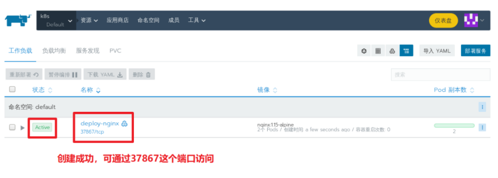

# 一、认识rancher

rancher是一个`kubernetes-as-a-service`解决方案,也就是说rancher将kubernetes集群搭建与应用编排实现了打包一体化,可以通过图形界面的操作就可以来部署与管理kubernetes集群与应用了。

参考: https://www.rancher.cn/


# 二、环境准备

1, 主机名和主机名绑定

```powershell
# hostnamectl set-hostname --static rancher1
```

```powershell
# vim /etc/hosts
127.0.0.1   localhost localhost.localdomain localhost4 localhost4.localdomain4
::1         localhost localhost.localdomain localhost6 localhost6.localdomain6
192.168.122.21  rancher1
192.168.122.22  rancher2
192.168.122.23  rancher3
```

2, **所有节点**关闭centos7的firewalld防火墙,打开iptables并保存为空规则

```powershell
# systemctl stop firewalld
# systemctl disable firewalld

# yum install iptables-services -y
# systemctl restart iptables
# systemctl enable iptables

# iptables -F && iptables -F -t nat && iptables -F -t mangle && iptables -F -t raw

# service iptables save
iptables: Saving firewall rules to /etc/sysconfig/iptables:[  OK  ]
```

3, **所有节点**关闭selinux

```powershell
# vim /etc/selinux/config

# This file controls the state of SELinux on the system.
# SELINUX= can take one of these three values:
#     enforcing - SELinux security policy is enforced.
#     permissive - SELinux prints warnings instead of enforcing.
#     disabled - No SELinux policy is loaded.
SELINUX=disabled				  确认为disabled,如果不是请改成disabled(需要reboot重启生效)
# SELINUXTYPE= can take one of three values:
#     targeted - Targeted processes are protected,
#     minimum - Modification of targeted policy. Only selected processes are protected.
#     mls - Multi Level Security protection.
SELINUXTYPE=targeted
```

4, **所有节点** 时间同步

```powershell
# systemctl restart ntpd
# systemctl enabled ntpd
```


5, 需要保证安装docker,并启动服务

```powershell
# wget https://mirrors.aliyun.com/docker-ce/linux/centos/docker-ce.repo -O /etc/yum.repos.d/docker-ce.repo
# yum install docker-ce -y
# systemctl restart docker 
# systemctl enable docker 
```

6, 配置镜像加速器

```powershell
# vim /etc/docker/daemon.json
{
	"registry-mirrors": ["https://42h8kzrh.mirror.aliyuncs.com"]
}
# systemctl daemon-reload
# systemctl restart docker
```

7, 启动rancher容器

在集群中任意一台上操作或在集群外的一台服务器(但要和集群网络可通)上操作

```powershell
[root@rancher1 ~]# docker run -d --restart=unless-stopped -p 80:80 -p 443:443 --name rancher -v /var/lib/rancher/:/var/lib/rancher/ --privileged rancher/rancher:stable
Unable to find image 'rancher/rancher:stable' locally
stable: Pulling from rancher/rancher
35c102085707: Pull complete
251f5509d51d: Pull complete
8e829fe70a46: Pull complete
6001e1789921: Pull complete
190724123869: Pull complete
f144ec07b677: Pull complete
eb837ce35a44: Pull complete
71ab38270b07: Pull complete
d69cad2e554a: Pull complete
33d6cdb7458b: Pull complete
f5a0fc4d0fec: Pull complete
2bd480581d18: Pull complete
d81d5f05f9e8: Pull complete
Digest: sha256:b85f1dd239d2555ef438f46790642334e0c75f314a35047b93acb1b457b4cd09
Status: Downloaded newer image for rancher/rancher:stable
3ff8ca28cede2b119eccecb27337748631ebc2659846d20671fbfdda456ec433

```

8, 通过浏览器访问配置

直接访问节点IP即可: https://192.168.122.21

注意: 因为我们没有配置SSL证书, 所以浏览器会报不安全的连接,如果要对公网使用，建议使用CA认证的证书。


# 三、创建rancher集群

## 1, 添加自定义集群


## 2, 自定义集群名称，版本等


## 3, 集群角色选择


## 4, 添加节点并安装

注意:

* 有几个节点就可以添加几个
* 但安装速度一般会很慢，因为要下载多个大镜像，可先添加一个，再慢慢添加其它节点

~~~powershell
[root@rancher1 ~]# docker run -d --privileged --restart=unless-stopped --net=host -v /etc/kubernetes:/etc/kubernetes -v /var/run:/var/run rancher/rancher-agent:v2.5.2 --server https://192.168.122.21 --token dd6xhrwmgdwhj9k2hlrj627plr47n67ml62qjc8t79gk7gtcgwnsd7 --ca-checksum 63a64ccf0ecc1c55a8cce38e025e6c4ac0f007ce5fc7b28f5ebcdc9878dc57b2 --etcd --controlplane --worker
~~~


~~~powershell
[root@rancher2 ~]# docker run -d --privileged --restart=unless-stopped --net=host -v /etc/kubernetes:/etc/kubernetes -v /var/run:/var/run rancher/rancher-agent:v2.5.2 --server https://192.168.122.21 --token dd6xhrwmgdwhj9k2hlrj627plr47n67ml62qjc8t79gk7gtcgwnsd7 --ca-checksum 63a64ccf0ecc1c55a8cce38e025e6c4ac0f007ce5fc7b28f5ebcdc9878dc57b2 --etcd --controlplane --worker
~~~


~~~powershell
[root@rancher3 ~]# docker run -d --privileged --restart=unless-stopped --net=host -v /etc/kubernetes:/etc/kubernetes -v /var/run:/var/run rancher/rancher-agent:v2.5.2 --server https://192.168.122.21 --token dd6xhrwmgdwhj9k2hlrj627plr47n67ml62qjc8t79gk7gtcgwnsd7 --ca-checksum 63a64ccf0ecc1c55a8cce38e025e6c4ac0f007ce5fc7b28f5ebcdc9878dc57b2 --etcd --controlplane --worker
~~~


**特别说明:  因为网速问题，课堂上很难安装成功。所以我们选择==将前面部署的k8s集群导入==**


# 四、导入已有k8s集群

## 1, 选择导入


## 2, 自定义集群名称


## 3, 复制导入命令


## 4, 在k8s管理节点执行导入命名

~~~powershell
[root@master1 ~]# curl --insecure -sfL https://192.168.122.21/v3/import/mq5csg5p2hbkflqfcv6wpjk8285ntl5d692cdkdvqczzcjwhbccl6g.yaml | kubectl apply -f -
clusterrole.rbac.authorization.k8s.io/proxy-clusterrole-kubeapiserver created
clusterrolebinding.rbac.authorization.k8s.io/proxy-role-binding-kubernetes-master created
namespace/cattle-system created
serviceaccount/cattle created
clusterrolebinding.rbac.authorization.k8s.io/cattle-admin-binding created
secret/cattle-credentials-45bbb63 created
clusterrole.rbac.authorization.k8s.io/cattle-admin created
deployment.apps/cattle-cluster-agent created
~~~

## 5, 验证导入结果

导入速度非常快，一分钟左右就集群状态OK了


# 五、使用rancher部署nginx

## 1, 进入namespace


## 2, 自定义部署参数


## 3, 验证部署




也可以在k8s集群上命名验证

~~~powershell
[root@master1 ~]# kubectl get deploy
NAME           READY   UP-TO-DATE   AVAILABLE   AGE
deploy-nginx   2/2     2            2           5m

[root@master1 ~]# kubectl get pod
NAME                            READY   STATUS    RESTARTS   AGE
deploy-nginx-59bd7848d6-4fsph   1/1     Running   0          5m
deploy-nginx-59bd7848d6-c5c49   1/1     Running   0          5m

[root@master1 ~]# kubectl get svc
NAME                    TYPE        CLUSTER-IP    EXTERNAL-IP   PORT(S)        AGE
deploy-nginx            ClusterIP   10.2.165.51   <none>        80/TCP         5m
deploy-nginx-nodeport   NodePort    10.2.77.138   <none>        80:37867/TCP   5m
kubernetes              ClusterIP   10.2.0.1      <none>        443/TCP        12d
~~~


