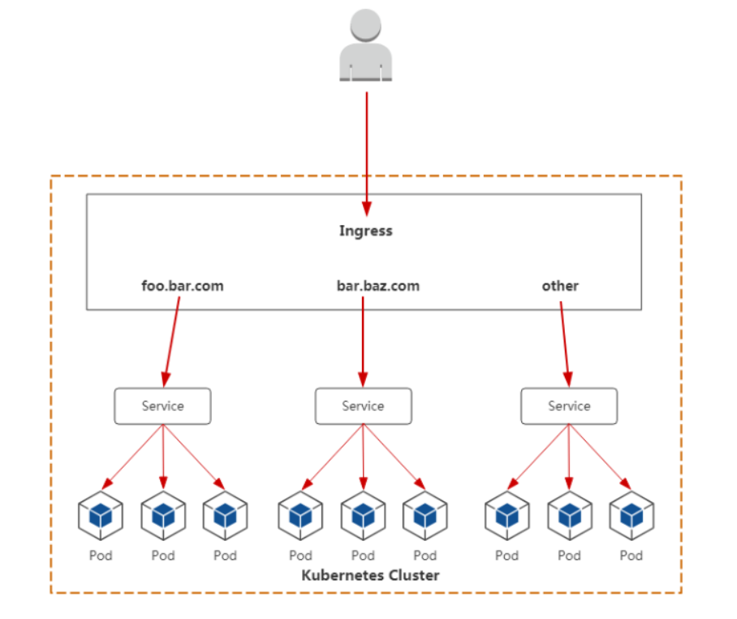
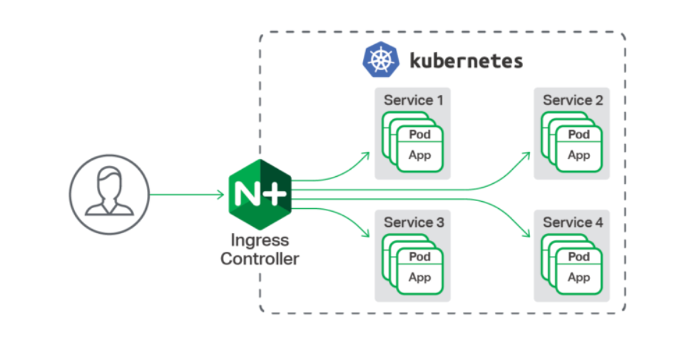
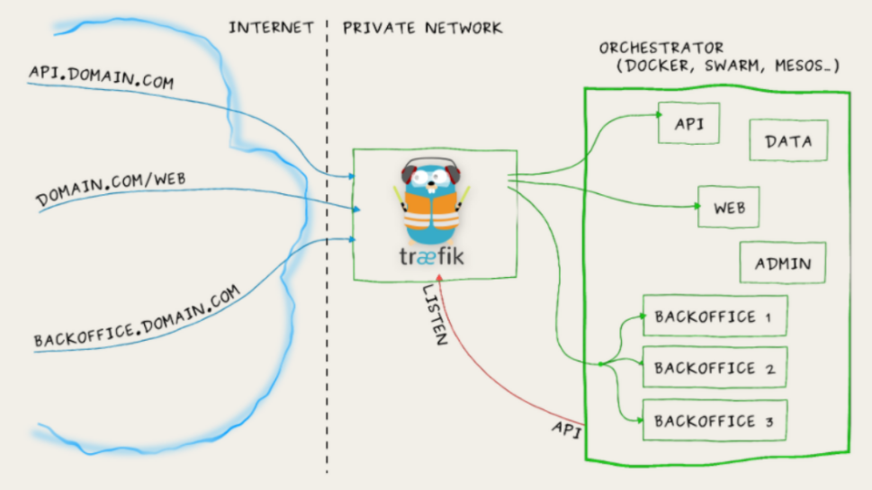
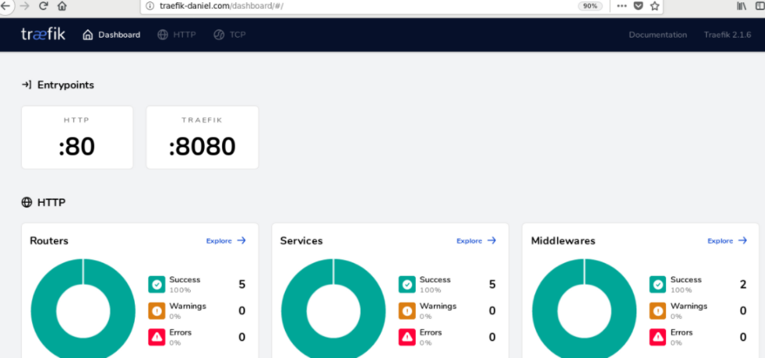
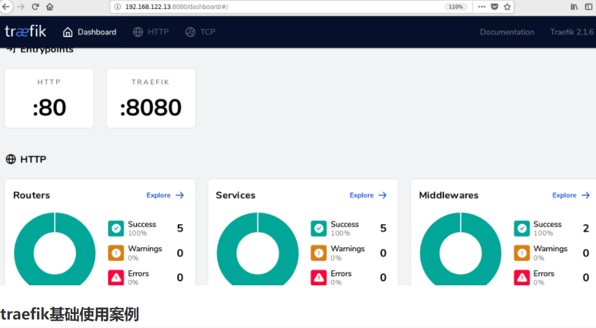
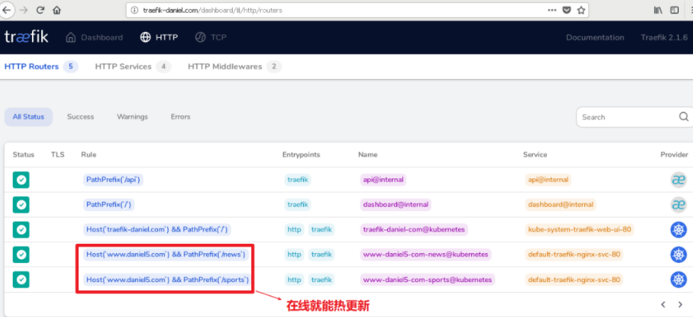

# 一、ingress控制器

ingress controller可以为外网用户访问K8S集群内部pod提供代理服务。

- 提供全局访问代理
- 访问流程
  - 用户-->ingress controller-->service-->pod





ingress控制器有很多种:

## **Kubernetes Ingress Controller**

http://github.com/kubernetes/ingress-nginx


实现：Go/Lua（nginx 是用 C 写的）

许可证：Apache 2.0

Kubernetes 的“官方”控制器（之所以称为官方，是想把它区别于 NGINX 公司的控制器）。这是社区开发的控制器，它基于 nginx Web 服务器，并补充了一组用于实现额外功能的 Lua 插件。

由于 NGINX 十分流行，再加上把它用作控制器时所需的修改较少，**它对于 K8s 普通工程师来说，可能是最简单和最直接的选择**。


## **NGINX Ingress Controller**

http://github.com/nginxinc/kubernetes-ingress

实现：Go

许可证：Apache 2.0

这是 NGINX 公司开发的官方产品，它也有一个基于 NGINX Plus 的商业版。NGINX 的控制器具有很高的稳定性、持续的向后兼容性，且没有任何第三方模块。


由于消除了 Lua 代码，和官方控制器相比，它保证了较高的速度，但也因此受到较大限制。相较之下，它的付费版本有更广泛的附加功能，如实时指标、JWT 验证、主动健康检查等。

NGINX Ingress 重要的优势是对 TCP/UDP 流量的全面支持，最主要缺点是缺乏流量分配功能。


## **Kong Ingress**


http://github.com/Kong/kubernetes-ingress-controller


实现：Go

许可证：Apache 2.0

Kong Ingress 由 Kong Inc 开发，有两个版本：商业版和免费版。它基于 NGINX 构建，并增加了扩展其功能的 Lua 模块。


最初，Kong Ingress 主要用作 API 网关，用于 API 请求的处理和路由。现在，它已经成为成熟的 Ingress 控制器，**主要优点是拥有大量易于安装和配置的附加模块、插件（包括第三方插件）**。它开启了控制器具备大量附加功能的先河，其内置函数也提供了许多可能性。Kong Ingress 配置是用 CRD 执行的。

Kong Ingress 的一个重要特性是它只能在一个环境中运行（而不支持跨命名空间）。这是一个颇有争议的话题：有些人认为这是一个缺点，因为必须为每个环境生成实例；而另一些人认为这是一个特殊特性，因为它是更高级别的隔离，控制器故障的影响仅限于其所在的环境。


## **Traefik**

http://github.com/containous/traefik


实现：Go

许可证：MIT

最初，这个代理是为微服务请求及其动态环境的路由而创建的，因此具有许多有用的功能：**连续更新配置（不重新启动）、支持多种负载均衡算法、Web UI、指标导出、对各种服务的支持协议、REST API、Canary 版本**等。

支持开箱即用的 Let’s Encrypt 是它的另一个不错的功能，但它的主要缺点也很明显，就是为了控制器的高可用性，你必须安装并连接其 Key-value store。

在 2019 年 9 月发布的 Traefik v2.0 中，虽然它增加许多不错的新功能，如带有 SNI 的 TCP/SSL、金丝雀部署、流量镜像/shadowing 和经过改进的 Web UI，但一些功能（如 WAF 支持）还在策划讨论中。

与新版本同期推出的还有一个名叫 Maesh 的服务网格，它建在 Traefik 之上。


## **HAProxy Ingress**


http://github.com/jcmoraisjr/haproxy-ingress


实现：Go（HAProxy 是用 C 写的）

许可证：Apache 2.0

HAProxy 是众所周知的代理服务器和负载均衡器。作为 Kubernetes 集群的一部分，它提供了“软”配置更新（无流量损失）、基于 DNS 的服务发现和通过 API 进行动态配置。 HAProxy 还支持完全自定义配置文件模板（通过替换 ConfigMap）以及在其中使用 Spring Boot 函数。

通常，工程师会把重点放在已消耗资源的高速、优化和效率上。而 HAProxy 的优点之一正是支持大量负载均衡算法。值得一提的是，在今年 6 月发布的 v2.0 中，HAProxy 增加了许多新功能，其即将推出的 v2.1 有望带来更多新功能（包括 OpenTracing 支持）。


## **Voyager**

http://github.com/appscode/voyager


实现：Go

许可证：Apache 2.0

Voyager 基于 HAProxy，并作为一个通用的解决方案提供给大量供应商。它最具代表性的功能包括 L7 和 L4 上的流量负载均衡，其中，**TCP L4 流量负载均衡称得上是该解决方案最关键的功能之一**。

在今年早些时候，尽管 Voyager 在 v9.0.0 中推出了对 HTTP/2 和 gRPC 协议的全面支持，但总的来看，对证书管理（Let’s Encrypt 证书）的支持仍是 Voyager 集成的最突出的新功能。


## **Contour**

http://github.com/heptio/contour


实现：Go

许可证：Apache 2.0

Contour 和 Envoy 由同一个作者开发，它基于 Envoy。**它最特别的功能是可以通过 CRD（IngressRoute）管理 Ingress 资源**，对于多团队需要同时使用一个集群的组织来说，这有助于保护相邻环境中的流量，使它们免受 Ingress 资源更改的影响。

它还提供了一组扩展的负载均衡算法（镜像、自动重复、限制请求率等），以及详细的流量和故障监控。对某些工程师而言，它不支持粘滞会话可能是一个严重缺陷。


## **Istio Ingress**


http://istio.io/docs/tasks/traffic-management/ingress


实现：Go

许可证：Apache 2.0

Istio 是 IBM、Google 和 Lyft 的联合开发项目，它是一个全面的服务网格解决方案——**不仅可以管理所有传入的外部流量（作为 Ingress 控制器），还可以控制集群内部的所有流量**。

Istio 将 Envoy 用作每种服务的辅助代理。从本质上讲，它是一个可以执行几乎所有操作的大型处理器，其中心思想是最大程度的控制、可扩展性、安全性和透明性。

通过 Istio Ingress，你可以对流量路由、服务之间的访问授权、均衡、监控、金丝雀发布等进行优化。


## **Ambassador**

http://github.com/datawire/ambassador


实现：Python

许可证：Apache 2.0

Ambassador 也是一个基于 Envoy 的解决方案，它有免费版和商业版两个版本。

**Ambassador 被称为“Kubernetes 原生 API 微服务网关”**，它与 K8s 原语紧密集成，拥有你所期望的从 Ingress controller 获得的功能包，它还可以与各种服务网格解决方案，如 Linkerd、Istio 等一起使用。

顺便提一下，Ambassador 博客日前发布了一份基准测试结果，比较了 Envoy、HAProxy 和 NGINX 的基础性能。


## **Gloo**

http://github.com/solo-io/gloo


实现：Go

许可证：Apache 2.0

Gloo 是在 Envoy 之上构建的新软件（于 2018 年 3 月发布），由于它的作者坚持认为“网关应该从功能而不是服务中构建 API”，它也被称为“功能网关”。其“功能级路由”的意思是它可以为后端实现是微服务、无服务器功能和遗留应用的混合应用路由流量。

由于拥有可插拔的体系结构，Gloo 提供了工程师期望的大部分功能，但是其中一些功能仅在其商业版本（Gloo Enterprise）中可用。


## **Skipper**

http://github.com/zalando/skipper


实现：Go

许可证：Apache 2.0

**Skipper 是 HTTP 路由器和反向代理，因此不支持各种协议**。从技术上讲，它使用 Endpoints API（而不是 Kubernetes Services）将流量路由到 Pod。它的优点在于其丰富的过滤器集所提供的高级 HTTP 路由功能，工程师可以借此创建、更新和删除所有 HTTP 数据。

Skipper 的路由规则可以在不停机的情况下更新。正如它的作者所述，Skipper 可以很好地与其他解决方案一起使用，比如 AWS ELB。


# 二、nginx ingress controller




参考链接：<https://www.nginx.com/products/nginx/kubernetes-ingress-controller>


## nginx ingress controller部署

项目地址：https://github.com/kubernetes/ingress-nginx

安装文档地址: https://github.com/kubernetes/ingress-nginx/blob/nginx-0.30.0/docs/deploy/index.md


下载并修改配置文件

~~~powershell
[root@master1 ~]# wget https://raw.githubusercontent.com/kubernetes/ingress-nginx/nginx-0.30.0/deploy/static/mandatory.yaml

#修改
210         prometheus.io/port: "10254"
211         prometheus.io/scrape: "true"
212     spec:
213       hostNetwork: true  		# 需要添加这句，使用主机网络
214       serviceAccountName: nginx-ingress-serviceaccount
~~~


应用配置文件

~~~powershell
[root@master1 ~]# kubectl apply -f mandatory.yaml
namespace/ingress-nginx created
configmap/nginx-configuration created
configmap/tcp-services created
configmap/udp-services created
serviceaccount/nginx-ingress-serviceaccount created
clusterrole.rbac.authorization.k8s.io/nginx-ingress-clusterrole created
role.rbac.authorization.k8s.io/nginx-ingress-role created
rolebinding.rbac.authorization.k8s.io/nginx-ingress-role-nisa-binding created
clusterrolebinding.rbac.authorization.k8s.io/nginx-ingress-clusterrole-nisa-binding created
deployment.apps/nginx-ingress-controller created
limitrange/ingress-nginx created
~~~

验证部署结果，注意镜像较大，可提前下载至集群node节点中。

~~~powershell
[root@master1 ~]# kubectl get pods -n ingress-nginx
NAME                                       READY   STATUS    RESTARTS   AGE
nginx-ingress-controller-77db54fc46-kwwkt   1/1     Running   0          89s
~~~


**`hostNetwork： true的补充说明`:**

* 此参数为true表示pod使用主机网络，也就是pod的IP就是node的IP
* 但同一个deployment里的pod副本数如果为2或越过2，在同一个node上只能启一个pod

~~~powershell
[root@master1 ~]# vim deployment-nginx.yaml
apiVersion: apps/v1
kind: Deployment
metadata:
  name: deploy-nginx
spec:
  replicas: 2							# 副本数为2
  selector:
    matchLabels:
      app: nginx
  template:
    metadata:
      labels:
        app: nginx
    spec:
      hostNetwork: true					# 加上这一句
      containers:
      - name: c1
        image: nginx:1.15-alpine
~~~

~~~powershell
[root@master1 ~]# kubectl apply -f deployment-nginx.yaml
deployment.apps/deploy-nginx created
~~~

~~~powershell
[root@master1 ~]# kubectl get pods -o wide
NAME                           READY   STATUS    RESTARTS   AGE   IP               NODE             NOMINATED NODE   READINESS GATES
deploy-nginx-8dc4c858f-hc4kj   0/1     Error     3          65s   192.168.122.14   192.168.122.14   <none>           <none>
deploy-nginx-8dc4c858f-tzq5q   1/1     Running   0          65s   192.168.122.14   192.168.122.14   <none>           <none>
~~~

可以看到pod-IP就是node-IP，而且只能启动成功一个副本


## ingress-http案例

### 创建deployment

```powershell
[root@master1 ~]# vim nginx.yml
apiVersion: apps/v1
kind: Deployment
metadata:
  name: nginx
  namespace: ingress-nginx
spec:
  replicas: 2
  selector:
    matchLabels:
      app: nginx
  template:
    metadata:
      labels:
        app: nginx
    spec:
      containers:
      - name: c1
        image: nginx:1.15-alpine
        imagePullPolicy: IfNotPresent
```

应用YAML

~~~powershell
[root@master1 ~]# kubectl apply -f nginx.yml
deployment.extensions/nginx created
~~~

验证pod

~~~powershell
[root@master1 ~]# kubectl get pods -n ingress-nginx
NAME                                        READY   STATUS    RESTARTS   AGE
nginx-79654d7b8-nhxpm                       1/1     Running   0          12s
nginx-79654d7b8-tp8wg                       1/1     Running   0          13s
nginx-ingress-controller-77db54fc46-kwwkt   1/1     Running   0          11m
~~~


### 创建service

```powershell
[root@master1 ~]# vim nginx-service.yml
apiVersion: v1
kind: Service
metadata:
  name: nginx-service
  namespace: ingress-nginx
  labels:
    app: nginx
spec:
  ports:
  - port: 80
    targetPort: 80
  selector:
    app: nginx
```

应用YAML

~~~powershell
[root@master1 ~]# kubectl apply -f nginx-service.yml
service/nginx-service created
~~~

验证service

~~~powershell
[root@master1 ~]# kubectl get svc -n ingress-nginx
NAME            TYPE        CLUSTER-IP     EXTERNAL-IP   PORT(S)   AGE
nginx-service   ClusterIP   10.2.115.144   <none>        80/TCP    5s
~~~


### 创建ingress

```powershell
[root@master1 ~]# vim ingress-nginx.yaml
apiVersion: extensions/v1beta1
kind: Ingress
metadata:
  name: ingress-nginx                    #自定义ingress名称
  namespace: ingress-nginx
spec:
  rules:
  - host: www.daniel.com                   # 自定义域名
    http:
      paths:
      - backend:
          serviceName: nginx-service     # 对应上面创建的service名称
          servicePort: 80
```

应用YAML

~~~powershell
[root@master1 ~]# kubectl apply -f ingress-nginx.yaml
ingress.extensions/ingress-nginx created
~~~

验证ingress

~~~powershell
[root@master1 ~]# kubectl get ingress -n ingress-nginx
NAME            CLASS    HOSTS            ADDRESS   PORTS   AGE
ingress-nginx   <none>   www.daniel.com             80      1m32s
~~~

描述查看ingress信息

~~~powershell
[root@master1 ~]# kubectl describe ingress ingress-nginx -n ingress-nginx
......
Rules:
  Host            Path  Backends
  ----            ----  --------
  www.daniel.com
                     nginx-service:80 (10.3.104.34:80,10.3.166.146:80)  与下面查询的两个pod的IP对应
......                     
~~~

~~~powershell
[root@master1 ~]# kubectl get pods -o wide -n ingress-nginx
NAME                                        READY   STATUS    RESTARTS   AGE   IP               NODE             NOMINATED NODE   READINESS GATES
nginx-79654d7b8-nhxpm                       1/1     Running   0          18m   10.3.166.146     192.168.122.13   <none>           <none>
nginx-79654d7b8-tp8wg                       1/1     Running   0          18m   10.3.104.34      192.168.122.14   <none>           <none>
nginx-ingress-controller-77db54fc46-kwwkt   1/1     Running   2          22h   192.168.122.13   192.168.122.13   <none>           <none>

可以看到两个pod的IP正好对应ingress域名对应的IP
~~~


确认`nginx-ingress-controller`的podIP为`192.168.122.13`


### 模拟客户端访问

1, 确认`nginx-ingress-controller`的podIP, 下面命令查询的结果为`192.168.122.13`

~~~powershell
[root@master1 ~]# kubectl get pods -o wide -n ingress-nginx  |grep ingress
nginx-ingress-controller-77db54fc46-kwwkt   1/1     Running   2          22h   192.168.122.13   192.168.122.13   <none>           <none>
~~~

2, 在集群之外任一主机中(我这里为hostos)添加上述域名与IP地址解析(模拟公网DNS)

```powershell
[root@hostos ~]# vim /etc/hosts

192.168.122.13 www.daniel.com
```

3, 准备pod内容器运行的web主页

```powershell
[root@master1 ~]# kubectl get pods  -n ingress-nginx 
nginx-79654d7b8-nhxpm                       1/1     Running   0          25m
nginx-79654d7b8-tp8wg                       1/1     Running   0          25m
nginx-ingress-controller-77db54fc46-kwwkt   1/1     Running   2          38h


[root@master1 ~]# kubectl exec -it nginx-79654d7b8-nhxpm -n ingress-nginx  -- /bin/sh
/ # echo "ingress web1" > /usr/share/nginx/html/index.html
/ # exit

[root@master1 ~]# kubectl exec -it nginx-79654d7b8-tp8wg -n ingress-nginx -- /bin/sh
/ # echo "ingress web2" > /usr/share/nginx/html/index.html
/ # exit
```

4, 访问及结果展示

```powershell
[root@hostos ~]# curl www.daniel.com
ingress web1
[root@hostos ~]# curl www.daniel.com
ingress web2
```


## ingress-https案例

### 创建自签证书

~~~powershell
[root@master1 ~]# mkdir ingress-https
[root@master1 ~]# cd ingress-https/
[root@master1 ingress-https]# openssl genrsa -out nginx.key 2048
[root@master1 ingress-https]# openssl req -new -x509 -key nginx.key -out nginx.pem -days 365
......
......
Country Name (2 letter code) [XX]:CN
State or Province Name (full name) []:GD
Locality Name (eg, city) [Default City]:SZ
Organization Name (eg, company) [Default Company Ltd]:IT
Organizational Unit Name (eg, section) []:it
Common Name (eg, your name or your server's hostname) []:daniel
Email Address []:daniel@xxx.com

[root@master1 ingress-https]# ls
nginx.key  nginx.pem
~~~

### 将证书创建成secret

~~~powershell
[root@master1 ingress-https]# kubectl create secret tls nginx-tls-secret --cert=nginx.pem --key=nginx.key -n ingress-nginx
secret/nginx-tls-secret created

[root@master1 ingress-https]# kubectl get secrets -n ingress-nginx |grep nginx-tls-secret
nginx-tls-secret                           kubernetes.io/tls                     2      38s
~~~

### 编排YAML并创建

~~~powershell
[root@master1 ingress-https]# vim ingress-https.yml
apiVersion: apps/v1
kind: Deployment
metadata:
  name: nginx2
  namespace: ingress-nginx
spec:
  replicas: 2
  selector:
    matchLabels:
      app: nginx2
  template:
    metadata:
      labels:
        app: nginx2
    spec:
      containers:
      - name: c1
        image: nginx:1.15-alpine
        imagePullPolicy: IfNotPresent
        ports:
        - name: http
          containerPort: 80
        - name: https
          containerPort: 443
---
apiVersion: v1
kind: Service
metadata:
  name: nginx-service2
  namespace: ingress-nginx
  labels:
    app: nginx2
spec:
  ports:
  - name: http
    port: 80
    targetPort: 80
  - name: https
    port: 443
    targetPort: 443
  selector:
    app: nginx2
---
apiVersion: extensions/v1beta1
kind: Ingress
metadata:
  name: ingress-nginx2
  namespace: ingress-nginx
spec:
  tls:
  - hosts:
    - www.daniel2.com							  # 域名
    secretName: nginx-tls-secret				  # 调用前面创建的secret
  rules:
  - host: www.daniel2.com						  # 域名
    http:
      paths:
      - backend:
          serviceName: nginx-service2			  # 对应服务名
          servicePort: 80
~~~


~~~powershell
[root@master1 ingress-https]# kubectl apply -f ingress-https.yml
deployment.apps/nginx2 created
service/nginx-service2 created
ingress.extensions/ingress-nginx2 created
~~~

验证

~~~powershell
[root@master1 ingress-https]# kubectl get ingress -n ingress-nginx
NAME             CLASS    HOSTS             ADDRESS   PORTS     AGE
ingress-nginx    <none>   www.daniel.com              80        39m
ingress-nginx2   <none>   www.daniel2.com             80, 443   55s
~~~


### 模拟客户端访问

~~~powershell
[root@hostos ~]# vim /etc/hosts

192.168.122.13 www.daniel2.com					添加这行模拟DNS

[root@hostos ~]# firefox https://www.daniel2.com &
[1] 10892
~~~


## ingress+nodeport服务

~~~powershell
[root@master1 ~]# vim ingress-nodeport.yml
apiVersion: apps/v1
kind: Deployment
metadata:
  name: nginx3
  namespace: ingress-nginx
spec:
  replicas: 2
  selector:
    matchLabels:
      app: nginx3
  template:
    metadata:
      labels:
        app: nginx3
    spec:
      containers:
      - name: c1
        image: nginx:1.15-alpine
        imagePullPolicy: IfNotPresent
---
apiVersion: v1
kind: Service
metadata:
  name: nginx-service3
  namespace: ingress-nginx
  labels:
    app: nginx3
spec:
  type: NodePort						# NodePort类型服务
  ports:
  - port: 80
    targetPort: 80
  selector:
    app: nginx3
---
apiVersion: extensions/v1beta1
kind: Ingress
metadata:
  name: ingress-nginx3
  namespace: ingress-nginx
spec:
  rules:
  - host: www.daniel3.com
    http:
      paths:
      - backend:
          serviceName: nginx-service3
          servicePort: 80

~~~


~~~powershell
[root@master1 ~]# kubectl apply -f ingress-nodeport.yml
service/nginx-service3 created
ingress.extensions/ingress-nginx3 created
ingress.extensions/ingress-nginx3 configured
~~~


~~~powershell
root@master1 ~]# kubectl get svc -n ingress-nginx
NAME             TYPE        CLUSTER-IP     EXTERNAL-IP   PORT(S)          AGE
nginx-service    ClusterIP   10.2.115.144   <none>        80/TCP           22h
nginx-service2   ClusterIP   10.2.237.70    <none>        80/TCP,443/TCP   22h
nginx-service3   NodePort    10.2.75.250    <none>        80:26765/TCP     3m51s
nginx-service3是nodeport类型
~~~


~~~powershell
[root@hostos ~]# vim /etc/hosts

192.168.122.13 www.daniel3.com					添加这行模拟DNS

[root@hostos ~]# curl www.daniel3.com
~~~


# 三、traefik

## 认识traefik

参考: https://traefik.cn/

是一个为了让部署微服务更加便捷而诞生的现代HTTP反向代理、负载均衡工具。 它支持多种后台 ([Docker](https://www.docker.com/), [Swarm](https://docs.docker.com/swarm), [Kubernetes](https://kubernetes.io/), [Marathon](https://mesosphere.github.io/marathon/), [Mesos](https://github.com/apache/mesos), [Consul](https://www.consul.io/), [Etcd](https://coreos.com/etcd/), [Zookeeper](https://zookeeper.apache.org/), [BoltDB](https://github.com/boltdb/bolt), Rest API, file…) 来自动化、动态的应用它的配置文件设置。




## traefik部署

~~~powershell
[root@master1 ~]# mkdir traefik/
[root@master1 ~]# cd traefik/
~~~

### 编排ConfigMap

~~~powershell
[root@master1 traefik]# vim traefik-config.yaml
apiVersion: v1
kind: ConfigMap
metadata:
  name: traefik-config
  namespace: kube-system
data:
  traefik.toml: |
    defaultEntryPoints = ["http","https"]
    debug = false
    logLevel = "INFO"
    # Do not verify backend certificates (use https backends)
    InsecureSkipVerify = true
    [entryPoints]
      [entryPoints.http]
      address = ":80"
      compress = true
      [entryPoints.https]
      address = ":443"
        [entryPoints.https.tls]
    #Config to redirect http to https
    #[entryPoints]
    #  [entryPoints.http]
    #  address = ":80"
    #  compress = true
    #    [entryPoints.http.redirect]
    #    entryPoint = "https"
    #  [entryPoints.https]
    #  address = ":443"
    #    [entryPoints.https.tls]
    [web]
      address = ":8080"
    [kubernetes]
    [metrics]
      [metrics.prometheus]
      buckets=[0.1,0.3,1.2,5.0]
      entryPoint = "traefik"
    [ping]
    entryPoint = "http"
~~~

### 编排SA与DaemonSet

~~~powershell
[root@master1 traefik]# vim traefik-ds.yaml
apiVersion: v1
kind: ServiceAccount
metadata:
  name: traefik-ingress-controller
  namespace: kube-system
---
kind: DaemonSet
apiVersion: apps/v1
#apiVersion: extensions/v1beta1
metadata:
  name: traefik-ingress-controller-v2
  namespace: kube-system
  labels:
    k8s-app: traefik-ingress-lb
spec:
  selector:
    matchLabels:
      name: traefik-ingress-lb-v2
  template:
    metadata:
      labels:
        k8s-app: traefik-ingress-lb
        name: traefik-ingress-lb-v2
    spec:
      serviceAccountName: traefik-ingress-controller
      terminationGracePeriodSeconds: 60
      containers:
      - image: traefik:2.1.6
        name: traefik-ingress-lb-v2
        ports:
        - name: http
          containerPort: 80
          hostPort: 80
        - name: admin
          containerPort: 8080
          hostPort: 8080
        securityContext:
          capabilities:
            drop:
            - ALL
            add:
            - NET_BIND_SERVICE
        args:
        - --api
        - --api.insecure=true
        - --providers.kubernetesingress=true
        - --log.level=INFO
        #- --configfile=/config/traefik.toml
        #volumeMounts:
        #- mountPath: /config
        #  name: config
      volumes:
      - configMap:
          name: traefik-config
        name: config
---
kind: Service
apiVersion: v1
metadata:
  name: traefik-ingress-service-v2
  namespace: kube-system
  labels:
    k8s-app: traefik-ingress-lb-v2
spec:
  selector:
    k8s-app: traefik-ingress-lb-v2
  ports:
    - protocol: TCP
      port: 80
      name: web
    - protocol: TCP
      port: 8080
      name: admin
~~~

### 编排rbac

~~~powershell
[root@master1 traefik]# vim traefik-rbac.yaml
kind: ClusterRole
apiVersion: rbac.authorization.k8s.io/v1beta1
metadata:
  name: traefik-ingress-controller
rules:
  - apiGroups:
      - ""
    resources:
      - services
      - endpoints
      - secrets
    verbs:
      - get
      - list
      - watch
  - apiGroups:
      - extensions
    resources:
      - ingresses
    verbs:
      - get
      - list
      - watch
  - apiGroups:
    - extensions
    resources:
    - ingresses/status
    verbs:
    - update
---
kind: ClusterRoleBinding
apiVersion: rbac.authorization.k8s.io/v1beta1
metadata:
  name: traefik-ingress-controller
roleRef:
  apiGroup: rbac.authorization.k8s.io
  kind: ClusterRole
  name: traefik-ingress-controller
subjects:
- kind: ServiceAccount
  name: traefik-ingress-controller
  namespace: kube-system

~~~

### 编排dashborad

~~~powershell
[root@master1 traefik]# vim traefik-dashboard.yaml
apiVersion: v1
kind: Service
metadata:
  name: traefik-web-ui
  namespace: kube-system
spec:
  selector:
    k8s-app: traefik-ingress-lb
  ports:
  - name: web
    port: 80
    targetPort: 8080
---
apiVersion: extensions/v1beta1
kind: Ingress
metadata:
  name: traefik-web-ui
  namespace: kube-system
spec:
  rules:
  - host: traefik-daniel.com					# 这里换成自己的域名(实验环境模拟一个就OK)
    http:
      paths:
      - path: /
        backend:
          serviceName: traefik-web-ui
          servicePort: 80

~~~

### 应用YAML

~~~powershell
[root@master1 traefik]# ls
traefik-config.yaml  traefik-dashboard.yaml  traefik-ds.yaml  traefik-rbac.yaml

[root@master1 taefik]# kubectl apply -f .
configmap/traefik-config created
serviceaccount/traefik-ingress-controller created
daemonset.apps/traefik-ingress-controller-v2 created
service/traefik-ingress-service-v2 created
clusterrole.rbac.authorization.k8s.io/traefik-ingress-controller created
clusterrolebinding.rbac.authorization.k8s.io/traefik-ingress-controller created
service/traefik-web-ui created
ingress.extensions/traefik-web-ui created
~~~


### 验证

~~~powershell
[root@master1 traefik]# kubectl get pods -n kube-system |grep traefik
traefik-ingress-controller-v2-6qxr5          1/1     Running   0          2m
traefik-ingress-controller-v2-9bjqv          1/1     Running   0          2m
traefik-ingress-controller-v2-qgfh7          0/1     Pending   0          2m
traefik-ingress-controller-v2-vc496          1/1     Running   0          2m
~~~


~~~powershell
[root@master1 traefik]# kubectl get svc -n kube-system |grep traefik
traefik-ingress-service-v2   ClusterIP   10.2.228.61    <none>        80/TCP,8080/TCP          122m
traefik-web-ui               ClusterIP   10.2.110.179   <none>        80/TCP                   122m
~~~

### 访问

用宿主机模拟客户端

~~~powershell
[root@hostos ~]# vim /etc/hosts
192.168.122.12 traefik-daniel.com			# 添加域名与任意k8s集群节点的绑定
~~~

客户端firefox访问`traefik-daniel.com`




或者使用任意k8s集群节点IP:8080访问




## traefik基础使用案例

### 编写YAML

~~~powershell
[root@master1 ~]# vim traefik-app1.yaml
apiVersion: apps/v1
kind: Deployment
metadata:
  name: traefik-nginx
spec:
  replicas: 2
  selector:
    matchLabels:
      app: traefik-nginx
  template:
    metadata:
      labels:
        app: traefik-nginx
    spec:
      containers:
      - name: c1
        image: nginx:1.15-alpine
        ports:
        - containerPort: 80
---
apiVersion: v1
kind: Service
metadata:
  name: traefik-nginx-svc
spec:
  selector:
    app: traefik-nginx
  ports:
    - protocol: TCP
      port: 80
---
apiVersion: extensions/v1beta1
kind: Ingress
metadata:
  name: traefik-nginx-ingress
spec:
  rules:
  - host: www.daniel5.com
    http:
      paths:
      - path: /
        backend:
          serviceName: traefik-nginx-svc
          servicePort: 80
~~~

### 应用YAML

~~~powershell
[root@master1 ~]# kubectl apply -f traefik-app1.yaml
deployment.apps/traefik-nginx created
service/traefik-nginx-svc created
ingress.networking.k8s.io/traefik-nginx-ingress created

~~~

### 验证资源

~~~powershell
[root@master1 ~]# kubectl get pods |grep traefik-nginx
traefik-nginx-5cf8576cc8-74skp   1/1     Running   0          4m15s
traefik-nginx-5cf8576cc8-gtxsq   1/1     Running   0          4m15s

[root@master1 ~]# kubectl get svc |grep traefik-nginx
traefik-nginx-svc   ClusterIP   10.2.111.205   <none>        80/TCP    4m22s

[root@master1 ~]# kubectl get ingress |grep traefik-nginx
traefik-nginx-ingress   <none>   www.daniel5.com             80      4m28s

~~~

### 客户端访问

~~~powershell
[root@hostos ~]# vim /etc/hosts
192.168.122.12 www.daniel5.com			# 添加域名与k8s集群节点内任意IP的绑定
~~~


~~~powershell
[root@hostos ~]# curl www.daniel5.com
~~~


## traefik拓展案例

1，修改YAML并直接应用

~~~powershell
[root@master1 ~]# vim traefik-app1.yaml
......
......
apiVersion: extensions/v1beta1
kind: Ingress
metadata:
  name: traefik-nginx-ingress
spec:
  rules:
  - host: www.daniel5.com
    http:
      paths:
      - path: /news		 # 表示客户访问www.daniel5.com/news这个URL时，会被代理给traefik-nginx-svc这个服务
        backend:
          serviceName: traefik-nginx-svc
          servicePort: 80
  - host: www.daniel5.com
    http:
      paths:
      - path: /sports    # 表示客户访问www.daniel5.com/sports这个URL时，会被代理给traefik-nginx-svc这个服务
        backend:
          serviceName: traefik-nginx-svc    # 你可以编排两套deployment和service，来实现不同的服务代理
          servicePort: 80
~~~

直接apply应用，在线热更新

~~~powershell
[root@master1 ~]# kubectl apply -f traefik-app1.yaml
deployment.apps/traefik-nginx unchanged
service/traefik-nginx-svc unchanged
ingress.extensions/traefik-nginx-ingress configured			# configured代表改变
~~~


2, 在nginx的pod里创建对应的news和sports目录

~~~powershell
[root@master1 ~]# kubectl get pods
NAME                             READY   STATUS    RESTARTS   AGE
traefik-nginx-5cf8576cc8-tv8x9   1/1     Running   0          15m
traefik-nginx-5cf8576cc8-xlwx5   1/1     Running   0          15m

[root@master1 ~]# kubectl exec -it traefik-nginx-5cf8576cc8-tv8x9 -- /bin/sh
/ # mkdir /usr/share/nginx/html/news
/ # echo web1_news > /usr/share/nginx/html/news/index.html
/ # mkdir /usr/share/nginx/html/sports
/ # echo web1_sports > /usr/share/nginx/html/sports/index.html
/ # exit


[root@master1 ~]# kubectl exec -it traefik-nginx-5cf8576cc8-xlwx5 -- /bin/sh
/ # mkdir /usr/share/nginx/html/news
/ # echo web2_news > /usr/share/nginx/html/news/index.html
/ # mkdir /usr/share/nginx/html/sports
/ # echo web2_sports > /usr/share/nginx/html/sports/index.html

/ # exit

~~~

3，客户端访问



