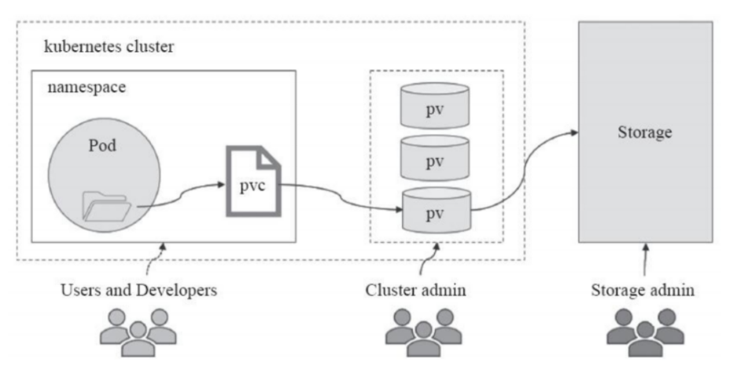
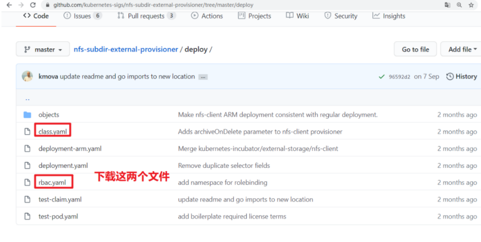

# 一、kubernetes存储卷


## 存储卷介绍

pod有生命周期，生命周期结束后pod里的数据会消失(如配置文件,业务数据等)。

解决: 我们需要将数据与pod分离,将数据放在专门的存储卷上

pod在k8s集群的节点中是可以调度的, 如果pod挂了被调度到另一个节点,那么数据和pod的联系会中断。

解决: 所以我们需要与集群节点分离的存储系统才能实现数据持久化

简单来说: **volume提供了在容器上挂载外部存储的能力**


## 存储卷的分类

kubernetes支持的存储卷类型非常丰富,使用下面的命令查看:

```powershell
# kubectl explain pod.spec.volumes
```

或者参考: https://kubernetes.io/docs/concepts/storage/

kubernetes支持的存储卷列表如下:

- [awsElasticBlockStore](https://kubernetes.io/docs/concepts/storage/#awselasticblockstore)
- [azureDisk](https://kubernetes.io/docs/concepts/storage/#azuredisk)
- [azureFile](https://kubernetes.io/docs/concepts/storage/#azurefile)
- [cephfs](https://kubernetes.io/docs/concepts/storage/#cephfs)
- [cinder](https://kubernetes.io/docs/concepts/storage/#cinder)
- [configMap](https://kubernetes.io/docs/concepts/storage/#configmap)
- [csi](https://kubernetes.io/docs/concepts/storage/#csi)
- [downwardAPI](https://kubernetes.io/docs/concepts/storage/#downwardapi)
- [emptyDir](https://kubernetes.io/docs/concepts/storage/#emptydir)
- [fc (fibre channel)](https://kubernetes.io/docs/concepts/storage/#fc)
- [flexVolume](https://kubernetes.io/docs/concepts/storage/#flexVolume)
- [flocker](https://kubernetes.io/docs/concepts/storage/#flocker)
- [gcePersistentDisk](https://kubernetes.io/docs/concepts/storage/#gcepersistentdisk)
- [gitRepo (deprecated)](https://kubernetes.io/docs/concepts/storage/#gitrepo)
- [glusterfs](https://kubernetes.io/docs/concepts/storage/#glusterfs)
- [hostPath](https://kubernetes.io/docs/concepts/storage/#hostpath)
- [iscsi](https://kubernetes.io/docs/concepts/storage/#iscsi)
- [local](https://kubernetes.io/docs/concepts/storage/#local)
- [nfs](https://kubernetes.io/docs/concepts/storage/#nfs)
- [persistentVolumeClaim](https://kubernetes.io/docs/concepts/storage/#persistentvolumeclaim)
- [projected](https://kubernetes.io/docs/concepts/storage/#projected)
- [portworxVolume](https://kubernetes.io/docs/concepts/storage/#portworxvolume)
- [quobyte](https://kubernetes.io/docs/concepts/storage/#quobyte)
- [rbd](https://kubernetes.io/docs/concepts/storage/#rbd)
- [scaleIO](https://kubernetes.io/docs/concepts/storage/#scaleio)
- [secret](https://kubernetes.io/docs/concepts/storage/#secret)
- [storageos](https://kubernetes.io/docs/concepts/storage/#storageos)
- [vsphereVolume](https://kubernetes.io/docs/concepts/storage/#vspherevolume)


我们将上面的存储卷列表进行简单的分类: 

- 本地存储卷 
  - emptyDir    pod删除,数据也会被清除, 用于数据的临时存储
  - hostPath     宿主机目录映射(本地存储卷)
- 网络存储卷
  - NAS类           nfs等
  - SAN类           iscsi,FC等
  - 分布式存储   glusterfs,cephfs,rbd,cinder等
  - 云存储           aws,azurefile等


## 存储卷的选择

市面上的存储产品种类繁多, 但按应用角度主要分为三类:

- 文件存储  如:nfs,glusterfs,cephfs等
  - 优点: 数据共享(多pod挂载可以同读同写)
  - 缺点: 性能较差
- 块存储  如: iscsi,rbd等
  - 优点: 不能实现数据共享
  - 缺点: 性能相对于文件存储好
- 对象存储 如: ceph对象存储
  - 优点: 性能好, 数据共享
  - 缺点: 使用方式特殊,支持较少

面对kubernetes支持的形形色色的存储卷,如何选择成了难题。在选择存储时,我们要抓住核心需求:

- 数据是否需要持久性   
- 数据可靠性  如存储集群节点是否有单点故障,数据是否有副本等
- 性能  
- 扩展性  如是否能方便扩容,应对数据增长的需求
- 运维难度  存储的运维难度是比较高的,尽量选择稳定的开源方案或商业产品
- 成本

总之, 存储的选择是需要考虑很多因素的, 熟悉各类存储产品, 了解它们的优缺点，结合自身需求才能选择合适自己的。


## 本地存储卷之emptyDir

- 应用场景

  实现pod内容器之间数据共享

- 特点

  随着pod被删除，该卷也会被删除


1, 创建yaml文件

```powershell
[root@master1 ~]# vim volume-emptydir.yml
apiVersion: v1
kind: Pod
metadata:
  name: volume-emptydir
spec:
  containers:
  - name: write
    image: centos
    imagePullPolicy: IfNotPresent
    command: ["bash","-c","echo haha > /data/1.txt ; dd if=/dev/zero of=/data/file1 bs=1M count=1000; sleep 6000"]
    volumeMounts:
    - name: data
      mountPath: /data

  - name: read
    image: centos
    imagePullPolicy: IfNotPresent
    command: ["bash","-c","cat /data/1.txt; sleep 6000"]
    volumeMounts:
    - name: data
      mountPath: /data
      
  volumes:
  - name: data
    emptyDir: {}
```


2, 基于yaml文件创建pod

```powershell
[root@master1 ~]# kubectl apply -f volume-emptydir.yml
pod/volume-emptydir created
```


3, 查看pod启动情况

```powershell
[root@master1 ~]# kubectl get pods |grep volume-emptydir
NAME                               READY   STATUS    RESTARTS   AGE
volume-emptydir                    2/2     Running   0          15s
```


4, 查看pod描述信息

```powershell
[root@master1 ~]# kubectl describe pod volume-emptydir |tail -10
Events:
  Type    Reason     Age    From                     Message
  ----    ------     ----   ----                     -------
  Normal  Scheduled  3m16s  default-scheduler        Successfully assigned default/volume-emptydir to 192.168.122.13
  Normal  Pulled     3m14s  kubelet, 192.168.122.13  Container image "centos" already present on machine
  Normal  Created    3m13s  kubelet, 192.168.122.13  Created container write
  Normal  Started    3m12s  kubelet, 192.168.122.13  Started container write
  Normal  Pulled     3m12s  kubelet, 192.168.122.13  Container image "centos" already present on machine
  Normal  Created    3m11s  kubelet, 192.168.122.13  Created container read
  Normal  Started    3m10s  kubelet, 192.168.122.13  Started container read
```


5, 验证

```powershell
[root@master1 ~]# kubectl logs volume-emptydir write			
[root@master1 ~]# kubectl logs volume-emptydir read
haha						
```


6，验证删除pod会删除数据

上面看到pod被调度给了`192.168.122.13`(node1)节点，删除pod前查看node1上的根区分大小

~~~powershell
[root@node1 ~]# df -h |grep "/$"
/dev/vda3        38G  9.5G   29G   23% /
~~~

删除pod

~~~powershell
[root@master1 ~]# kubectl delete -f volume-emptydir.yaml
pod "volume-emptydir" deleted
~~~

再查看node1上的根分区大小

~~~powershell
[root@node1 ~]# df -h |grep "/$"
/dev/vda3        38G  8.5G   30G   23% /
~~~

**说明: 可以看到删除pod后，根分区空间少了1个G，表示write容器里dd占用的文件被清除了**


## 本地存储卷之hostPath

- 应用场景

  pod内与节点目录映射（pod中容器想访问节点上数据，例如监控，只有监控访问到节点主机文件才能知道节点主机状态）

- 缺点

  如果节点挂掉，控制器在另一个节点拉起容器，数据就会变成另一台节点主机的了（无法实现数据共享)


1, 创建yaml文件

~~~powershell
[root@master1 ~]# vim volume-hostpath.yml
apiVersion: v1
kind: Pod
metadata:
  name: volume-hostpath
spec:
  containers:
  - name: busybox
    image: busybox
    imagePullPolicy: IfNotPresent
    command: ["/bin/sh","-c","echo haha > /data/1.txt ; sleep 600"]
    volumeMounts:
    - name: data
      mountPath: /data
      
  volumes:
  - name: data
    hostPath:
      path: /opt			# 此目录必须存在，否则挂载不成功
      type: Directory

~~~

2, 基于yaml文件创建pod

~~~powershell
[root@master ~]# kubectl apply  -f volume-hostpath.yml
pod/volume-hostpath created
~~~

3, 查看pod状态

~~~powershell
[root@master1 ~]# kubectl get pods -o wide |grep volume-hostpath
volume-hostpath        1/1     Running   0      22s    10.3.104.5     192.168.122.14   <none>    <none>
可以看到pod是在192.168.122.14(node2)节点上
~~~

4, 验证pod所在机器上的挂载文件

~~~powershell
[root@node2 ~]# cat /opt/1.txt
haha
~~~


## 网络存储卷之nfs

1, 搭建nfs服务器(这里使用192.168.122.1宿主机来模拟)

~~~powershell
[root@hostos ~]# mkdir -p /data/nfs
[root@hostos ~]# vim /etc/exports
/data/nfs       *(rw,no_root_squash,sync)
[root@hostos ~]# systemctl restart nfs
[root@hostos ~]# systemctl enable nfs
~~~


2, 所有node节点安装nfs客户端相关软件包

```powershell
[root@node1 ~]# yum install rpcbind nfs-utils -y

[root@node2 ~]# yum install rpcbind nfs-utils -y
```


3, 验证nfs可用性

```powershell
[root@node1 ~]# showmount -e 192.168.122.1
Export list for 192.168.122.1:
/data/nfs *

[root@node2 ~]# showmount -e 192.168.122.1
Export list for 192.168.122.1:
/data/nfs *
```


4, master上创建yaml文件

```powershell
[root@master1 ~]# vim volume-nfs.yml
apiVersion: apps/v1
kind: Deployment
metadata:
  name: volume-nfs
spec:
  replicas: 2
  selector:
    matchLabels:
      app: nginx
  template:
    metadata:
      labels:
        app: nginx
    spec:
      containers:
      - name: nginx
        image: nginx:1.15-alpine
        imagePullPolicy: IfNotPresent
        volumeMounts:
        - name: documentroot
          mountPath: /usr/share/nginx/html

        
      volumes:
      - name: documentroot
        nfs:
          server: 192.168.122.1
          path: /data/nfs
```

5, apply应用yaml创建

```powershell
[root@master1 ~]#  kubectl apply -f volume-nfs.yml
deployment.apps/nginx-deployment created
```


6, 在nfs服务器共享目录中创建验证文件

```powershell
[root@hostos ~]# echo "volume-nfs" > /data/nfs/index.html
```


7, 验证pod

```powershell
[root@master1 ~]# kubectl get pod |grep volume-nfs
volume-nfs-649d848b57-qg4bz   1/1     Running   0          10s
volume-nfs-649d848b57-wrnpn   1/1     Running   0          10s


[root@master1 ~]# kubectl exec -it volume-nfs-649d848b57-qg4bz -- /bin/sh
/ # ls /usr/share/nginx/html/
index.html
/ # cat /usr/share/nginx/html/index.html
volume-nfs										# 文件内容与nfs服务器上创建的一致
/ # exit


[root@master1 ~]# kubectl exec -it volume-nfs-649d848b57-wrnpn -- /bin/sh
/ # ls /usr/share/nginx/html/
index.html
/ # cat /usr/share/nginx/html/index.html
volume-nfs										# 文件内容与nfs服务器上创建的一致
/ # exit
```


# 二、PV与PVC

## 认识pv与pvc

kubernetes存储卷的分类太丰富了,每种类型都要写相应的接口与参数才行，这就让维护与管理难度加大。


persisentvolume(**PV**) 是配置好的一段存储(可以是任意类型的存储卷)

- 也就是说将网络存储共享出来,配置定义成PV。


PersistentVolumeClaim(**PVC**)是用户pod使用PV的申请请求。

- 用户不需要关心具体的volume实现细节,只需要关心使用需求。


## pv与pvc之间的关系

- pv提供存储资源(生产者)

- pvc使用存储资源(消费者)

- 使用pvc绑定pv




## 实现nfs类型pv与pvc

**1, 编写创建pv的YAML文件**

~~~powershell
[root@master1 ~]# vim pv-nfs.yml
apiVersion: v1
kind: PersistentVolume						# 类型为PersistentVolume(pv)
metadata:		
  name: pv-nfs								# 名称
spec:
  capacity:
    storage: 1Gi							# 大小
  accessModes:
    - ReadWriteMany							# 访问模式
  nfs:
    path: /data/nfs							# nfs共享目录
    server: 192.168.122.1					# nfs服务器IP
~~~

访问模式有3种       参考: https://kubernetes.io/docs/concepts/storage/persistent-volumes/#access-modes

- ReadWriteOnce 单节点读写挂载
- ReadOnlyMany  多节点只读挂载
- ReadWriteMany  多节点读写挂载

cephfs存储卷3种类型都支持, 我们要实现多个nginx跨节点之间的数据共享,所以选择ReadWriteMany模式。

**2, 创建pv并验证**

~~~powershell
[root@master1 ~]# kubectl apply -f pv-nfs.yml
persistentvolume/pv-nfs created
~~~

~~~powershell
[root@master1 ~]# kubectl get pv
NAME     CAPACITY   ACCESS MODES   RECLAIM POLICY   STATUS      CLAIM   STORAGECLASS   REASON   AGE
pv-nfs   1Gi        RWX            Retain           Available                                   81s
~~~

说明: 

- RWX为ReadWriteMany的简写
- Retain是回收策略  
  - Retain表示需要不使用了需要手动回收
  - 参考: https://kubernetes.io/docs/concepts/storage/persistent-volumes/#reclaim-policy

**3, 编写创建pvc的YAML文件**

~~~powershell
[root@master1 ~]# vim pvc-nfs.yml
apiVersion: v1
kind: PersistentVolumeClaim				# 类型为PersistentVolumeClaim(pvc)
metadata:
  name: pvc-nfs							# pvc的名称
spec:
  accessModes:
    - ReadWriteMany						# 访问模式
  resources:
    requests:
      storage: 1Gi						# 大小要与pv的大小保持一致
~~~

**4, 创建pvc并验证**

~~~powershell
[root@master1 ~]# kubectl apply -f pvc-nfs.yml
persistentvolumeclaim/pvc-nfs created
~~~

~~~powershell
[root@master1 ~]# kubectl get pvc
NAME      STATUS   VOLUME   CAPACITY   ACCESS MODES   STORAGECLASS   AGE
pvc-nfs   Bound    pv-nfs   1Gi        RWX                           38s
~~~

**注意:** STATUS必须为Bound状态(Bound状态表示pvc与pv绑定OK)


**5, 编写deployment的YMAL**

~~~powershell
[root@master1 ~]# vim deploy-nginx-nfs.yml
apiVersion: apps/v1
kind: Deployment
metadata:
  name: deploy-nginx-nfs
spec:
  replicas: 2
  selector:
    matchLabels:
      app: nginx
  template:
    metadata:
      labels:
        app: nginx
    spec:
      containers:
      - name: nginx
        image: nginx:1.15-alpine
        imagePullPolicy: IfNotPresent
        volumeMounts:
        - name: www
          mountPath: /usr/share/nginx/html
          
      volumes:
      - name: www
        persistentVolumeClaim:
          claimName: pvc-nfs
~~~

**6, 应用YAML创建deploment**

~~~powershell
[root@master1 ~]# kubectl apply -f deploy-nginx-nfs.yml
deployment.apps/deploy-nginx-nfs created
~~~

**7, 验证pod**

~~~powershell
[root@master1 ~]# kubectl get pod |grep deploy-nginx-nfs
deploy-nginx-nfs-6f9bc4546c-gbzcl   1/1     Running   0          1m46s
deploy-nginx-nfs-6f9bc4546c-hp4cv   1/1     Running   0          1m46s
~~~

**8, 验证pod内卷的数据**

~~~powershell
[root@master1 ~]# kubectl exec -it deploy-nginx-nfs-6f9bc4546c-gbzcl -- /bin/sh
/ # ls /usr/share/nginx/html/
index.html
/ # cat /usr/share/nginx/html/index.html
volume-nfs
/ # exit


[root@master1 ~]# kubectl exec -it deploy-nginx-nfs-6f9bc4546c-hp4cv -- /bin/sh
/ # ls /usr/share/nginx/html/
index.html
/ # cat /usr/share/nginx/html/index.html
volume-nfs
/ # exit
~~~


# 三、存储的动态供给

## 什么是动态供给


每次使用存储要先创建pv, 再创建pvc，真累!   所以我们可以实现使用存储的动态供给特性。

* 静态存储需要用户申请PVC时保证容量和读写类型与预置PV的容量及读写类型完全匹配, 而动态存储则无需如此.
* 管理员无需预先创建大量的PV作为存储资源


Kubernetes从1.4版起引入了一个新的资源对象StorageClass，可用于将存储资源定义为具有显著特性的类（Class）而不是具体

的PV。用户通过PVC直接向意向的类别发出申请，匹配由管理员事先创建的PV，或者由其按需为用户动态创建PV，这样就免去

了需要先创建PV的过程。


PV对存储系统的支持可通过其插件来实现，目前，Kubernetes支持如下类型的插件。

官方地址：https://kubernetes.io/docs/concepts/storage/storage-classes/

官方插件是不支持NFS动态供给的，但是我们可以用第三方的插件来实现


第三方插件地址: https://github.com/kubernetes-sigs/nfs-subdir-external-provisioner/tree/master/deploy



## **1, 下载并创建storageclass**

~~~powershell
[root@master1 ~]# wget https://raw.githubusercontent.com/kubernetes-sigs/nfs-subdir-external-provisioner/master/deploy/class.yaml

[root@master1 ~]# mv class.yaml storageclass-nfs.yml
~~~

~~~powershell
[root@master ~]# cat storageclass-nfs.yml
apiVersion: storage.k8s.io/v1
kind: StorageClass				# 类型
metadata:
  name: managed-nfs-storage		# 名称,要使用就需要调用此名称
provisioner: fuseim.pri/ifs 	# 动态供给插件
parameters:
  archiveOnDelete: "false"		
~~~

~~~powershell
[root@master1 ~]# kubectl apply -f storageclass-nfs.yml
storageclass.storage.k8s.io/managed-nfs-storage created
~~~

~~~powershell
[root@master1 ~]# kubectl get storageclass
NAME                  PROVISIONER      RECLAIMPOLICY   VOLUMEBINDINGMODE   ALLOWVOLUMEEXPANSION   AGE
managed-nfs-storage   fuseim.pri/ifs   Delete          Immediate           false                  30s
~~~

## **2, 下载并创建rbac**

因为storage自动创建pv需要经过kube-apiserver，所以需要授权。

~~~powershell
[root@master1 ~]# wget https://raw.githubusercontent.com/kubernetes-sigs/nfs-subdir-external-provisioner/master/deploy/rbac.yaml

[root@master1 ~]# mv rbac.yaml storageclass-nfs-rbac.yaml
~~~


~~~powershell
[root@master1 ~]# cat storageclass-nfs-rbac.yaml
apiVersion: v1
kind: ServiceAccount
metadata:
  name: nfs-client-provisioner
  # replace with namespace where provisioner is deployed
  namespace: default
---
kind: ClusterRole
apiVersion: rbac.authorization.k8s.io/v1
metadata:
  name: nfs-client-provisioner-runner
rules:
  - apiGroups: [""]
    resources: ["persistentvolumes"]
    verbs: ["get", "list", "watch", "create", "delete"]
  - apiGroups: [""]
    resources: ["persistentvolumeclaims"]
    verbs: ["get", "list", "watch", "update"]
  - apiGroups: ["storage.k8s.io"]
    resources: ["storageclasses"]
    verbs: ["get", "list", "watch"]
  - apiGroups: [""]
    resources: ["events"]
    verbs: ["create", "update", "patch"]
---
kind: ClusterRoleBinding
apiVersion: rbac.authorization.k8s.io/v1
metadata:
  name: run-nfs-client-provisioner
subjects:
  - kind: ServiceAccount
    name: nfs-client-provisioner
    # replace with namespace where provisioner is deployed
    namespace: default
roleRef:
  kind: ClusterRole
  name: nfs-client-provisioner-runner
  apiGroup: rbac.authorization.k8s.io
---
kind: Role
apiVersion: rbac.authorization.k8s.io/v1
metadata:
  name: leader-locking-nfs-client-provisioner
  # replace with namespace where provisioner is deployed
  namespace: default
rules:
  - apiGroups: [""]
    resources: ["endpoints"]
    verbs: ["get", "list", "watch", "create", "update", "patch"]
---
kind: RoleBinding
apiVersion: rbac.authorization.k8s.io/v1
metadata:
  name: leader-locking-nfs-client-provisioner
  # replace with namespace where provisioner is deployed
  namespace: default
subjects:
  - kind: ServiceAccount
    name: nfs-client-provisioner
    # replace with namespace where provisioner is deployed
    namespace: default
roleRef:
  kind: Role
  name: leader-locking-nfs-client-provisioner
  apiGroup: rbac.authorization.k8s.io

~~~


~~~powershell
[root@master1 ~]# kubectl apply -f rbac.yaml
serviceaccount/nfs-client-provisioner created
clusterrole.rbac.authorization.k8s.io/nfs-client-provisioner-runner created
clusterrolebinding.rbac.authorization.k8s.io/run-nfs-client-provisioner created
role.rbac.authorization.k8s.io/leader-locking-nfs-client-provisioner created
rolebinding.rbac.authorization.k8s.io/leader-locking-nfs-client-provisioner created
~~~

## 3, 创建动态供给的deployment

需要一个deployment来专门实现pv与pvc的自动创建

~~~powershell
[root@master1 ~]# wget https://raw.githubusercontent.com/kubernetes-sigs/nfs-subdir-external-provisioner/master/deploy/deployment.yaml

[root@master1 ~]# mv deployment.yaml deploy-nfs-client-provisioner.yml

[root@master1 ~]# vim deploy-nfs-client-provisioner.yml
apiVersion: apps/v1
kind: Deployment
metadata:
  name: nfs-client-provisioner
spec:
  replicas: 1
  strategy:
    type: Recreate
  selector:
    matchLabels:
      app: nfs-client-provisioner
  template:
    metadata:
      labels:
        app: nfs-client-provisioner
    spec:
      serviceAccount: nfs-client-provisioner
      containers:
        - name: nfs-client-provisioner
          image: registry.cn-beijing.aliyuncs.com/docker-dhbm/nfs-subdir-external-provisioner
          volumeMounts:
            - name: nfs-client-root
              mountPath: /persistentvolumes
          env:
            - name: PROVISIONER_NAME
              value: k8s-sigs.io/nfs-subdir-external-provisioner
            - name: NFS_SERVER
              value: 192.168.122.1
            - name: NFS_PATH
              value: /data/nfs
      volumes:
        - name: nfs-client-root
          nfs:
            server: 192.168.122.1
            path: /data/nfs
~~~

~~~powershell
[root@master1 ~]# kubectl apply -f deploy-nfs-client-provisioner.yml
deployment.apps/nfs-client-provisioner created
~~~

~~~powershell
[root@master1 ~]# kubectl get pods |grep nfs-client-provisioner
nfs-client-provisioner-5b5ddcd6c8-b6zbq   1/1     Running   0          34s
~~~


